# AI_CCTV 아키텍처 설계서

## 1. 문서 정보

| 항목 | 값 |
| --- | --- |
| 문서명 | AI_CCTV Architecture Description |
| 대상 시스템 | `AI_CCTV` |
| 대상 저장소 | `Eye-O-T/AI_CCTV` |
| 기준 브랜치 | `develop` |
| 문서 버전 | `0.3.0-draft` |
| 기준일 | 2026-08-23 |
| 현재 구현 | 중앙 MediaMTX·최대 4개 활성 카메라·Docker Compose·Edge HTTP 관리 구조 |
| Legacy 구현 | `client_code/` 단일 카메라 Python/PyQt 관제 프로토타입 |
| 목표 구조 | 멀티카메라·중앙 MediaMTX·Docker Compose 기반 소규모 서비스 구조 |

이 문서는 [SRS.md](SRS.md)의 요구사항을 어떤 구성 요소와 데이터 흐름으로 실현할지 정의한다. 현재 코드의 설명과 목표 구조를 구분하기 위해 다음 표기를 사용한다.

- **현재**: `develop` 브랜치에 실제 존재하는 구조
- **목표**: 다음 릴리스에서 구현할 기준 구조
- **확장**: 현재 범위 밖이지만 경계를 미리 고려하는 기능

---

## 2. 아키텍처 목표

AI_CCTV의 목표는 Raspberry Pi 카메라 2~4대에서 들어오는 영상을 중앙 서버가 안정적으로 수집하고, 다음 기능을 한 시스템에서 제공하는 것이다.

1. 카메라별 RTSP 영상 입력
2. 중앙 스트림 집약과 사용자용 HLS 생성
3. 중앙 영상 분할 저장과 시간 기반 검색
4. 사람 탐지·추적 및 이벤트 기록
5. JWT 로그인 기반 외부 조회
6. 설치 프로그램과 GUI/CLI 설정을 통한 일반 사용자 배포
7. Edge 네트워크 장애 시 로컬 백업과 복구

아키텍처는 기능을 과도하게 세분화하지 않는다. 애플리케이션 책임은 **영상, 추론, 데이터, 외부**의 네 영역으로 제한하고, Nginx는 공통 인프라로 둔다.

---

## 3. 핵심 설계 결정

| ID | 결정 | 근거 |
| --- | --- | --- |
| AD-001 | 중앙 서버에 MediaMTX를 둔다. | 카메라별 RTSP를 한 지점에서 집약하고 RTSP relay, HLS, 녹화, Playback을 재사용하기 위함이다. |
| AD-002 | Edge→중앙은 RTSP/1.0과 H.264를 사용한다. | 현재 코드와 MediaMTX의 검증 경로를 유지하고 재인코딩을 줄이기 위함이다. |
| AD-003 | 실시간 사용자 영상은 HLS over HTTPS로 제공한다. | HTTP 기반 외부 전달, 브라우저/클라이언트 호환성, Nginx 연동을 단순화하기 위함이다. |
| AD-004 | 저장 영상 원본은 파일시스템에 두고 SQLite에는 메타데이터만 둔다. | 대용량 BLOB을 DB에서 제외하고 시간·카메라·이벤트 검색을 인덱스로 처리하기 위함이다. |
| AD-005 | SQLite 파일은 Data Service만 직접 연다. | 여러 컨테이너의 직접 동시 쓰기와 파일 잠금 문제를 피하기 위함이다. |
| AD-006 | 추론 서비스는 MediaMTX RTSP를 직접 읽는다. | 프레임을 HTTP/JPEG로 반복 복사하는 구조를 피하기 위함이다. |
| AD-007 | Nginx를 외부 HTTP/HTTPS 단일 진입점으로 둔다. | API, HLS, Playback을 한 인증 경계에서 중계하기 위함이다. |
| AD-008 | 중앙 서버는 Docker Compose, Edge는 native systemd를 기본으로 한다. | 중앙 의존성 재현성을 확보하되 Raspberry Pi 카메라 장치 접근 복잡도는 낮추기 위함이다. |
| AD-009 | 저장 영상 암호화는 현재 릴리스에서 제외한다. | 구현 범위를 통제하되 HTTPS, JWT, 비밀정보 보호는 현재 적용한다. |
| AD-010 | Tailscale, Kubernetes, 별도 메시지 브로커는 사용하지 않는다. | 2~4대 카메라와 단일 중앙 서버 규모에서 운영 복잡도가 이득보다 크기 때문이다. |
| AD-011 | FFmpeg CLI는 핵심 런타임의 필수 구성으로 두지 않는다. | 현재 GStreamer, MediaMTX, OpenCV 경로로 핵심 기능이 가능하다. VOD HLS, 클립, 썸네일 등 필요 시 한정 도입한다. |
| AD-012 | 기본 영상은 `hd` 1280×720@30fps·2Mbps이고 `fhd` 1920×1080@30fps·4Mbps는 카메라별 선택 Profile로 둔다. | 기본 대역폭·저장량을 낮추고 장치 Capability에 따라 FHD를 명시적으로 적용하기 위함이다. |
| AD-013 | PyQt Configurator는 설치·운영 설정 도구이고 기존 PyQt 관제 UI는 Legacy로 둔다. | 서버 운영과 일반 사용자 영상 관제를 분리하기 위함이다. |
| AD-014 | Edge 상태·제어·복구는 현재 인증된 HTTP를 사용하고 MQTT는 후속 확장으로 둔다. | 현재 범위에서 Broker 운영·QoS·중복 명령 처리를 추가하지 않기 위함이다. |

---

## 4. Legacy 아키텍처

### 4.1 Legacy 런타임 구조

`client_code/`와 `rtspv1.0/`에 보존된 이전 관제 프로토타입의 주요 영상 경로는 다음과 같다. 신규 배포의 공식 런타임이 아니다.

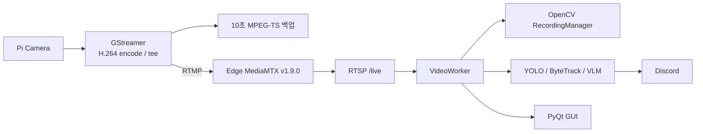

### 4.2 Legacy 코드의 강점

- Raspberry Pi 카메라 취득과 H.264 인코딩 경로가 존재한다.
- Edge에서 10초 단위 MPEG-TS 백업을 수행한다.
- 중앙 PC가 RTSP를 수신하고 분할 MP4를 저장한다.
- YOLO, ByteTrack, 안정 ID 보정, 선택적 VLM 분석 코드가 존재한다.
- 네트워크 복구 요청과 누락 파일 반환의 기본 흐름이 존재한다.
- 역할별 Python package가 어느 정도 분리되어 있다.

### 4.3 Legacy 구조의 한계

- GUI와 `VideoWorker`가 단일 카메라 전제를 가진다.
- 영상 수신, 녹화, 추론, 복구, UI가 한 Python 프로세스에 강하게 결합되어 있다.
- 카메라와 영상 파일의 검색용 DB가 없다.
- HLS, JWT, 외부 사용자 API, Nginx, Docker Compose가 없다.
- MediaMTX가 Edge에 위치하여 카메라 수 증가 시 설정과 운영 지점이 늘어난다.
- 패키지 버전과 Python patch 버전이 충분히 고정되어 있지 않다.

현재 코드는 폐기 대상이 아니라 **기능 검증을 마친 프로토타입**이다. 목표 구조로 이전할 때 영상 취득, 추론, 녹화, 복구 로직을 책임 단위로 분리하여 재사용한다.

---

## 5. 목표 시스템 컨텍스트

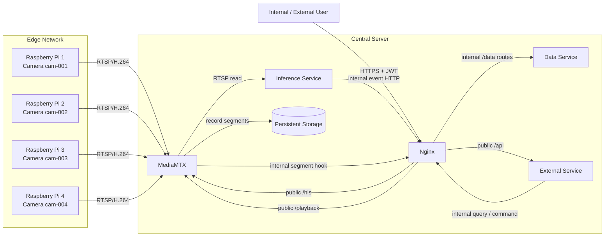

### 5.1 신뢰 경계

```text
Internet / untrusted network
        |
        | 80/443 only
        v
+-------------------------------+
| Nginx public boundary         |
+-------------------------------+
        |
        | Docker internal network
        v
+-------------------------------+
| External / Data / MediaMTX    |
| Inference                     |
+-------------------------------+
        ^
        | RTSP 8554, trusted LAN
        |
+-------------------------------+
| Raspberry Pi Edge devices     |
+-------------------------------+
```

- 인터넷에서 직접 접근 가능한 구성 요소는 Nginx 하나로 제한한다.
- RTSP 8554는 기본적으로 loopback에 Bind하며, 원격 Edge가 필요한 설치에서만 중앙 서버의 명시된 신뢰 LAN IP에 Bind한다.
- Data Service, Inference Service, MediaMTX HLS/Playback 내부 포트는 Host에 공개하지 않는다.
- Docker 내부 통신과 외부 통신은 논리적으로 분리한다.

---

## 6. 논리 서비스와 컨테이너

### 6.1 서비스 개수 해석

프로젝트에서 정한 “2~4개 서비스”는 업무 책임을 의미한다.

| 논리 역할 | 기본 구현 | Docker 컨테이너 |
| --- | --- | --- |
| 영상 | MediaMTX | `mediamtx` |
| 추론 | Python service | `inference` |
| 데이터 | FastAPI + SQLite | `data` |
| 외부 | FastAPI + JWT | `external` |
| 공통 인프라 | Nginx | `nginx` |

따라서 표준 Compose에는 5개 컨테이너가 나타날 수 있으나, 도메인 서비스는 4개다. 초기 구현에서 Data와 External을 합치면 4개 컨테이너로 줄일 수 있지만, 목표 구조에서는 SQLite 단독 소유와 외부 인증 책임을 명확히 하기 위해 분리를 권장한다.

### 6.2 MediaMTX

**책임**

- 카메라별 RTSP publish 또는 source pull 수용
- 내부 RTSP relay
- 실시간 HLS 생성
- 카메라별 중앙 녹화
- 저장 영상 Playback HTTP 제공
- Stream/Recording Hook과 Control API 제공

**소유하지 않는 책임**

- 사용자 계정과 비밀번호
- 이벤트 의미 해석
- SQLite 직접 쓰기
- 사용자용 검색 API
- 저장 보관 정책의 비즈니스 판단

**경로 규칙**

```text
camera_id : cam-001
stream    : rtsp://central-server:8554/cam-001
live HLS  : http://mediamtx:8888/cam-001/index.m3u8
recording : /recordings/cam-001/YYYY/MM/DD/...
```

Camera ID와 MediaMTX path를 동일하게 유지하여 매핑을 단순화한다.

### 6.3 Inference Service

**책임**

- 활성 카메라 목록 조회
- MediaMTX RTSP 연결
- External과만 공유한 전용 reader 자격증명으로 RTSP read 인증
- YOLO 사람 탐지
- ByteTrack 또는 동등 추적
- 안정 Track ID 보정
- 선택적 VLM 분석
- 이벤트와 스냅샷 생성
- Nginx의 Docker 전용 내부 route를 통해 Data Service로 이벤트 전송

**비책임**

- 원본 영상 영구 저장
- HLS 생성
- 사용자 로그인
- SQLite 직접 접근
- Nginx 설정 변경

**프로세스 모델**

카메라별로 독립된 파이프라인을 유지한다.

```text
Inference Supervisor
├── CameraWorker(cam-001)
├── CameraWorker(cam-002)
├── CameraWorker(cam-003)
└── CameraWorker(cam-004)
```

한 카메라 연결 실패가 다른 카메라의 추론 루프를 중단시키지 않아야 한다. GPU가 부족한 경우 분석 FPS를 낮추거나 카메라별 round-robin 추론을 적용할 수 있다.

### 6.4 Data Service

**책임**

- SQLite schema와 migration 소유
- 사용자, 카메라, 영상 Segment, 이벤트 메타데이터 관리
- 시간 범위 검색
- Segment와 Event 연결
- 영상 파일/DB 정합성 검사
- 보관 기간에 따른 삭제 작업
- 내부 서비스용 데이터 API 제공

**원칙**

- `data` 컨테이너만 SQLite 파일을 read/write한다.
- 다른 컨테이너에 DB 파일을 마운트하지 않는다.
- 영상 파일 자체를 BLOB으로 저장하지 않는다.
- 저장 경로는 Storage Root 기준 상대 경로를 기록한다.

### 6.5 External Service

**책임**

- 로그인, 로그아웃, Token 갱신
- JWT 발급과 검증
- Role 기반 권한 검사
- 사용자용 REST API
- Nginx 내부 route를 통해 Data Service를 호출하고 응답 조합
- Live HLS와 Playback URL 발급 또는 접근 허가
- Nginx `auth_request`용 경량 인증 Endpoint

**권한 모델**

| 역할 | 권한 |
| --- | --- |
| `admin` | 사용자·카메라·모델·저장 설정 관리, 모든 조회 |
| `viewer` | 허용된 카메라의 Live, Recording, Event 조회 |

카메라별 세부 ACL은 v1.0 이후 확장할 수 있으나 schema와 token claim 설계에서 확장 가능성을 막지 않는다.

### 6.6 Nginx

**책임**

- 외부 HTTP/HTTPS 단일 진입점
- TLS 종료
- `/api/` → External Service
- `/hls/` → MediaMTX HLS
- `/playback/` → MediaMTX Playback
- Docker Network 전용 `/internal/data/` → Data Service
- 선택적 `/internal/media/` → MediaMTX Control/Adapter
- 보호 자원에 대한 인증 Subrequest
- Forwarded Header와 요청 크기/시간 제한 설정
- 후속 별도 Web UI가 도입될 경우에만 빌드된 정적 파일 제공

**비책임**

- 영상 프레임 변환
- 이벤트 큐
- DB 비즈니스 로직
- JWT 발급
- AI 추론

Nginx는 외부 listener와 Docker Network 전용 내부 listener를 별도 `server` block으로 구성한다. Inference, External, Media hook의 제어·메타데이터 HTTP 요청은 내부 listener를 거쳐 Data Service로 중계한다. Data Service 내부 Recovery Worker는 Loopback API를 사용한다. 내부 listener는 Host에 publish하지 않는다. Nginx를 영상 프레임이나 대용량 파일 업로드의 서비스 버스로 사용하지 않는다.

### 6.7 Configurator와 Installer

Configurator는 Runtime 서비스와 별도의 관리 도구다.

```text
Server Setup.exe
    └── AI CCTV Configurator
          ├── Config Core
          ├── Validation
          ├── Model Manager
          ├── Docker/Compose Adapter
          ├── Diagnostic Adapter
          └── External API Management Client
```

GUI와 CLI는 동일한 Config Core를 호출한다.

- GUI: 서버 설치·최초 설정, Edge 등록·상태 조회, 카메라별 HD/FHD 설정과 서비스 운영
- CLI: 같은 Edge 관리 작업의 자동화, 장애 진단, 개발자 운영
- Installer: 파일 배치, Configurator 설치, 최초 실행

Configurator의 운영 Edge 관리 Client는 Nginx 공개 HTTPS Origin에 관리자 JWT로 접속한다. `POST/PATCH /api/v1/cameras`, `GET /status`, `GET/PATCH /video-profile`, `POST /publish-credentials/rotate`만 알고 Data Service를 직접 알지 않는다. 최초 Pairing에 한해 Windows Host의 Configurator가 LAN UDP 광고와 선택된 Edge의 임시 `/internal/v1/pairing/complete`를 직접 사용한다. 최초 설정의 공개 HTTPS Origin은 GUI 입력 또는 CLI의 `--public-base-url`로 받고 HTTPS Origin 형식만 허용하여 Compose `PUBLIC_BASE_URL`을 생성한다. 등록 시 상태·제어·이벤트용 `edge_management_url`(기본 8003)과 `/v1/recovery`용 `edge_recovery_url`(기본 8002)을 별도로 받고 Port를 추론하지 않는다. 32자 이상의 Edge Pairing Key는 등록 후 두 Edge API의 Bearer Token으로 사용하되 서버 응답, GUI 결과, CLI 출력과 로그에는 표시하지 않는다. 등록·재발급 응답의 일회성 RTSP 게시 자격증명은 인증된 Pairing이 선택되면 Edge에 즉시 전달하고, 자동 전달 실패 또는 수동 등록에서는 사전 검증한 제한 권한 파일로 원자 저장한다.

### 6.4 LAN Edge 발견과 최초 Pairing

```text
Unconfigured Edge                         Windows Configurator
  |-- signed ADVERTISE, UDP/37020 ------->|
  |   device/camera/ports/profiles         |-- HMAC/UUID/time 검증
  |                                        |-- 관리자 Camera 등록
  |<-- PUT pairing/complete + Bearer ------|
  |    central RTSP + publish credential   |
  |-- atomic config + marker               |
  |-- pairing listener stop                |
  `-- RTSP/1.0 publish -------------------> Central MediaMTX
```

광고는 `255.255.255.255:37020`으로 전송하며 Secret을 포함하지 않는다. JSON의
서명 대상은 Protocol Version, UUID v4, Unix Timestamp, Device/Camera ID, 관리·복구
Port와 지원 Profile이고 HMAC-SHA256 Key는 사용자가 양쪽에 숨김 입력한 32자 이상
Pairing Key다. Configurator는 광고에 IP를 싣거나 신뢰하지 않고 실제 UDP Peer 주소를
사용한다. 잘못된 서명, 10초보다 오래된 광고, 중복 Device ID의 이전 광고를 버린다.
Pairing API는 미설정 Edge에서만 열리고 한 번 성공하면 종료한다. 이 Bootstrap은 신뢰
LAN용이며 다른 Subnet 자동 탐색, 인터넷 Discovery와 상시 장비 Registry를 제공하지 않는다.

UI 책임은 다음처럼 고정한다.

| UI | 역할 |
| --- | --- |
| PyQt/CLI Configurator | 서버 설치 및 운영 설정 |
| 기존 `client_code/` PyQt UI | Legacy 개발·진단 참고용 |
| 외부 사용자 애플리케이션 | 별도 프로젝트, REST와 HLS/Playback 사용 |
| Web UI·모바일 네이티브 앱 | 현재 저장소 범위 제외 |

따라서 Configurator는 일반 사용자의 영상 관제 기능을 포함하지 않는다.

---

## 7. Edge 아키텍처

### 7.1 Edge 구성 요소

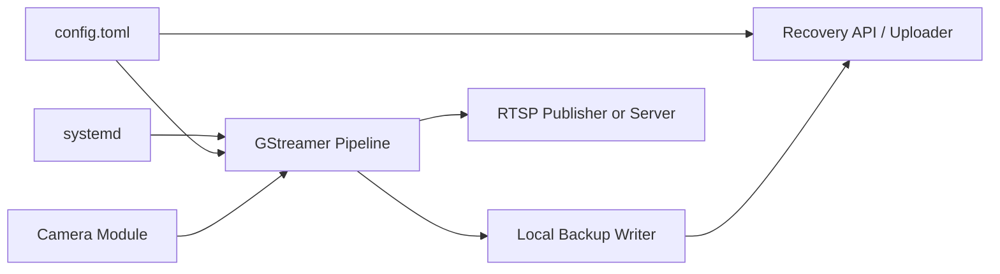

### 7.2 RTSP 전달 모드

두 구현 방식 모두 **Edge–중앙 내부 영상 계약**은 RTSP/1.0으로 동일하다. 일반 사용자 외부 영상 계약은 HTTPS HLS/Playback이다.

#### 모드 A — Edge publish

```text
Edge GStreamer -- RTSP RECORD --> Central MediaMTX /cam-001
```

- 중앙 서버가 고정 주소를 가지는 환경에 적합하다.
- Edge에서 중앙 연결과 재접속 상태를 직접 관리한다.
- Edge에 별도 MediaMTX가 필요하지 않다.

#### 모드 B — Central pull

```text
Edge RTSP Server <-- RTSP DESCRIBE/PLAY -- Central MediaMTX
```

- Edge의 로컬 MediaMTX와 진단 Pipeline 준비 코드는 보존한다.
- 현재 중앙 서버에는 DB `source_url`을 MediaMTX 동적 Path 설정으로 적용하는 Adapter가 없으므로 운영 호환 모드로 제공하지 않는다.
- 후속 구현 시 중앙 MediaMTX source 수명주기, 인증, 상태 동기화와 통합시험이 함께 필요하다.

신규 Edge의 구현·공식 기본은 **모드 A `central_publish`**다. 모드 B `central_pull`은 Edge 진단용 준비 코드일 뿐 중앙 연동이 완료되기 전까지 지원 Profile이 아니며, 외부 사용자에게 Edge RTSP 주소를 노출하는 근거가 되지 않는다.

### 7.3 영상 Profile과 HTTP 제어

카메라 하나는 한 시점에 하나의 활성 Profile만 갖는다.

| Profile | 해상도 | FPS | Bitrate | 정책 |
| --- | ---: | ---: | ---: | --- |
| `hd` | 1280×720 | 30 | 2,000kbps | 기본 |
| `fhd` | 1920×1080 | 30 | 4,000kbps | 장치 지원 시 선택 |

중앙 External Service는 `GET/PATCH /api/v1/cameras/{camera_id}/video-profile`을 제공하고, 저장된 `edge_management_url`과 비공개 `edge_auth_token`으로 Edge의 다음 인증된 HTTP API를 호출한다.

```text
GET /internal/v1/capabilities/video
PUT /internal/v1/config/video-profile
Authorization: Bearer <edge_auth_token>
```

Profile 변경은 요청 검증 → 기본 Camera(index 0)의 센서 Mode 해상도·최대 FPS와 Encoder Capability 확인 → 시험 Pipeline 시작 → 프레임·RTSP 게시 확인 → 설정 원자 교체 순서로 확정한다. Mode 정보 판정이 불가능하면 `CAPABILITY_UNKNOWN`, 지원하지 않는 FHD면 `UNSUPPORTED_VIDEO_PROFILE`로 기존 HD를 유지한다. 적용 중 실패하면 이전 Pipeline으로 Rollback하며 중앙의 `current_profile`은 Edge의 적용 성공 응답 후에만 바꾼다. HD와 FHD를 동시에 만드는 Adaptive HLS는 현재 범위가 아니다.

### 7.4 Edge 로컬 백업

기본 경로:

```text
/var/lib/ai-cctv-edge/
├── recordings/
│   └── cam-001/YYYY/MM/DD/
├── state/
├── logs/
└── recovery/
```

- 기본 Segment: 10초 MPEG-TS
- 목적: 중앙 연결 장애 구간의 임시 보존
- 정책: 용량 또는 시간 기반 ring buffer
- 복구: 누락 구간만 중앙으로 전송
- 삭제: 중앙 수신과 인덱스 완료를 확인한 뒤 정책에 따라 수행

Edge 백업은 중앙 상시 녹화를 대체하지 않는다.

---

## 8. 주요 데이터 흐름

### 8.1 설치와 최초 시작

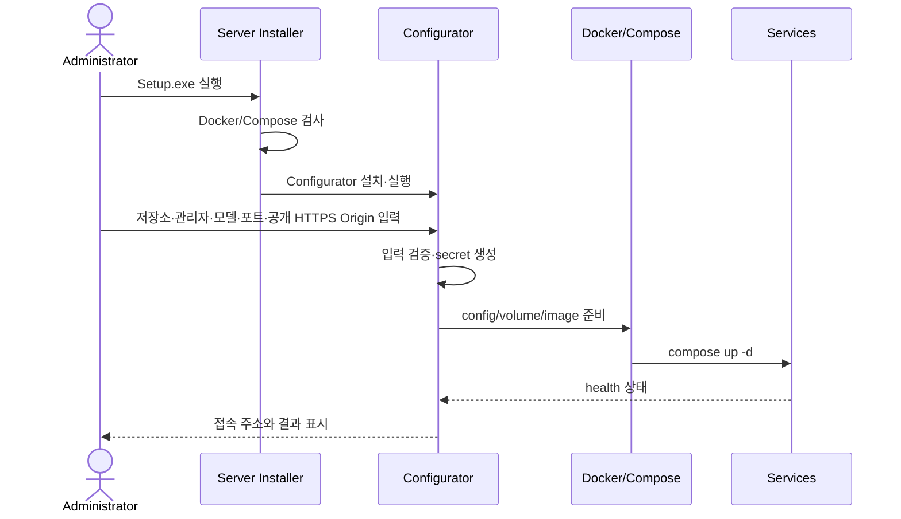

### 8.2 카메라 등록

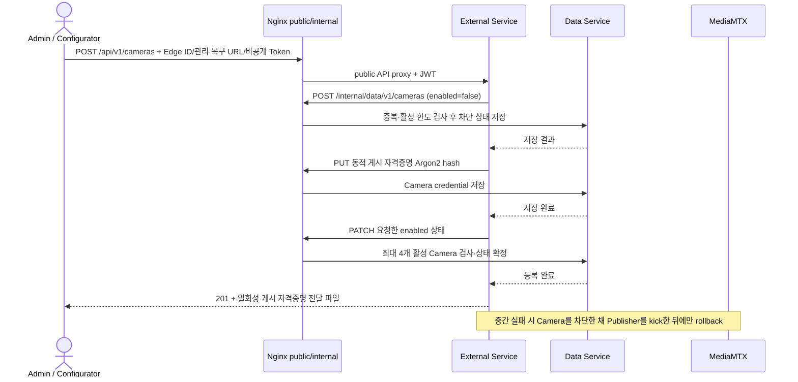

카메라는 동적 자격증명이 저장되기 전에는 활성화하지 않는다. 따라서 삭제 후 같은
Camera ID를 재등록하더라도 Bootstrap 정적 비밀번호를 가진 오래된 Edge가 인증
경계 사이에 Publisher로 남을 수 없다. MediaMTX 설정 갱신이 필요한 경우 다음
우선순위를 따른다.

1. Control API 또는 지원되는 동적 설정
2. 설정 파일을 임시 파일에 생성하고 검증 후 원자 교체
3. Hot Reload
4. 해당 서비스만 제한적으로 재시작

전체 Compose 재시작은 최후 수단이다.

#### Edge 상태와 Profile 운영

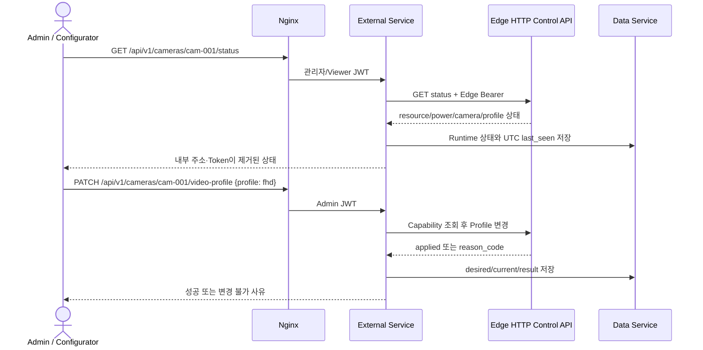

초기 상태 수집 권장 주기는 5초이며 향후 운영 시험으로 확정한다. Runtime 응답에는 CPU, 메모리, 저장장치, 배터리, 전원, 카메라 입력, 중앙 연결, 현재 Profile, `last_seen_at`과 최근 오류를 포함한다. 일반 응답에는 `edge_management_url`, `edge_recovery_url`, `edge_auth_token`, RTSP 게시 자격증명을 포함하지 않는다.

### 8.3 실시간 영상

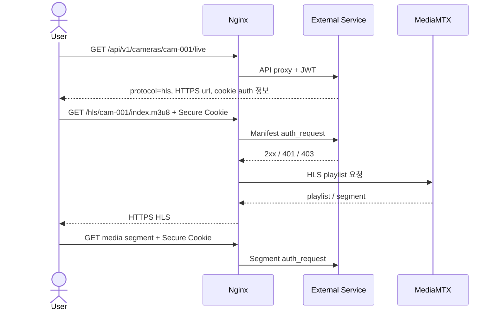

브라우저/HLS 연속 재생의 공식 방식은 로그인 응답이 설정한 HttpOnly Secure Access Cookie다. Nginx는 Manifest와 모든 Segment에서 동일하게 JWT와 Camera ACL을 검증한다. 헤더 주입이 가능한 네이티브 Player는 Bearer Token을 매 요청에 사용할 수 있다. URL Query Token은 사용하지 않는다. `PUBLIC_BASE_URL`이 있으면 `url`은 Absolute HTTPS이고 개발용 미설정 때만 같은 Origin 상대 경로일 수 있다.

### 8.4 중앙 녹화와 인덱싱

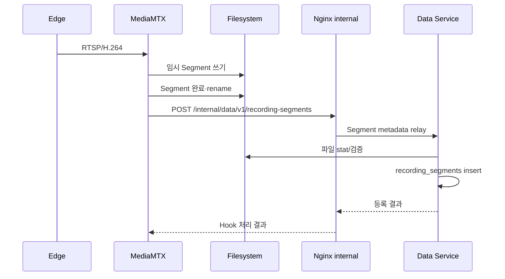

Hook 처리 원칙:

- 완료된 파일만 인덱싱한다.
- Hook은 제한 재시도하며 끝내 실패하면 Data Service의 시작 시·주기적
  reconciliation이 settle된 표준 MediaMTX 경로를 `central` Segment로 멱등
  인덱싱한다.
- Data Service가 파일 크기와 경로를 검증한다.
- 동일 Camera ID, 시작 시각, 경로의 중복 등록을 방지한다.
- 검증할 수 없는 파일은 자동 신뢰하지 않고 `orphaned` 진단 목록에 남긴다.

### 8.5 AI 이벤트 생성

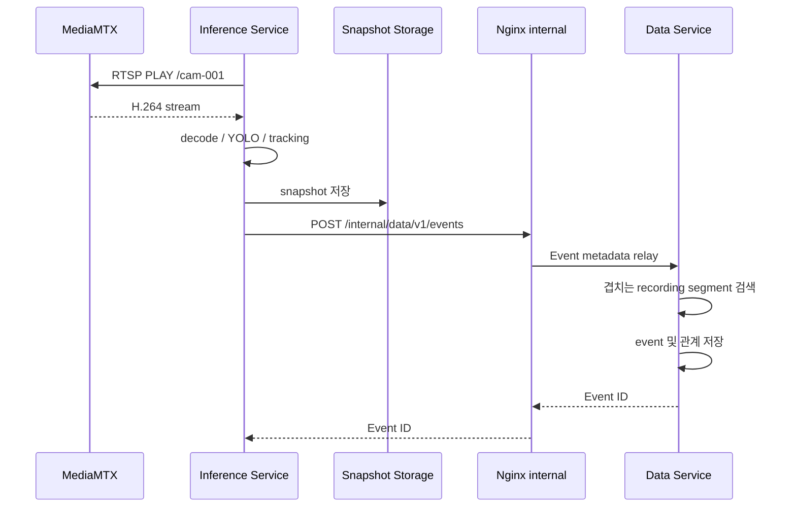

Inference Service 장애는 MediaMTX의 녹화와 HLS를 중단시키지 않는다.

### 8.6 저장 영상 검색과 재생

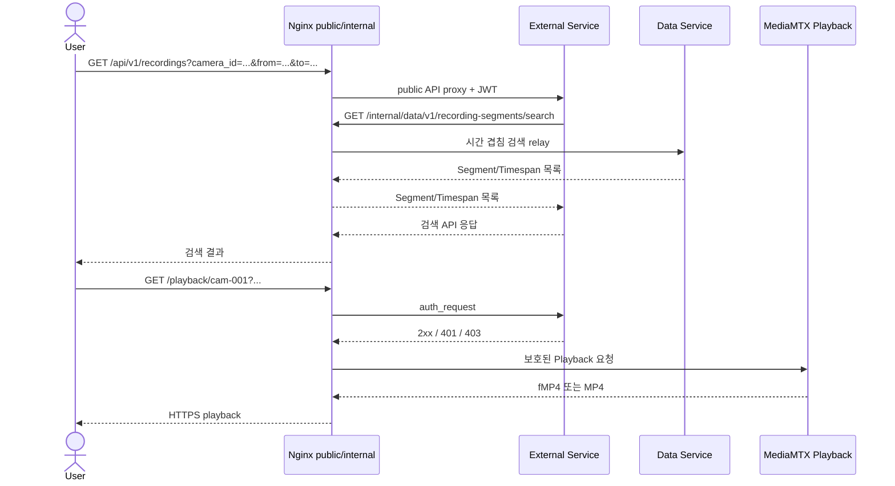

**초기 기준**은 MediaMTX Playback의 fMP4/MP4 응답이다. 실시간 사용자 영상은 HLS로 고정한다. 저장 영상까지 HLS VOD가 반드시 필요해지면 다음 확장 중 하나를 선택한다.

1. 기존 fMP4 Segment를 이용한 VOD playlist 생성기
2. 요청 구간을 FFmpeg로 HLS 변환하고 TTL cache에 저장
3. 별도 Media Processing Worker 도입

이 확장은 핵심 녹화·검색 구조와 분리한다.

### 8.7 Edge 장애 복구

```mermaid
sequenceDiagram
    participant E as Edge
    participant M as MediaMTX
    participant X as External Status Collector
    participant D as Data Service + Recovery Worker
    participant F as Central Storage

    E-xM: 네트워크 단절
    E->>E: 10초 로컬 Segment 저장
    E->>E: central_connection_lost Journal
    X->>E: 인증된 Status/Event Poll
    E-->>X: lost Event
    X->>D: Event 저장 + Job detected
    E->>M: RTSP 재연결
    E->>E: central_connection_restored Journal
    X->>E: 인증된 Status/Event Poll
    E-->>X: restored Event
    X->>D: Event 저장 + Job waiting_for_recovery
    D->>D: settle 뒤 due Job claim (downloading)
    D->>E: 누락 시간 범위 manifest/file 요청
    E-->>D: 해당 Segment + SHA-256
    D->>F: temp 다운로드·크기/SHA-256 검증·원자 이동
    D->>D: recovered/&lt;camera&gt;/... metadata 멱등 등록
    D->>D: Job completed 또는 failed/backoff retry
```

Edge Publisher가 생성한 `central_connection_lost/restored`만 자동 Segment 복구의 권위 Event다. MediaMTX를 읽는 Inference Worker의 장애는 `inference_stream_lost/restored`로 별도 기록하여 복구 구간을 만들지 않는다. 중복 수집 또는 순서가 뒤바뀐 동일 장애 보고는 상관 Window 안에서 시작 최솟값과 종료 최댓값으로 병합한다.

복구 파일은 원본 중앙 녹화와 시간이 겹칠 수 있다. 다음 키를 이용해 중복을 판별한다.

- `camera_id`
- 시작/종료 시각
- 파일 크기
- 필수 SHA-256
- source=`central` 또는 `edge_recovery`

중복 시 무조건 덮어쓰지 않고 우선순위 정책을 적용한다.

---

## 9. 데이터 아키텍처

### 9.1 개념 모델

```mermaid
erDiagram
    USERS ||--o{ REFRESH_TOKENS : owns
    EDGE_DEVICES ||--o{ CAMERAS : manages
    EDGE_DEVICES ||--o| EDGE_RUNTIME_STATUS : reports
    CAMERAS ||--o{ RECORDING_SEGMENTS : produces
    CAMERAS ||--o{ EVENTS : produces
    CAMERAS ||--o| CAMERA_RUNTIME_STATUS : reports
    CAMERAS ||--|| CAMERA_VIDEO_PROFILES : selects
    CAMERAS ||--o{ RECOVERY_JOBS : recovers
    EVENTS }o--o{ RECORDING_SEGMENTS : overlaps

    USERS {
        integer id PK
        string username UK
        string password_hash
        string role
        boolean enabled
        datetime created_at_utc
    }

    REFRESH_TOKENS {
        integer id PK
        integer user_id FK
        string jti UK
        datetime expires_at_utc
        datetime revoked_at_utc
    }

    CAMERAS {
        string id PK
        string name
        string stream_path UK
        string status
        boolean enabled
        string edge_device_id FK
        datetime created_at_utc
        datetime updated_at_utc
    }

    EDGE_DEVICES {
        string edge_device_id PK
        string management_url UK
        string recovery_url
        string auth_token_secret
        datetime updated_at_utc
    }

    EDGE_RUNTIME_STATUS {
        string edge_device_id PK_FK
        boolean online
        float cpu_percent
        float memory_percent
        float storage_percent
        float battery_percent
        string power_source
        datetime last_seen_at_utc
        string last_error_code
    }

    CAMERA_RUNTIME_STATUS {
        string camera_id PK_FK
        string camera_input_status
        string central_connection_status
        string current_video_profile
        string event_cursor
        datetime last_seen_at_utc
        string last_error_code
    }

    CAMERA_VIDEO_PROFILES {
        string camera_id PK_FK
        string current_profile
        string desired_profile
        json supported_profiles
        string encoder
        string last_error_code
    }

    RECOVERY_JOBS {
        integer id PK
        string camera_id FK
        datetime outage_started_at_utc
        datetime outage_ended_at_utc
        string status
        integer attempt_count
        datetime next_retry_at_utc
        string last_error
    }

    RECORDING_SEGMENTS {
        integer id PK
        string camera_id FK
        datetime start_time_utc
        datetime end_time_utc
        string relative_path UK
        integer file_size
        string format
        string source
        string status
        string checksum
    }

    EVENTS {
        integer id PK
        string camera_id FK
        string event_type
        datetime occurred_at_utc
        string track_id
        float confidence
        string snapshot_path
        json metadata_json
    }
```

Event와 Segment는 다대다 관계가 될 수 있다. 하나의 Event가 Segment 경계를 가로지를 수 있고, 하나의 Segment에 여러 Event가 포함될 수 있기 때문이다. 실제 schema에서는 `event_recording_segments` 연결 테이블을 둔다. `edge_devices.auth_token`과 내부 URL은 External Service가 Edge를 호출할 때만 읽고 공개 Camera/Status/Profile 응답에서는 제거한다. 영구 설정과 Runtime 상태, 요청 Profile과 실제 적용 Profile을 별도 테이블로 유지한다.

### 9.2 필수 인덱스

```sql
CREATE INDEX idx_segments_camera_time
ON recording_segments(camera_id, start_time_utc, end_time_utc);

CREATE INDEX idx_events_camera_time
ON events(camera_id, occurred_at_utc);

CREATE INDEX idx_events_type_time
ON events(event_type, occurred_at_utc);
```

시간 겹침 검색 조건:

```sql
SELECT *
FROM recording_segments
WHERE camera_id = :camera_id
  AND start_time_utc < :query_end
  AND end_time_utc > :query_start
ORDER BY start_time_utc;
```

### 9.3 파일 구조

```text
runtime/
├── database/
│   ├── ai_cctv.db
│   └── backups/
├── recordings/
│   └── cam-001/
│       └── 2026/08/22/
│           ├── 20260822T080000-000001Z.mp4
│           └── 20260822T080100-000001Z.mp4
├── recovered/
│   └── cam-001/2026/08/22/...
├── snapshots/
│   └── cam-001/2026/08/22/...
├── models/
├── hls-cache/
└── logs/
```

Host의 `runtime/recovered/`는 Compose가 Data 컨테이너의
`/recordings/recovered/`에 중첩 bind mount한다. 따라서 DB에는 중앙 Segment는
`cam-001/...`, Edge 복구 Segment는 `recovered/cam-001/...` 상대 경로로 저장한다.
파일명 규칙은 사람이 읽을 수 있어야 하지만 검색의 주 수단으로 사용하지 않는다.
DB의 상대 경로가 정본이며, 파일명 parsing은 Hook 유실 복구·reconciliation 보조
수단으로만 사용한다.

### 9.4 시간 규칙

- DB와 파일명은 UTC를 사용한다.
- 사용자 UI에서 `Asia/Seoul` 등 설정된 시간대로 변환한다.
- Edge와 중앙 서버는 NTP 또는 OS 시간 동기화를 사용한다.
- Event와 Segment 비교 시 timezone-aware datetime만 사용한다.
- 카메라별 clock drift를 진단 항목으로 포함한다.

### 9.5 데이터 정합성 상태

`recording_segments.status` 예시:

| 상태 | 의미 |
| --- | --- |
| `pending` | 파일 쓰기 또는 검증 진행 중 |
| `ready` | 검색·재생 가능 |
| `missing` | DB에는 있으나 파일이 없음 |
| `corrupt` | 파일 검사 실패 |
| `deleting` | 보관 정책에 따라 삭제 중; 시작 시·주기 점검에서 재시도 |
| `deleted` | 논리 삭제 완료 |

파일 생성과 DB insert는 하나의 DB 트랜잭션으로 묶을 수 없으므로, Hook와
Reconciliation을 이용한 **eventual consistency**를 허용한다. `deleting` 중 프로세스가
중단되면 파일이 남은 경우 unlink를 재시도하고 이미 없으면 `deleted`로 수렴한다.

---

## 10. API 경계

### 10.1 외부 API

기본 Prefix: `/api/v1`

| Method | Path | 서비스 |
| --- | --- | --- |
| POST | `/auth/login` | External |
| POST | `/auth/refresh` | External |
| POST | `/auth/logout` | External |
| GET | `/cameras` | External → Nginx internal → Data |
| POST | `/cameras` | External → Nginx internal → Data/Media Adapter |
| PATCH | `/cameras/{id}` | External → Nginx internal → Data/Edge Adapter |
| DELETE | `/cameras/{id}` | External → Data history preflight/Media Adapter |
| GET | `/cameras/{id}/live` | External |
| GET | `/cameras/{id}/status` | External → Edge HTTP/Runtime Data |
| GET | `/cameras/{id}/video-profile` | External → Edge HTTP/Runtime Data |
| PATCH | `/cameras/{id}/video-profile` | External → Edge HTTP/Runtime Data |
| POST | `/cameras/{id}/publish-credentials/rotate` | External → Data/Media Adapter |
| GET | `/recordings` | External → Nginx internal → Data |
| GET | `/recordings/{id}/playback` | External → Nginx internal → Data/Media |
| GET | `/recordings/{id}/content` | External ACL → Data recovered MPEG-TS stream |
| GET | `/events` | External → Nginx internal → Data |
| GET | `/events/{id}` | External → Nginx internal → Data |
| GET | `/system/status` | External → services |
| GET | `/openapi.json` | External OpenAPI 3 schema |
| GET | `/docs` | External interactive API documentation |

공개 경로의 완전한 URL은 `/api/v1/openapi.json`, `/api/v1/docs`다. Nginx의 `/api/` proxy를 통해 제공되므로 Data·Edge 내부 API와 `/health/*`는 Schema에 포함하지 않는다. 카메라 등록/수정 관리자 입력은 `edge_device_id`, `edge_management_url`, `edge_recovery_url`, `edge_auth_token`을 포함할 수 있으나 일반 카메라·상태·Profile 응답은 `source_url`, Edge 관리·복구 주소·Token과 게시 자격증명을 제거한다. 관리 URL(8003)과 Recovery URL(8002)은 독립 계약이며 서로의 Port를 추론하지 않는다. Configurator 신규 등록은 네 Edge 필드를 모두 요구하고, 일반 Bootstrap은 네 필드 전체를 생략할 수 있다. 일부만 있는 기존 DB 레코드는 호환하여 읽되 제어·복구를 `CAPABILITY_UNKNOWN` 또는 `failed`로 보고하고 `edge-update`로 완성한다.

`PUBLIC_BASE_URL`이 설정된 운영 배포는 Live HLS와 Playback에 Absolute HTTPS URL을 반환한다. 개발용 미설정 배포만 같은 Origin 기준 상대 경로를 반환할 수 있다. 외부 앱 계약의 정본은 [외부 애플리케이션 REST/HLS 연동](docs/external-app-integration.md)이다.

### 10.2 내부 Data API

호출자는 Data Service 주소를 직접 사용하지 않고 Nginx Docker 전용 listener를 호출한다.

- Client Prefix: `http://nginx:8080/internal/data/v1`
- Data upstream Prefix: `http://data:8000/internal/v1`

| Method | Path | 호출자 |
| --- | --- | --- |
| POST | `/recording-segments` | Data 내 Recovery Worker (`DATA_RECOVERY_TOKEN`) |
| POST | `/hooks/recording-complete` | MediaMTX hook (`DATA_MEDIA_TOKEN`) |
| POST | `/events` | Inference 또는 External (`DATA_INFERENCE_TOKEN`/`DATA_EXTERNAL_TOKEN`) |
| GET | `/cameras/enabled` | Inference (`DATA_INFERENCE_TOKEN`) |
| PATCH | `/cameras/{id}/status` | Inference (`DATA_INFERENCE_TOKEN`) |
| 기타 사용자·Camera·검색·운영 Route | External (`DATA_EXTERNAL_TOKEN`) |

Nginx는 `/internal/`을 외부 listener에 노출하지 않는다. Data Service는 서로 다른 네
Token을 constant-time 비교하고 호출 서비스별 Route allowlist를 적용한다. External,
Inference, Media hook, Recovery Worker는 자기 Token 하나만 받으며 환경 HTTP Proxy와
Redirect를 사용하지 않는다. 신규 Compose 배포는 결합 shared Token을 허용하지 않는다.

RTSP read 인증은 Data API Token과 별도다. Configurator가 생성한
`MEDIA_READ_USERNAME`/`MEDIA_READ_PASSWORD` 쌍은 External의 MediaMTX 인증 callback과
Inference에만 동일하게 주입한다. Inference는 이 값을 percent-encode한 URI userinfo로
MediaMTX에 제시하며, Data와 Media hook에는 reader 쌍을 주입하지 않는다.

### 10.3 Media 제어 API

External Service의 좁은 Media Adapter만 MediaMTX Control API를 사용한다. 호출은 Nginx Docker 전용 `/internal/media/` route를 거치며, Data Service와 Inference Service가 MediaMTX 설정 형식을 직접 알지 않도록 한다. 현재 Adapter 책임은 Camera disable/delete 때 `GET /v3/paths/get/{camera_id}`로 활성 RTSP source를 찾고 `POST /v3/rtspsessions/kick/{session_id}`로 해당 publisher만 종료하는 것이다.

```text
External Service
    └── MediaMtxClient
          └── Nginx /internal/media/
                └── MediaMTX Control API
                      ├── get_camera_path()
                      └── disconnect_rtsp_publisher()
```

일반 비활성화는 DB를 먼저 disabled로 바꾸어 새 게시 인증과 Live/HLS를 차단하고,
그 뒤 session을 종료한다. Media 제어 실패 시 DB는 disabled로 유지하여 fail closed하고
관리 API가 재시도 가능한 오류를 반환한다. 삭제는 먼저 Data의 Recording/Event/Recovery
이력을 검사하며, 이력이 있으면 활성 상태를 바꾸거나 session을 종료하지 않고 409로
거부한다. 자격증명 재발급은 일시 차단→기존 Publisher 종료→동적 Argon2 Credential
교체→원래 활성 상태 복원 순서이며 새 원문은 한 번만 반환한다. MediaMTX 버전 변경 시
Adapter, Nginx upstream 설정과 통합 테스트만 수정할 수 있게 한다.

### 10.4 Future MQTT 경계

현재 Edge Telemetry, Event, Availability와 Command/Result는 인증된 HTTP 상태·제어 API를 사용한다. MQTT는 현 릴리스의 구성 요소나 필수 의존성이 아니다. 후속 도입 시 Broker, 장치 인증, retained 상태, Last Will, QoS, Command ID 기반 중복 제거와 결과 Topic을 함께 설계하고 HTTP 계약에서 단계적으로 이전한다. 영상은 MQTT로 전달하지 않으며 Edge→중앙·Inference는 계속 RTSP, 사용자 재생은 계속 HLS/Playback을 사용한다.

---

## 11. 인증과 보안 아키텍처

### 11.1 사용자 인증

```text
username + password
        |
        v
External Service
  - password hash verify
  - access JWT issue
  - refresh token issue/rotate
        |
        v
REST API: Authorization Bearer
Browser/HLS 연속 요청: HttpOnly Secure Cookie
```

Access JWT 최소 Claim:

```json
{
  "sub": "user-id",
  "role": "viewer",
  "iat": 1787385600,
  "exp": 1787386500,
  "jti": "unique-token-id"
}
```

- 비밀번호는 Argon2id 또는 bcrypt로 저장한다.
- HMAC secret은 256bit 이상 난수로 Installer가 생성한다.
- Secret과 비밀번호 hash를 Git에 포함하지 않는다.
- JWT 전체 값을 로그에 기록하지 않는다.
- Access Token은 짧게, Refresh Token은 회전·철회 가능하게 구성한다.
- 로그인과 Refresh 응답은 JSON Token과 함께 HttpOnly Secure Access/Refresh Cookie를 설정한다.
- REST API Client는 `Authorization: Bearer <access_token>`을 사용한다.
- 브라우저/HLS 재생의 공식 방식은 Cookie이며 Query Token은 사용하지 않는다.

### 11.2 HLS와 Playback 보호

```nginx
location /hls/ {
    auth_request /_auth;
    proxy_pass http://mediamtx:8888/;
}

location /playback/ {
    auth_request /_auth;
    proxy_pass http://mediamtx:9996/;
}

location = /_auth {
    internal;
    proxy_pass http://external:8000/internal/auth/verify;
    proxy_pass_request_body off;
}
```

실제 Nginx는 Manifest와 모든 Segment 요청마다 `Authorization`과 `Cookie`를 `/internal/auth/verify`로 전달하고 Camera ACL을 확인한다. 인증 전에 원본 URI의 `%` 인코딩, 역슬래시, 중복 Slash와 dot Segment를 거부하여 Nginx와 Application의 정규화 차이를 이용한 우회를 막는다. 브라우저/HLS 연속 재생의 공식 인증은 HttpOnly Secure Cookie다. 헤더를 매 요청에 지정할 수 있는 네이티브 Player는 Bearer도 사용할 수 있다. Access Token이 재생 중 만료되어 401이 발생하면 Refresh Token을 회전한 뒤 Playlist를 다시 로드한다. Query Token은 로그·referrer 유출 위험 때문에 허용하지 않는다. 복구 Content는 `Range`의 `200/206/416`과 ETag 기반 `If-Range`를 지원하며 Cache control, timeout과 CORS는 연동 시험에 포함한다.

### 11.3 Media publish 인증

각 Edge는 자신의 경로에만 게시할 수 있어야 한다.

```text
edge-001 credentials -> publish cam-001 only
edge-002 credentials -> publish cam-002 only
```

RTSP publish credential은 Edge 설정의 secret 영역에 저장하고 로그나 CLI 일반 출력에 노출하지 않는다. Inference read credential은 게시 자격증명과 별도로 생성하며 32자 이상의 password를 External과 Inference secret 파일에만 동일하게 저장한다. External 인증 callback은 read 요청에서 이 전용 쌍만 constant-time 비교하고 Camera publish 자격증명을 read 권한으로 재사용하지 않는다.

### 11.4 저장 데이터 보호

현재 릴리스는 파일 암호화를 적용하지 않는다. 대신 다음을 적용한다.

- OS 파일 권한
- Docker Volume 권한
- Nginx 보호 경로 외 직접 파일 제공 금지
- 영상 루트의 directory listing 비활성화
- DB와 secret 정기 백업
- 외부 전송 HTTPS

향후 암호화 도입 시 `StorageAdapter` 아래에 구현하여 Data schema와 사용자 API를 변경하지 않는 것을 목표로 한다.

---

## 12. Docker Compose 배포

### 12.1 목표 디렉터리

```text
server/
├── compose.yml
├── .env.example
├── mediamtx/
│   └── mediamtx.yml
├── nginx/
│   └── nginx.conf
├── services/
│   ├── inference/
│   ├── data/
│   └── external/
└── scripts/
```

### 12.2 Compose 개념 구조

```yaml
services:
  mediamtx:
    image: bluenviron/mediamtx:<pinned-version>
    expose: ["8554", "8888", "9996", "9997"]
    volumes:
      - ./mediamtx/mediamtx.yml:/mediamtx.yml:ro
      - recordings:/recordings

  inference:
    image: ghcr.io/eye-o-t/ai-cctv-inference:<version>
    depends_on:
      mediamtx:
        condition: service_healthy
    volumes:
      - models:/models:ro
      - snapshots:/snapshots

  data:
    image: ghcr.io/eye-o-t/ai-cctv-data:<version>
    volumes:
      - database:/data/database
      - recordings:/data/recordings:ro
      - snapshots:/data/snapshots:ro

  external:
    image: ghcr.io/eye-o-t/ai-cctv-external:<version>
    depends_on:
      data:
        condition: service_healthy

  nginx:
    image: nginx:<pinned-version>
    ports:
      - "80:80"
      - "443:443"
    expose:
      - "8080"  # Docker network 전용 내부 relay
    depends_on:
      - external
      - data
      - mediamtx

volumes:
  recordings:
  database:
  snapshots:
  models:
```

이 YAML은 설계 예시이며 그대로 운영에 사용하지 않는다. Windows에서 영상 저장 위치를 사용자가 선택할 수 있도록 실제 Compose는 bind mount 또는 생성된 override 파일을 사용한다.

### 12.3 Network

초기에는 하나의 사용자 정의 bridge network로 충분하다.

```text
ai_cctv_internal
├── mediamtx
├── inference
├── data
├── external
└── nginx
```

필요 시 다음처럼 분리할 수 있다.

- `media_net`: MediaMTX ↔ Inference/Nginx
- `app_net`: External ↔ Data/Nginx

그러나 초기 릴리스에서 복잡도를 늘릴 실질적 보안 이득이 작으면 단일 network를 유지한다.

### 12.4 Port 정책

| Port | 프로토콜 | Host 노출 | 용도 |
| --- | --- | --- | --- |
| 80 | HTTP | 선택 | HTTPS redirect 또는 로컬 개발 |
| 443 | HTTPS | 예 | 외부 사용자 진입점 |
| 8554 | RTSP | 기본 loopback, 원격 Edge 필요 시 명시적 trusted-LAN IP | Edge publish, Inference authenticated read |
| 8888 | HTTP | 아니오 | MediaMTX HLS 내부 |
| 9996 | HTTP | 아니오 | MediaMTX Playback 내부 |
| 9997 | HTTP | 아니오 | MediaMTX Control API 내부 |
| 8000 | HTTP | 아니오 | External/Data upstream 예시 |
| 8080 | HTTP | 아니오 | Nginx Docker 전용 내부 relay 예시 |

Windows Docker Desktop에서 LAN 전용 binding이 의도대로 적용되는지 설치 단계에서 검증한다. 어려운 경우 OS Firewall rule로 범위를 제한한다.

### 12.5 영속성

다음 데이터는 컨테이너 생명주기와 분리한다.

- 녹화 영상
- Edge 복구 영상
- SQLite DB와 DB backup
- 스냅샷
- 모델
- 사용자 설정과 secret
- 필요한 운영 로그

`docker compose down`과 Windows uninstall은 데이터를 제거하지 않아야 한다. `down -v` 또는 수동 storage reset처럼 Runtime Data를 지우는 작업은 백업 확인과 별도 명시 절차를 둔다.

---

## 13. 설정 아키텍처

### 13.1 설정 파일 분리

```text
C:\ProgramData\AI_CCTV\
├── config\config.yaml
├── config\compose.env
├── secrets\data.env
├── secrets\external.env
├── secrets\inference.env
├── secrets\media.env
├── secrets\camera-credentials.json
├── models\
├── database\
├── recordings\
├── recovered\
├── snapshots\
├── logs\
└── certs\
    ├── tls.crt
    └── tls.key
```

- `config.yaml`: 일반 설정
- `compose.env`: Compose가 읽는 절대 운영 경로와 Port·모델 파일명
- `data.env`: 상호 구별된 External/Inference/Media/Recovery Data Token과 초기 관리자 Hash
- `external.env`: `DATA_EXTERNAL_TOKEN`, JWT Secret, Bootstrap RTSP publish credential, Inference 전용 RTSP reader 쌍
- `inference.env`: `DATA_INFERENCE_TOKEN`과 External에 일치하는 Inference 전용 RTSP reader 쌍
- `media.env`: `DATA_MEDIA_TOKEN`만 포함
- `camera-credentials.json`: Configurator가 초기 Edge 전달용으로만 보관
- SQLite: 카메라, 사용자, 런타임 데이터
- Compose env/override: Configurator가 생성하는 배포 세부 정보

신규 Configurator/Compose 배포는 결합 `secrets.env`를 허용하지 않으며 `doctor`가
필수 Key, 서비스별 allowlist, Token 길이·일치·상호 구별, RTSP reader 쌍의
External/Inference 간 일치·32자 이상 password와 Legacy 결합 배포를
검사한다. `INTERNAL_SERVICE_TOKEN` fallback은 Compose 밖 직접 개발·테스트 호환에만
남긴다. Configurator는 POSIX `0600` 또는 Windows에서 상속을 제거한 DACL로 Secret
파일을 보호한다. Inference와 MediaMTX에는 JWT·관리자·Edge·Camera publish
자격증명을 주입하지 않으며, Inference에는 자신의 전용 RTSP read credential만 추가한다.

### 13.2 Config Core

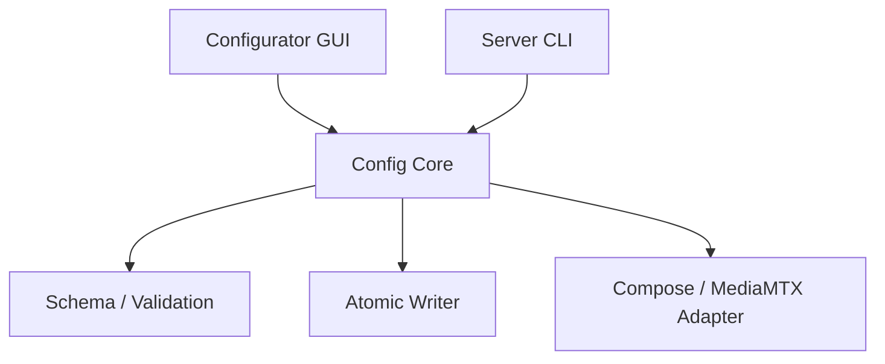

Config Core는 다음을 보장한다.

- 하나의 schema와 기본값
- path, port, model, credential 검증
- 임시 파일 작성 후 원자 교체
- 설정 변경 전 backup
- 변경 영향 서비스 계산
- 실패 시 이전 설정 복원

### 13.3 모델 관리

운영 모델 설치 절차:

```text
운영자가 모델 파일을 별도로 다운로드
  -> GUI/CLI에서 로컬 경로 선택
  -> 일반 파일/읽기 권한/확장자/크기 검증
  -> 원본 SHA-256 계산
  -> 관리 models 디렉터리에 임시 복사
  -> 임시 복사본과 원본 SHA-256 대조
  -> 최종 경로로 원자 교체 후 SHA-256 재확인
  -> Compose MODEL_FILE 설정 변경
  -> Inference에 models 디렉터리를 읽기 전용 마운트
  -> Inference restart
```

설치 프로그램은 모델 weight를 포함하거나 네트워크에서 자동 다운로드하지 않는다. 현재 지원 입력은 `.pt`, `.onnx`, `.engine`이며 비어 있지 않은 2GiB 이하의 로컬 일반 파일이어야 한다. GUI와 CLI는 동일한 Config Core 검증과 복사 절차를 사용한다.

---

## 14. 설치와 배포 아키텍처

### 14.1 Windows Server

권장 도구 조합:

- Configurator: PyQt
- 실행 번들: PyInstaller
- Installer: Inno Setup 또는 동등 도구
- Runtime: Docker Desktop/Engine + Compose v2

사용자 흐름:

```text
AI_CCTV_Server_Setup.exe
  -> prerequisite check
  -> Configurator
  -> storage/model/admin setup
  -> compose pull/up
  -> health check
  -> 접속 URL 표시
```

초기 OSS 릴리스는 Docker Desktop 설치를 전제로 하고, Installer가 Docker Desktop 자체를 무단 번들링하지 않는다.

### 14.2 Raspberry Pi Edge

권장 배포물:

```text
ai-cctv-edge_<version>_arm64.deb
```

구성:

- 실행 파일 또는 Python venv/package
- GStreamer dependency 검사
- `/etc/ai-cctv-edge/config.toml`
- `/var/lib/ai-cctv-edge/`
- systemd unit
- CLI/TUI

대표 명령:

```bash
sudo ai-cctv-edge setup
sudo ai-cctv-edge configure
sudo ai-cctv-edge pair --device-id edge-001 --camera-id cam-001 --set-pairing-key
sudo ai-cctv-edge start
sudo ai-cctv-edge stop
sudo ai-cctv-edge status
sudo ai-cctv-edge doctor
sudo ai-cctv-edge logs
```

---

## 15. 장애 모델과 복구 전략

| 장애 | 영향 | 감지 | 복구 |
| --- | --- | --- | --- |
| Edge 카메라 오류 | 해당 카메라 입력 중단 | GStreamer exit/health | Pipeline 재시작, 사용자 경고 |
| Edge↔중앙 단절 | Live/중앙 녹화 gap | RTSP publisher/path offline | Edge local backup, 재연결, 누락 업로드 |
| MediaMTX 장애 | 모든 live/recording 영향 | Container health/path API | Container restart, 영속 녹화 점검 |
| Inference 장애 | 이벤트 생성 중단 | health/worker status | 추론 재시작, 영상 녹화는 지속 |
| Data Service 장애 | 검색·이벤트 쓰기 중단 | readiness/DB probe | 재시작, hook retry/reconcile |
| External 장애 | 로그인/API 중단 | Nginx upstream health | 재시작, media 내부 녹화는 지속 |
| Nginx 장애 | 외부 접근과 내부 HTTP 메타데이터 중계 중단 | port/upstream health | 재시작, MediaMTX 녹화는 지속하고 Hook/Event는 재시도·reconcile |
| 저장소 full | 녹화 실패 위험 | disk threshold | 경고, retention cleanup, fail-safe |
| SQLite 손상 | 검색/계정 기능 장애 | integrity check | backup restore, reconciliation |
| 모델 load 실패 | AI 기능 중단 | startup probe | 이전 모델 rollback, 비추론 모드 |

### 15.1 우선순위

장애 상황에서는 다음 기능 우선순위를 적용한다.

1. Edge 영상 취득과 로컬 백업
2. 중앙 원본 영상 녹화
3. 실시간 사용자 영상
4. 기본 객체 탐지와 이벤트 기록
5. VLM, Discord 등 부가 기능

부가 기능 실패가 상위 기능을 중단시키지 않아야 한다.

---

## 16. 관측성과 진단

### 16.1 Health Check

| 구성 요소 | Liveness | Readiness |
| --- | --- | --- |
| MediaMTX | 프로세스/Control API | 필요한 listener와 path 상태 |
| Inference | event loop/thread | 모델 load + Media 연결 + Nginx 내부 Data route 가능 |
| Data | HTTP 응답 | SQLite open/migration/storage 접근 |
| External | HTTP 응답 | Nginx 내부 Data route + JWT key load |
| Nginx | HTTP endpoint | 주요 upstream 접근 가능 |
| Edge | systemd/process | camera + GStreamer + disk 상태 |

### 16.2 로그 필드

가능하면 JSON 구조화 로그를 사용한다.

```json
{
  "timestamp": "2026-08-22T08:00:00.000Z",
  "level": "INFO",
  "service": "inference",
  "camera_id": "cam-001",
  "event": "person_detected",
  "message": "Person event created",
  "request_id": null
}
```

포함 권장 필드:

- UTC timestamp
- service
- level
- camera_id
- request_id/correlation_id
- event/error code
- 사용자 ID는 필요한 경우 내부 ID만

제외 필드:

- 비밀번호
- 전체 JWT
- RTSP 비밀번호
- Discord/API token
- 불필요한 얼굴 원본 또는 개인정보

### 16.3 `doctor` 검사

서버:

- Docker Engine/Compose
- Container 상태
- Nginx port
- MediaMTX RTSP/HLS/Playback/Control API
- 카메라 path
- DB migration/integrity
- storage read/write/free space
- model 존재/체크섬/load
- Edge/중앙 시간 차이

Edge:

- Camera enumeration
- GStreamer plugin
- RTSP publish/read
- 중앙 연결
- 백업 디렉터리 쓰기
- 저장 공간
- systemd 상태

---

## 17. 성능과 확장 기준

### 17.1 기본 검증 규모

- Raspberry Pi Camera: 2대 필수 검증, 4대 목표
- 기본 입력: 각 `hd` 1280×720, 30fps, H.264 약 2Mbps
- 선택 입력: 각 `fhd` 1920×1080, 30fps, H.264 약 4Mbps
- 중앙 녹화: 모든 활성 카메라
- 추론: 서버 자원에 따라 분석 FPS 분리
- 외부 사용자: 학부 프로젝트 규모의 소수 동시 사용자

기본 HD 4대의 Edge→MediaMTX 입력은 약 8Mbps이고 선택 FHD 4대는 약 16Mbps다. 명목 연속 녹화량은 `bitrate × seconds ÷ 8`의 십진 단위로 계산한다.

| Profile | 1대/시간 | 1대/일 | 4대/일 | 4대/7일 | 4대/30일 |
| --- | ---: | ---: | ---: | ---: | ---: |
| `hd` 2Mbps | 0.9GB | 21.6GB | 86.4GB | 604.8GB | 2.592TB |
| `fhd` 4Mbps | 1.8GB | 43.2GB | 172.8GB | 1.210TB | 5.184TB |

Container·Audio·파일시스템 overhead는 표에 포함하지 않으므로 실제 저장소에는 최소 10~20% 여유와 보관 정책을 반영한다. HLS egress는 동시 사용자 한 명당 선택 Profile Bitrate가 대략 추가된다. MediaMTX→Inference의 RTSP는 Docker 내부 대역폭으로 별도 발생하며 추론 FPS를 낮춰도 RTSP 원본 전송 Bitrate 자체가 자동으로 줄지는 않는다. 실제 용량과 성능은 코덱, GOP, 장면 복잡도와 동시 재생 수에 따라 측정한다.

### 17.2 추론 성능 분리

카메라 영상은 30fps로 저장하더라도 모든 프레임을 추론할 필요는 없다.

```text
recording_fps = source fps
analysis_fps  = configurable, e.g. 5~15 fps
```

추론 병목이 녹화 경로에 backpressure를 주지 않도록 별도 process/container에서 처리한다.

### 17.3 SQLite 확장 경계

다음 조건이 발생하면 PostgreSQL 이전을 검토한다.

- 중앙 서버가 여러 대로 늘어남
- 여러 Data Service instance가 동시에 write해야 함
- 쓰기 lock 대기가 지속적으로 증가함
- 원격 DB 접근과 고가용성이 필요함

현재 2~4대 카메라, 단일 중앙 서버에서는 SQLite를 유지한다.

---

## 18. 현재 코드에서 목표 구조로의 마이그레이션

### Phase 1 — 기준 환경과 설정 정리

- Python 3.11 patch 버전 고정
- dependency lock 도입
- hard-coded IP, camera ID, path, token 제거
- 공통 config schema 작성
- 기존 단일 카메라 회귀 테스트 확보

### Phase 2 — 중앙 MediaMTX와 멀티카메라

- MediaMTX를 중앙 Docker 컨테이너로 이동
- 카메라별 path 규칙 적용
- Edge RTSP publish/pull 방식 검증
- 2대 및 4대 동시 스트림 시험
- HLS live 경로 확인
- MediaMTX 중앙 녹화 활성화

### Phase 3 — Data Service

- SQLite schema와 migration
- Segment complete hook 인덱싱
- 카메라·영상·이벤트 API
- 파일/DB reconciliation
- 보관 정책

### Phase 4 — Inference Service

현재 코드 이동 기준:

| 현재 코드 | 목표 위치 |
| --- | --- |
| `client_code/detection/person_tracker.py` | `server/services/inference/` |
| `client_code/workers/vlm_worker.py` | `server/services/inference/` |
| `client_code/storage/crop_manager.py` | Inference snapshot adapter |
| `client_code/workers/video_worker.py` | Camera supervisor로 분해 |
| `client_code/storage/recording_manager.py` | 중앙 MediaMTX 녹화로 대체 또는 fallback |
| `client_code/recovery/` | Recovery Coordinator/Edge package |
| `client_code/ui/` | Legacy 관제 UI로 보존; Configurator와 외부 앱에 포함하지 않음 |

### Phase 5 — External Service와 Nginx

- 사용자 schema와 password hash
- JWT login/refresh/logout
- 카메라, recording, event API
- HLS/Playback auth request
- HTTPS와 Reverse Proxy
- 권한 테스트

### Phase 6 — 설치 프로그램

- Windows Configurator/CLI
- PyInstaller build
- Installer
- Edge `.deb`와 systemd
- 로컬 모델 선택·무결성 검증
- doctor와 upgrade/uninstall

---

## 19. 테스트 아키텍처

### 19.1 단위 테스트

- Config schema와 validator
- Camera ID와 path normalization
- Segment 시간 겹침 검색
- Event-Segment 연결
- JWT 발급·만료·권한
- retention/reconciliation
- 로컬 모델 검증·원자 복사·checksum 일치

### 19.2 통합 테스트

- Edge RTSP → 중앙 MediaMTX
- MediaMTX RTSP → Inference
- MediaMTX HLS → Nginx auth → Client
- MediaMTX Segment Hook → Nginx internal → Data DB
- External → Nginx internal → Data 검색
- Nginx → MediaMTX Playback
- JWT 없는 HLS/Playback 차단
- Docker Compose 재시작 후 DB/영상 유지

### 19.3 End-to-End 시나리오

1. 카메라 2대를 등록한다.
2. 두 RTSP stream이 중앙 MediaMTX에서 online이 된다.
3. 두 영상이 중앙에 60초 Segment로 저장된다.
4. 한 카메라에서 사람 이벤트가 생성된다.
5. 사용자 로그인 후 해당 이벤트를 검색한다.
6. 이벤트 시점의 저장 영상을 재생한다.
7. Edge network를 단절하고 로컬 Segment 생성을 확인한다.
8. 연결 복구 후 누락 Segment가 중앙에 중복 없이 등록되는지 확인한다.
9. Compose를 재시작하고 영상과 DB가 유지되는지 확인한다.

---

## 20. 보류 및 미결정 사항

다음 항목은 구현 전에 시험 또는 별도 ADR이 필요하다.

1. 중앙 MediaMTX 최종 버전과 image digest
2. 저장 영상 HLS VOD를 어느 후속 릴리스에서 추가할지
3. Windows GPU 컨테이너 지원 범위와 NVIDIA dependency
4. 기본 보관 기간과 디스크 임계치
5. 오픈소스 라이선스와 모델 weight 배포 정책

미결정 항목은 구현 편의로 암묵적으로 고정하지 않고 ADR 또는 issue에 결정 근거와 검증 결과를 기록한다.

---

## 21. 최종 목표 구조 요약

```text
Raspberry Pi 1..4
  - Camera capture / H.264 / RTSP
  - 10s outage backup
              |
              v
        Central MediaMTX
  - RTSP gateway / live HLS
  - recording / playback
       | RTSP          | files
       v               v
Inference Service   Persistent Storage
       | event HTTP         |
       v                    | segment hook
   Nginx internal relay <---+
       | /internal/data
       v
Data Service + SQLite
  - camera / recording index / event search
       ^
       | query / command through internal relay
       |
External Service
  - login / JWT / user API
       ^
       | public /api
       |
Nginx public boundary
  - HTTPS
  - protected /hls
  - protected /playback
       ^
       |
Authenticated User
```

이 구조의 핵심은 **대용량 영상 경로와 제어·검색 데이터 경로를 분리하는 것**이다. 영상은 RTSP, HLS, 파일시스템을 통해 이동하고, HTTP/SQLite에는 작은 메타데이터만 전달한다. 이를 통해 2~4대 카메라 규모에서 구현 복잡도를 통제하면서도 설치성, 검색성, 외부 접근성, 향후 확장성을 확보한다.
