# AI_CCTV 아키텍처 설계서

## 1. 문서 정보

| 항목 | 값 |
| --- | --- |
| 문서명 | AI_CCTV Architecture Description |
| 대상 시스템 | `AI_CCTV` |
| 대상 저장소 | `Eye-O-T/AI_CCTV` |
| 기준 브랜치 | `develop` |
| 문서 버전 | `0.3.0-draft` |
| 기준일 | 2026-08-22 |
| 현재 구현 | 단일 카메라 중심 Python/PyQt 프로토타입 |
| 목표 구조 | 멀티카메라·중앙 MediaMTX·Docker Compose 기반 소규모 서비스 구조 |

이 문서는 [SRS.md](SRS.md)의 요구사항을 어떤 구성 요소와 데이터 흐름으로 실현할지 정의한다. 현재 코드의 설명과 목표 구조를 구분하기 위해 다음 표기를 사용한다.

- **현재**: `develop` 브랜치에 실제 존재하는 구조
- **목표**: 다음 릴리스에서 구현할 기준 구조
- **확장**: 현재 범위 밖이지만 경계를 미리 고려하는 기능

---

## 2. 아키텍처 목표

AI_CCTV의 목표는 Raspberry Pi 카메라 2~4대에서 들어오는 영상을 중앙 서버가 안정적으로 수집하고, 다음 기능을 한 시스템에서 제공하는 것이다.

1. 카메라별 RTSP 영상 입력
2. 중앙 스트림 집약과 사용자용 HLS 생성
3. 중앙 영상 분할 저장과 시간 기반 검색
4. 사람 탐지·추적 및 이벤트 기록
5. JWT 로그인 기반 외부 조회
6. 설치 프로그램과 GUI/CLI 설정을 통한 일반 사용자 배포
7. Edge 네트워크 장애 시 로컬 백업과 복구

아키텍처는 기능을 과도하게 세분화하지 않는다. 애플리케이션 책임은 **영상, 추론, 데이터, 외부**의 네 영역으로 제한하고, Nginx는 공통 인프라로 둔다.

---

## 3. 핵심 설계 결정

| ID | 결정 | 근거 |
| --- | --- | --- |
| AD-001 | 중앙 서버에 MediaMTX를 둔다. | 카메라별 RTSP를 한 지점에서 집약하고 RTSP relay, HLS, 녹화, Playback을 재사용하기 위함이다. |
| AD-002 | Edge→중앙은 RTSP/1.0과 H.264를 사용한다. | 현재 코드와 MediaMTX의 검증 경로를 유지하고 재인코딩을 줄이기 위함이다. |
| AD-003 | 실시간 사용자 영상은 HLS over HTTPS로 제공한다. | HTTP 기반 외부 전달, 브라우저/클라이언트 호환성, Nginx 연동을 단순화하기 위함이다. |
| AD-004 | 저장 영상 원본은 파일시스템에 두고 SQLite에는 메타데이터만 둔다. | 대용량 BLOB을 DB에서 제외하고 시간·카메라·이벤트 검색을 인덱스로 처리하기 위함이다. |
| AD-005 | SQLite 파일은 Data Service만 직접 연다. | 여러 컨테이너의 직접 동시 쓰기와 파일 잠금 문제를 피하기 위함이다. |
| AD-006 | 추론 서비스는 MediaMTX RTSP를 직접 읽는다. | 프레임을 HTTP/JPEG로 반복 복사하는 구조를 피하기 위함이다. |
| AD-007 | Nginx를 외부 HTTP/HTTPS 단일 진입점으로 둔다. | API, HLS, Playback을 한 인증 경계에서 중계하기 위함이다. |
| AD-008 | 중앙 서버는 Docker Compose, Edge는 native systemd를 기본으로 한다. | 중앙 의존성 재현성을 확보하되 Raspberry Pi 카메라 장치 접근 복잡도는 낮추기 위함이다. |
| AD-009 | 저장 영상 암호화는 현재 릴리스에서 제외한다. | 구현 범위를 통제하되 HTTPS, JWT, 비밀정보 보호는 현재 적용한다. |
| AD-010 | Tailscale, Kubernetes, 별도 메시지 브로커는 사용하지 않는다. | 2~4대 카메라와 단일 중앙 서버 규모에서 운영 복잡도가 이득보다 크기 때문이다. |
| AD-011 | FFmpeg CLI는 핵심 런타임의 필수 구성으로 두지 않는다. | 현재 GStreamer, MediaMTX, OpenCV 경로로 핵심 기능이 가능하다. VOD HLS, 클립, 썸네일 등 필요 시 한정 도입한다. |

---

## 4. 현재 아키텍처

### 4.1 현재 런타임 구조

현재 `develop` 브랜치의 주요 영상 경로는 다음과 같다.

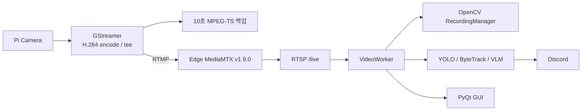

### 4.2 현재 코드의 강점

- Raspberry Pi 카메라 취득과 H.264 인코딩 경로가 존재한다.
- Edge에서 10초 단위 MPEG-TS 백업을 수행한다.
- 중앙 PC가 RTSP를 수신하고 분할 MP4를 저장한다.
- YOLO, ByteTrack, 안정 ID 보정, 선택적 VLM 분석 코드가 존재한다.
- 네트워크 복구 요청과 누락 파일 반환의 기본 흐름이 존재한다.
- 역할별 Python package가 어느 정도 분리되어 있다.

### 4.3 현재 구조의 한계

- GUI와 `VideoWorker`가 단일 카메라 전제를 가진다.
- 영상 수신, 녹화, 추론, 복구, UI가 한 Python 프로세스에 강하게 결합되어 있다.
- 카메라와 영상 파일의 검색용 DB가 없다.
- HLS, JWT, 외부 사용자 API, Nginx, Docker Compose가 없다.
- MediaMTX가 Edge에 위치하여 카메라 수 증가 시 설정과 운영 지점이 늘어난다.
- 패키지 버전과 Python patch 버전이 충분히 고정되어 있지 않다.

현재 코드는 폐기 대상이 아니라 **기능 검증을 마친 프로토타입**이다. 목표 구조로 이전할 때 영상 취득, 추론, 녹화, 복구 로직을 책임 단위로 분리하여 재사용한다.

---

## 5. 목표 시스템 컨텍스트

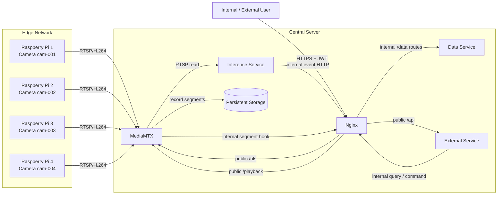

### 5.1 신뢰 경계

```text
Internet / untrusted network
        |
        | 80/443 only
        v
+-------------------------------+
| Nginx public boundary         |
+-------------------------------+
        |
        | Docker internal network
        v
+-------------------------------+
| External / Data / MediaMTX    |
| Inference                     |
+-------------------------------+
        ^
        | RTSP 8554, trusted LAN
        |
+-------------------------------+
| Raspberry Pi Edge devices     |
+-------------------------------+
```

- 인터넷에서 직접 접근 가능한 구성 요소는 Nginx 하나로 제한한다.
- RTSP 8554는 Edge와 중앙 서버가 위치한 신뢰 LAN에서만 접근한다.
- Data Service, Inference Service, MediaMTX HLS/Playback 내부 포트는 Host에 공개하지 않는다.
- Docker 내부 통신과 외부 통신은 논리적으로 분리한다.

---

## 6. 논리 서비스와 컨테이너

### 6.1 서비스 개수 해석

프로젝트에서 정한 “2~4개 서비스”는 업무 책임을 의미한다.

| 논리 역할 | 기본 구현 | Docker 컨테이너 |
| --- | --- | --- |
| 영상 | MediaMTX | `mediamtx` |
| 추론 | Python service | `inference` |
| 데이터 | FastAPI + SQLite | `data` |
| 외부 | FastAPI + JWT | `external` |
| 공통 인프라 | Nginx | `nginx` |

따라서 표준 Compose에는 5개 컨테이너가 나타날 수 있으나, 도메인 서비스는 4개다. 초기 구현에서 Data와 External을 합치면 4개 컨테이너로 줄일 수 있지만, 목표 구조에서는 SQLite 단독 소유와 외부 인증 책임을 명확히 하기 위해 분리를 권장한다.

### 6.2 MediaMTX

**책임**

- 카메라별 RTSP publish 또는 source pull 수용
- 내부 RTSP relay
- 실시간 HLS 생성
- 카메라별 중앙 녹화
- 저장 영상 Playback HTTP 제공
- Stream/Recording Hook과 Control API 제공

**소유하지 않는 책임**

- 사용자 계정과 비밀번호
- 이벤트 의미 해석
- SQLite 직접 쓰기
- 사용자용 검색 API
- 저장 보관 정책의 비즈니스 판단

**경로 규칙**

```text
camera_id : cam-001
stream    : rtsp://central-server:8554/cam-001
live HLS  : http://mediamtx:8888/cam-001/index.m3u8
recording : /recordings/cam-001/YYYY/MM/DD/...
```

Camera ID와 MediaMTX path를 동일하게 유지하여 매핑을 단순화한다.

### 6.3 Inference Service

**책임**

- 활성 카메라 목록 조회
- MediaMTX RTSP 연결
- YOLO 사람 탐지
- ByteTrack 또는 동등 추적
- 안정 Track ID 보정
- 선택적 VLM 분석
- 이벤트와 스냅샷 생성
- Nginx의 Docker 전용 내부 route를 통해 Data Service로 이벤트 전송

**비책임**

- 원본 영상 영구 저장
- HLS 생성
- 사용자 로그인
- SQLite 직접 접근
- Nginx 설정 변경

**프로세스 모델**

카메라별로 독립된 파이프라인을 유지한다.

```text
Inference Supervisor
├── CameraWorker(cam-001)
├── CameraWorker(cam-002)
├── CameraWorker(cam-003)
└── CameraWorker(cam-004)
```

한 카메라 연결 실패가 다른 카메라의 추론 루프를 중단시키지 않아야 한다. GPU가 부족한 경우 분석 FPS를 낮추거나 카메라별 round-robin 추론을 적용할 수 있다.

### 6.4 Data Service

**책임**

- SQLite schema와 migration 소유
- 사용자, 카메라, 영상 Segment, 이벤트 메타데이터 관리
- 시간 범위 검색
- Segment와 Event 연결
- 영상 파일/DB 정합성 검사
- 보관 기간에 따른 삭제 작업
- 내부 서비스용 데이터 API 제공

**원칙**

- `data` 컨테이너만 SQLite 파일을 read/write한다.
- 다른 컨테이너에 DB 파일을 마운트하지 않는다.
- 영상 파일 자체를 BLOB으로 저장하지 않는다.
- 저장 경로는 Storage Root 기준 상대 경로를 기록한다.

### 6.5 External Service

**책임**

- 로그인, 로그아웃, Token 갱신
- JWT 발급과 검증
- Role 기반 권한 검사
- 사용자용 REST API
- Nginx 내부 route를 통해 Data Service를 호출하고 응답 조합
- Live HLS와 Playback URL 발급 또는 접근 허가
- Nginx `auth_request`용 경량 인증 Endpoint

**권한 모델**

| 역할 | 권한 |
| --- | --- |
| `admin` | 사용자·카메라·모델·저장 설정 관리, 모든 조회 |
| `viewer` | 허용된 카메라의 Live, Recording, Event 조회 |

카메라별 세부 ACL은 v1.0 이후 확장할 수 있으나 schema와 token claim 설계에서 확장 가능성을 막지 않는다.

### 6.6 Nginx

**책임**

- 외부 HTTP/HTTPS 단일 진입점
- TLS 종료
- `/api/` → External Service
- `/hls/` → MediaMTX HLS
- `/playback/` → MediaMTX Playback
- Docker Network 전용 `/internal/data/` → Data Service
- 선택적 `/internal/media/` → MediaMTX Control/Adapter
- 보호 자원에 대한 인증 Subrequest
- Forwarded Header와 요청 크기/시간 제한 설정
- 정적 Web UI가 존재할 경우 파일 제공

**비책임**

- 영상 프레임 변환
- 이벤트 큐
- DB 비즈니스 로직
- JWT 발급
- AI 추론

Nginx는 외부 listener와 Docker Network 전용 내부 listener를 별도 `server` block으로 구성한다. Inference, External, Media hook, Recovery Coordinator의 제어·메타데이터 HTTP 요청은 내부 listener를 거쳐 Data Service로 중계한다. 내부 listener는 Host에 publish하지 않는다. Nginx를 영상 프레임이나 대용량 파일 업로드의 서비스 버스로 사용하지 않는다.

### 6.7 Configurator와 Installer

Configurator는 Runtime 서비스와 별도의 관리 도구다.

```text
Server Setup.exe
    └── AI CCTV Configurator
          ├── Config Core
          ├── Validation
          ├── Model Manager
          ├── Docker/Compose Adapter
          └── Diagnostic Adapter
```

GUI와 CLI는 동일한 Config Core를 호출한다.

- GUI: 일반 사용자 설치와 운영 설정
- CLI: 자동화, 장애 진단, 개발자 운영
- Installer: 파일 배치, Configurator 설치, 최초 실행

---

## 7. Edge 아키텍처

### 7.1 Edge 구성 요소

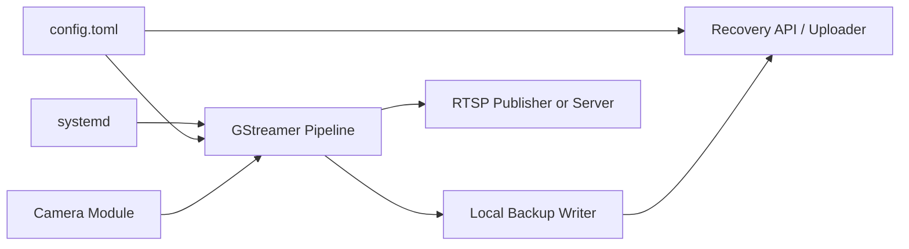

### 7.2 RTSP 전달 모드

두 구현 방식 모두 외부 계약은 RTSP/1.0으로 동일하다.

#### 모드 A — Edge publish

```text
Edge GStreamer -- RTSP RECORD --> Central MediaMTX /cam-001
```

- 중앙 서버가 고정 주소를 가지는 환경에 적합하다.
- Edge에서 중앙 연결과 재접속 상태를 직접 관리한다.
- Edge에 별도 MediaMTX가 필요하지 않다.

#### 모드 B — Central pull

```text
Edge RTSP Server <-- RTSP DESCRIBE/PLAY -- Central MediaMTX
```

- 현재의 Edge RTSP 제공 구조를 재사용하기 쉽다.
- 중앙 MediaMTX가 source 상태를 관리한다.
- Edge RTSP 포트가 중앙 서버에서 접근 가능해야 한다.

**초기 마이그레이션은 모드 B가 위험이 낮고**, 중앙화 완료 후 모드 A의 배포 단순성과 재연결 특성을 비교 시험하여 최종 고정한다.

### 7.3 Edge 로컬 백업

기본 경로:

```text
/var/lib/ai-cctv-edge/
├── recordings/
│   └── cam-001/YYYY/MM/DD/
├── state/
├── logs/
└── recovery/
```

- 기본 Segment: 10초 MPEG-TS
- 목적: 중앙 연결 장애 구간의 임시 보존
- 정책: 용량 또는 시간 기반 ring buffer
- 복구: 누락 구간만 중앙으로 전송
- 삭제: 중앙 수신과 인덱스 완료를 확인한 뒤 정책에 따라 수행

Edge 백업은 중앙 상시 녹화를 대체하지 않는다.

---

## 8. 주요 데이터 흐름

### 8.1 설치와 최초 시작

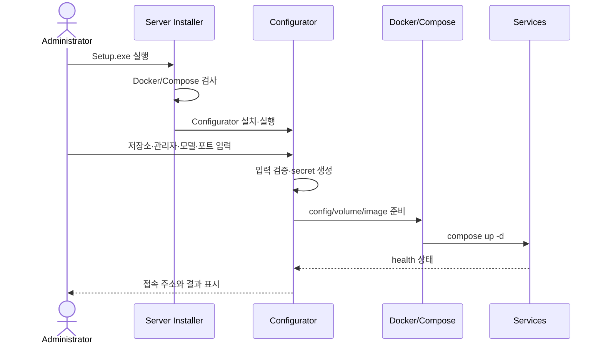

### 8.2 카메라 등록

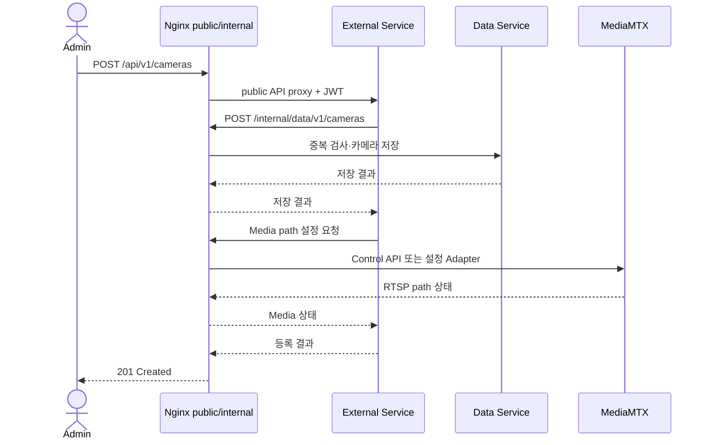

MediaMTX 설정 갱신 방식은 다음 우선순위를 따른다.

1. Control API 또는 지원되는 동적 설정
2. 설정 파일을 임시 파일에 생성하고 검증 후 원자 교체
3. Hot Reload
4. 해당 서비스만 제한적으로 재시작

전체 Compose 재시작은 최후 수단이다.

### 8.3 실시간 영상

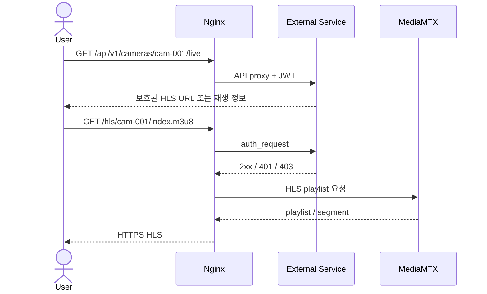

브라우저 HLS Segment 요청마다 인증 헤더를 넣기 어려운 경우 HttpOnly Secure Cookie를 우선 사용한다. URL Query Token은 로그와 referrer 유출 가능성이 있으므로 기본 방식으로 사용하지 않는다.

### 8.4 중앙 녹화와 인덱싱

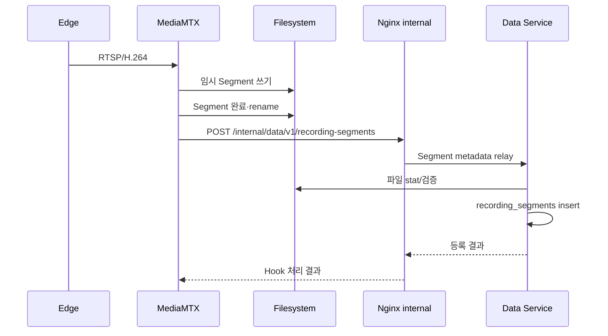

Hook 처리 원칙:

- 완료된 파일만 인덱싱한다.
- Hook 실패 시 재시도 queue 또는 주기적 reconciliation으로 보상한다.
- Data Service가 파일 크기와 경로를 검증한다.
- 동일 Camera ID, 시작 시각, 경로의 중복 등록을 방지한다.

### 8.5 AI 이벤트 생성

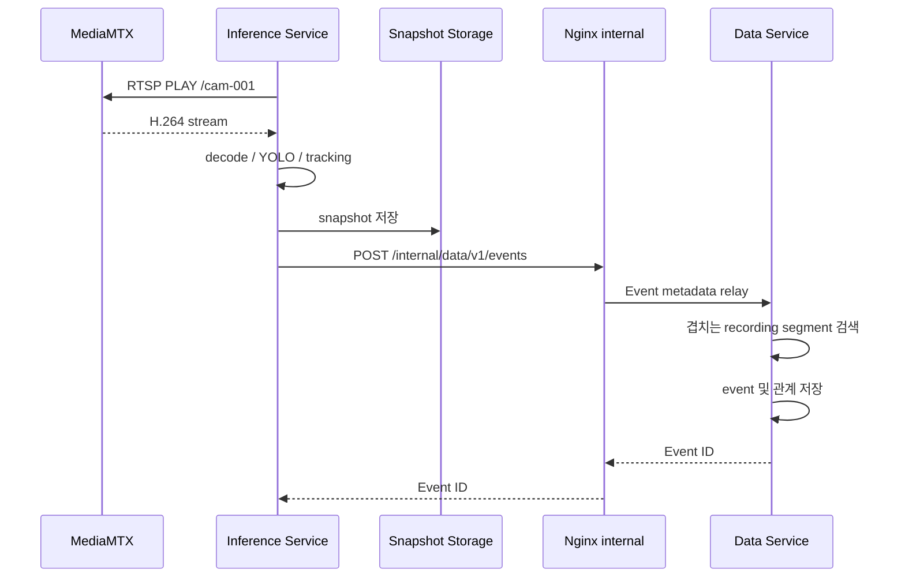

Inference Service 장애는 MediaMTX의 녹화와 HLS를 중단시키지 않는다.

### 8.6 저장 영상 검색과 재생

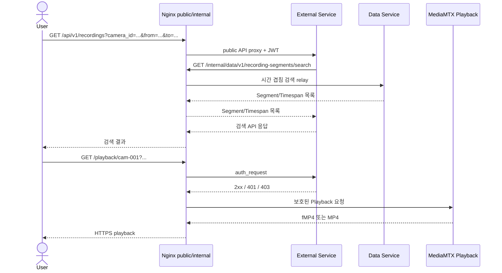

**초기 기준**은 MediaMTX Playback의 fMP4/MP4 응답이다. 실시간 사용자 영상은 HLS로 고정한다. 저장 영상까지 HLS VOD가 반드시 필요해지면 다음 확장 중 하나를 선택한다.

1. 기존 fMP4 Segment를 이용한 VOD playlist 생성기
2. 요청 구간을 FFmpeg로 HLS 변환하고 TTL cache에 저장
3. 별도 Media Processing Worker 도입

이 확장은 핵심 녹화·검색 구조와 분리한다.

### 8.7 Edge 장애 복구

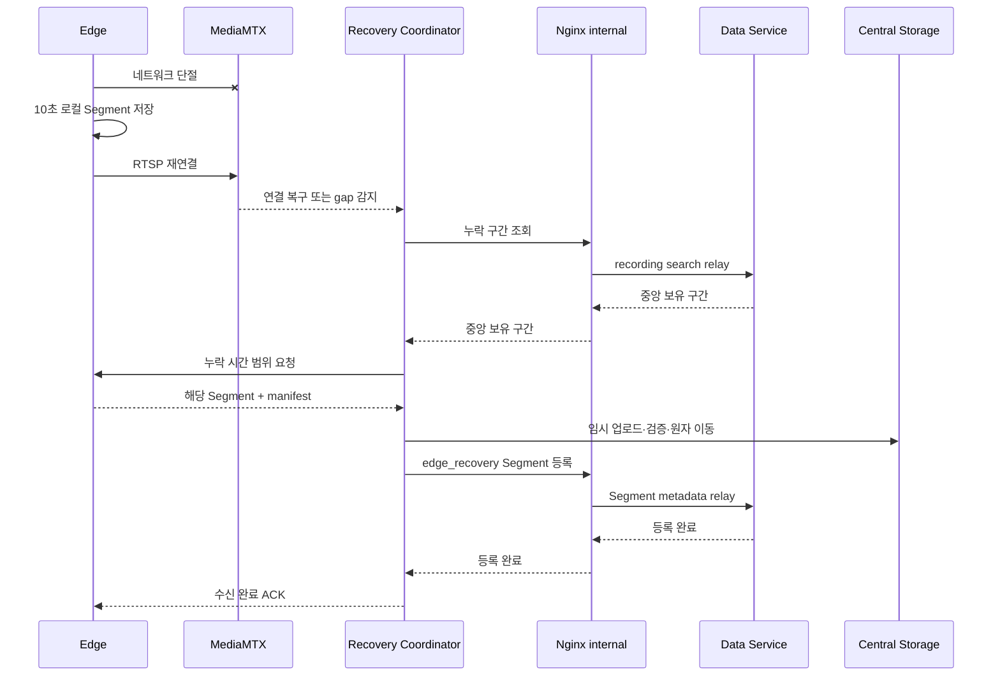

복구 파일은 원본 중앙 녹화와 시간이 겹칠 수 있다. 다음 키를 이용해 중복을 판별한다.

- `camera_id`
- 시작/종료 시각
- 파일 크기
- 선택적 SHA-256
- source=`central_recording` 또는 `edge_recovery`

중복 시 무조건 덮어쓰지 않고 우선순위 정책을 적용한다.

---

## 9. 데이터 아키텍처

### 9.1 개념 모델

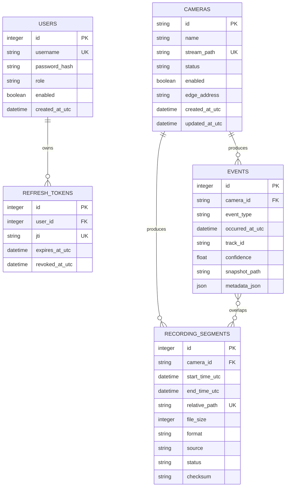

Event와 Segment는 다대다 관계가 될 수 있다. 하나의 Event가 Segment 경계를 가로지를 수 있고, 하나의 Segment에 여러 Event가 포함될 수 있기 때문이다. 실제 schema에서는 `event_recording_segments` 연결 테이블을 둔다.

### 9.2 필수 인덱스

```sql
CREATE INDEX idx_segments_camera_time
ON recording_segments(camera_id, start_time_utc, end_time_utc);

CREATE INDEX idx_events_camera_time
ON events(camera_id, occurred_at_utc);

CREATE INDEX idx_events_type_time
ON events(event_type, occurred_at_utc);
```

시간 겹침 검색 조건:

```sql
SELECT *
FROM recording_segments
WHERE camera_id = :camera_id
  AND start_time_utc < :query_end
  AND end_time_utc > :query_start
ORDER BY start_time_utc;
```

### 9.3 파일 구조

```text
runtime/
├── database/
│   ├── ai_cctv.db
│   └── backups/
├── recordings/
│   └── cam-001/
│       └── 2026/08/22/
│           ├── 20260822T080000.000Z_20260822T080100.000Z.mp4
│           └── 20260822T080100.000Z_20260822T080200.000Z.mp4
├── recovered/
│   └── cam-001/2026/08/22/...
├── snapshots/
│   └── cam-001/2026/08/22/...
├── models/
├── hls-cache/
└── logs/
```

파일명 규칙은 사람이 읽을 수 있어야 하지만 검색의 주 수단으로 사용하지 않는다. DB의 상대 경로가 정본이며, 파일명 parsing은 복구·reconciliation 보조 수단으로만 사용한다.

### 9.4 시간 규칙

- DB와 파일명은 UTC를 사용한다.
- 사용자 UI에서 `Asia/Seoul` 등 설정된 시간대로 변환한다.
- Edge와 중앙 서버는 NTP 또는 OS 시간 동기화를 사용한다.
- Event와 Segment 비교 시 timezone-aware datetime만 사용한다.
- 카메라별 clock drift를 진단 항목으로 포함한다.

### 9.5 데이터 정합성 상태

`recording_segments.status` 예시:

| 상태 | 의미 |
| --- | --- |
| `pending` | 파일 쓰기 또는 검증 진행 중 |
| `ready` | 검색·재생 가능 |
| `missing` | DB에는 있으나 파일이 없음 |
| `corrupt` | 파일 검사 실패 |
| `deleting` | 보관 정책에 따라 삭제 중 |
| `deleted` | 논리 삭제 완료 |

파일 생성과 DB insert는 하나의 DB 트랜잭션으로 묶을 수 없으므로, Hook와 Reconciliation을 이용한 **eventual consistency**를 허용한다.

---

## 10. API 경계

### 10.1 외부 API

기본 Prefix: `/api/v1`

| Method | Path | 서비스 |
| --- | --- | --- |
| POST | `/auth/login` | External |
| POST | `/auth/refresh` | External |
| POST | `/auth/logout` | External |
| GET | `/cameras` | External → Nginx internal → Data |
| POST | `/cameras` | External → Nginx internal → Data/Media Adapter |
| GET | `/cameras/{id}/live` | External |
| GET | `/recordings` | External → Nginx internal → Data |
| GET | `/recordings/{id}/playback` | External → Nginx internal → Data/Media |
| GET | `/events` | External → Nginx internal → Data |
| GET | `/events/{id}` | External → Nginx internal → Data |
| GET | `/system/status` | External → services |

### 10.2 내부 Data API

호출자는 Data Service 주소를 직접 사용하지 않고 Nginx Docker 전용 listener를 호출한다.

- Client Prefix: `http://nginx:8080/internal/data/v1`
- Data upstream Prefix: `http://data:8000/internal/v1`

| Method | Path | 호출자 |
| --- | --- | --- |
| POST | `/recording-segments` | Media hook/indexer/recovery |
| POST | `/events` | Inference |
| GET | `/cameras/enabled` | Inference/External |
| PATCH | `/cameras/{id}/status` | Media monitor |
| GET | `/recording-segments/search` | External/Recovery |
| POST | `/reconcile` | Operator job |

Nginx는 `/internal/`을 외부 listener에 노출하지 않는다. 내부 API 인증은 Docker network만으로 끝내지 않고 서비스 간 shared token 또는 mTLS 확장을 고려할 수 있다. 초기 릴리스에서는 호출 서비스별 최소 권한의 내부 token을 secret으로 주입하고 Nginx가 이를 upstream에 전달하거나 검증한다.

### 10.3 Media 제어 API

External Service의 Media Adapter만 MediaMTX Control API를 사용한다. 호출은 Nginx Docker 전용 `/internal/media/` route를 거치며, Data Service와 Inference Service가 MediaMTX 설정 형식을 직접 알지 않도록 한다.

```text
External Service
    └── MediaGatewayAdapter
          └── Nginx /internal/media/
                └── MediaMTX Control API
                      ├── create_path()
                      ├── disable_path()
                      ├── get_path_status()
                      └── get_playback_url()
```

MediaMTX 버전 변경 시 Adapter, Nginx upstream 설정과 통합 테스트만 수정할 수 있게 한다.

---

## 11. 인증과 보안 아키텍처

### 11.1 사용자 인증

```text
username + password
        |
        v
External Service
  - password hash verify
  - access JWT issue
  - refresh token issue/rotate
        |
        v
HttpOnly Secure Cookie 또는 Bearer Token
```

Access JWT 최소 Claim:

```json
{
  "sub": "user-id",
  "role": "viewer",
  "iat": 1787385600,
  "exp": 1787386500,
  "jti": "unique-token-id"
}
```

- 비밀번호는 Argon2id 또는 bcrypt로 저장한다.
- HMAC secret은 256bit 이상 난수로 Installer가 생성한다.
- Secret과 비밀번호 hash를 Git에 포함하지 않는다.
- JWT 전체 값을 로그에 기록하지 않는다.
- Access Token은 짧게, Refresh Token은 회전·철회 가능하게 구성한다.

### 11.2 HLS와 Playback 보호

```nginx
location /hls/ {
    auth_request /_auth;
    proxy_pass http://mediamtx:8888/;
}

location /playback/ {
    auth_request /_auth;
    proxy_pass http://mediamtx:9996/;
}

location = /_auth {
    internal;
    proxy_pass http://external:8000/internal/auth/verify;
    proxy_pass_request_body off;
}
```

위 설정은 구조 예시다. 실제 설정은 Cookie/Bearer 전달, cache control, range request, timeout, CORS를 포함하여 통합 테스트해야 한다.

### 11.3 Media publish 인증

각 Edge는 자신의 경로에만 게시할 수 있어야 한다.

```text
edge-001 credentials -> publish cam-001 only
edge-002 credentials -> publish cam-002 only
```

RTSP credential은 Edge 설정의 secret 영역에 저장하고 로그나 CLI 일반 출력에 노출하지 않는다.

### 11.4 저장 데이터 보호

현재 릴리스는 파일 암호화를 적용하지 않는다. 대신 다음을 적용한다.

- OS 파일 권한
- Docker Volume 권한
- Nginx 보호 경로 외 직접 파일 제공 금지
- 영상 루트의 directory listing 비활성화
- DB와 secret 정기 백업
- 외부 전송 HTTPS

향후 암호화 도입 시 `StorageAdapter` 아래에 구현하여 Data schema와 사용자 API를 변경하지 않는 것을 목표로 한다.

---

## 12. Docker Compose 배포

### 12.1 목표 디렉터리

```text
server/
├── compose.yml
├── .env.example
├── mediamtx/
│   └── mediamtx.yml
├── nginx/
│   └── nginx.conf
├── services/
│   ├── inference/
│   ├── data/
│   └── external/
└── scripts/
```

### 12.2 Compose 개념 구조

```yaml
services:
  mediamtx:
    image: bluenviron/mediamtx:<pinned-version>
    expose: ["8554", "8888", "9996", "9997"]
    volumes:
      - ./mediamtx/mediamtx.yml:/mediamtx.yml:ro
      - recordings:/recordings

  inference:
    image: ghcr.io/eye-o-t/ai-cctv-inference:<version>
    depends_on:
      mediamtx:
        condition: service_healthy
    volumes:
      - models:/models:ro
      - snapshots:/snapshots

  data:
    image: ghcr.io/eye-o-t/ai-cctv-data:<version>
    volumes:
      - database:/data/database
      - recordings:/data/recordings:ro
      - snapshots:/data/snapshots:ro

  external:
    image: ghcr.io/eye-o-t/ai-cctv-external:<version>
    depends_on:
      data:
        condition: service_healthy

  nginx:
    image: nginx:<pinned-version>
    ports:
      - "80:80"
      - "443:443"
    expose:
      - "8080"  # Docker network 전용 내부 relay
    depends_on:
      - external
      - data
      - mediamtx

volumes:
  recordings:
  database:
  snapshots:
  models:
```

이 YAML은 설계 예시이며 그대로 운영에 사용하지 않는다. Windows에서 영상 저장 위치를 사용자가 선택할 수 있도록 실제 Compose는 bind mount 또는 생성된 override 파일을 사용한다.

### 12.3 Network

초기에는 하나의 사용자 정의 bridge network로 충분하다.

```text
ai_cctv_internal
├── mediamtx
├── inference
├── data
├── external
└── nginx
```

필요 시 다음처럼 분리할 수 있다.

- `media_net`: MediaMTX ↔ Inference/Nginx
- `app_net`: External ↔ Data/Nginx

그러나 초기 릴리스에서 복잡도를 늘릴 실질적 보안 이득이 작으면 단일 network를 유지한다.

### 12.4 Port 정책

| Port | 프로토콜 | Host 노출 | 용도 |
| --- | --- | --- | --- |
| 80 | HTTP | 선택 | HTTPS redirect 또는 로컬 개발 |
| 443 | HTTPS | 예 | 외부 사용자 진입점 |
| 8554 | RTSP | LAN binding만 | Edge publish/pull |
| 8888 | HTTP | 아니오 | MediaMTX HLS 내부 |
| 9996 | HTTP | 아니오 | MediaMTX Playback 내부 |
| 9997 | HTTP | 아니오 | MediaMTX Control API 내부 |
| 8000 | HTTP | 아니오 | External/Data upstream 예시 |
| 8080 | HTTP | 아니오 | Nginx Docker 전용 내부 relay 예시 |

Windows Docker Desktop에서 LAN 전용 binding이 의도대로 적용되는지 설치 단계에서 검증한다. 어려운 경우 OS Firewall rule로 범위를 제한한다.

### 12.5 영속성

다음 데이터는 컨테이너 생명주기와 분리한다.

- 녹화 영상
- Edge 복구 영상
- SQLite DB와 DB backup
- 스냅샷
- 모델
- 사용자 설정과 secret
- 필요한 운영 로그

`docker compose down`은 데이터를 제거하지 않아야 한다. `down -v`, uninstall, storage reset은 별도 확인 절차를 둔다.

---

## 13. 설정 아키텍처

### 13.1 설정 파일 분리

```text
C:\ProgramData\AI_CCTV\
├── config\config.yaml
├── secrets\secrets.env
├── models\
├── database\
├── recordings\
├── snapshots\
└── logs\
```

- `config.yaml`: 일반 설정
- `secrets.env`: JWT secret, 내부 service token, RTSP credential
- SQLite: 카메라, 사용자, 런타임 데이터
- Compose env/override: Configurator가 생성하는 배포 세부 정보

### 13.2 Config Core

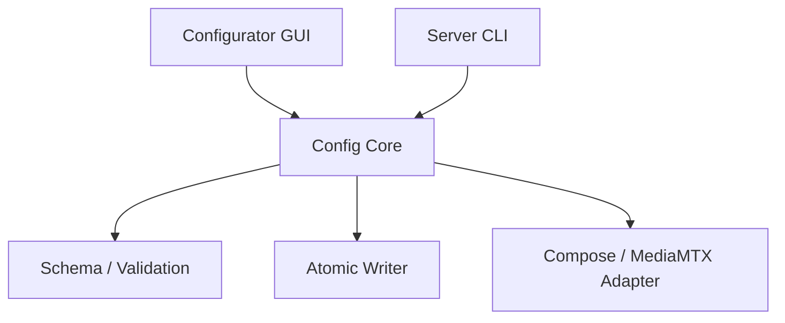

Config Core는 다음을 보장한다.

- 하나의 schema와 기본값
- path, port, model, credential 검증
- 임시 파일 작성 후 원자 교체
- 설정 변경 전 backup
- 변경 영향 서비스 계산
- 실패 시 이전 설정 복원

### 13.3 모델 관리

기본 모델 설치 절차:

```text
manifest 조회
  -> URL/version/license/SHA-256 확인
  -> 임시 파일 다운로드
  -> SHA-256 검증
  -> models/<version>/로 원자 이동
  -> active model 설정 변경
  -> Inference restart
```

Custom model은 존재 여부, 확장자, load test를 통과한 뒤 활성화한다.

---

## 14. 설치와 배포 아키텍처

### 14.1 Windows Server

권장 도구 조합:

- Configurator: PyQt
- 실행 번들: PyInstaller
- Installer: Inno Setup 또는 동등 도구
- Runtime: Docker Desktop/Engine + Compose v2

사용자 흐름:

```text
AI_CCTV_Server_Setup.exe
  -> prerequisite check
  -> Configurator
  -> storage/model/admin setup
  -> compose pull/up
  -> health check
  -> 접속 URL 표시
```

초기 OSS 릴리스는 Docker Desktop 설치를 전제로 하고, Installer가 Docker Desktop 자체를 무단 번들링하지 않는다.

### 14.2 Raspberry Pi Edge

권장 배포물:

```text
ai-cctv-edge_<version>_arm64.deb
```

구성:

- 실행 파일 또는 Python venv/package
- GStreamer dependency 검사
- `/etc/ai-cctv-edge/config.toml`
- `/var/lib/ai-cctv-edge/`
- systemd unit
- CLI/TUI

대표 명령:

```bash
sudo ai-cctv-edge setup
sudo ai-cctv-edge configure
sudo ai-cctv-edge start
sudo ai-cctv-edge stop
sudo ai-cctv-edge status
sudo ai-cctv-edge doctor
sudo ai-cctv-edge logs
```

---

## 15. 장애 모델과 복구 전략

| 장애 | 영향 | 감지 | 복구 |
| --- | --- | --- | --- |
| Edge 카메라 오류 | 해당 카메라 입력 중단 | GStreamer exit/health | Pipeline 재시작, 사용자 경고 |
| Edge↔중앙 단절 | Live/중앙 녹화 gap | RTSP publisher/path offline | Edge local backup, 재연결, 누락 업로드 |
| MediaMTX 장애 | 모든 live/recording 영향 | Container health/path API | Container restart, 영속 녹화 점검 |
| Inference 장애 | 이벤트 생성 중단 | health/worker status | 추론 재시작, 영상 녹화는 지속 |
| Data Service 장애 | 검색·이벤트 쓰기 중단 | readiness/DB probe | 재시작, hook retry/reconcile |
| External 장애 | 로그인/API 중단 | Nginx upstream health | 재시작, media 내부 녹화는 지속 |
| Nginx 장애 | 외부 접근과 내부 HTTP 메타데이터 중계 중단 | port/upstream health | 재시작, MediaMTX 녹화는 지속하고 Hook/Event는 재시도·reconcile |
| 저장소 full | 녹화 실패 위험 | disk threshold | 경고, retention cleanup, fail-safe |
| SQLite 손상 | 검색/계정 기능 장애 | integrity check | backup restore, reconciliation |
| 모델 load 실패 | AI 기능 중단 | startup probe | 이전 모델 rollback, 비추론 모드 |

### 15.1 우선순위

장애 상황에서는 다음 기능 우선순위를 적용한다.

1. Edge 영상 취득과 로컬 백업
2. 중앙 원본 영상 녹화
3. 실시간 사용자 영상
4. 기본 객체 탐지와 이벤트 기록
5. VLM, Discord 등 부가 기능

부가 기능 실패가 상위 기능을 중단시키지 않아야 한다.

---

## 16. 관측성과 진단

### 16.1 Health Check

| 구성 요소 | Liveness | Readiness |
| --- | --- | --- |
| MediaMTX | 프로세스/Control API | 필요한 listener와 path 상태 |
| Inference | event loop/thread | 모델 load + Media 연결 + Nginx 내부 Data route 가능 |
| Data | HTTP 응답 | SQLite open/migration/storage 접근 |
| External | HTTP 응답 | Nginx 내부 Data route + JWT key load |
| Nginx | HTTP endpoint | 주요 upstream 접근 가능 |
| Edge | systemd/process | camera + GStreamer + disk 상태 |

### 16.2 로그 필드

가능하면 JSON 구조화 로그를 사용한다.

```json
{
  "timestamp": "2026-08-22T08:00:00.000Z",
  "level": "INFO",
  "service": "inference",
  "camera_id": "cam-001",
  "event": "person_detected",
  "message": "Person event created",
  "request_id": null
}
```

포함 권장 필드:

- UTC timestamp
- service
- level
- camera_id
- request_id/correlation_id
- event/error code
- 사용자 ID는 필요한 경우 내부 ID만

제외 필드:

- 비밀번호
- 전체 JWT
- RTSP 비밀번호
- Discord/API token
- 불필요한 얼굴 원본 또는 개인정보

### 16.3 `doctor` 검사

서버:

- Docker Engine/Compose
- Container 상태
- Nginx port
- MediaMTX RTSP/HLS/Playback/Control API
- 카메라 path
- DB migration/integrity
- storage read/write/free space
- model 존재/체크섬/load
- Edge/중앙 시간 차이

Edge:

- Camera enumeration
- GStreamer plugin
- RTSP publish/read
- 중앙 연결
- 백업 디렉터리 쓰기
- 저장 공간
- systemd 상태

---

## 17. 성능과 확장 기준

### 17.1 기본 검증 규모

- Raspberry Pi Camera: 2대 필수 검증, 4대 목표
- 입력: 각 1920×1080, 30fps, H.264 약 4Mbps 기본
- 중앙 녹화: 모든 활성 카메라
- 추론: 서버 자원에 따라 분석 FPS 분리
- 외부 사용자: 학부 프로젝트 규모의 소수 동시 사용자

4대 × 4Mbps일 때 영상 입력만 약 16Mbps이며, HLS 사용자 수와 저장 I/O가 추가된다. 실제 용량과 성능은 코덱, GOP, 장면 복잡도, 동시 재생 수에 따라 측정해야 한다.

### 17.2 추론 성능 분리

카메라 영상은 30fps로 저장하더라도 모든 프레임을 추론할 필요는 없다.

```text
recording_fps = source fps
analysis_fps  = configurable, e.g. 5~15 fps
```

추론 병목이 녹화 경로에 backpressure를 주지 않도록 별도 process/container에서 처리한다.

### 17.3 SQLite 확장 경계

다음 조건이 발생하면 PostgreSQL 이전을 검토한다.

- 중앙 서버가 여러 대로 늘어남
- 여러 Data Service instance가 동시에 write해야 함
- 쓰기 lock 대기가 지속적으로 증가함
- 원격 DB 접근과 고가용성이 필요함

현재 2~4대 카메라, 단일 중앙 서버에서는 SQLite를 유지한다.

---

## 18. 현재 코드에서 목표 구조로의 마이그레이션

### Phase 1 — 기준 환경과 설정 정리

- Python 3.11 patch 버전 고정
- dependency lock 도입
- hard-coded IP, camera ID, path, token 제거
- 공통 config schema 작성
- 기존 단일 카메라 회귀 테스트 확보

### Phase 2 — 중앙 MediaMTX와 멀티카메라

- MediaMTX를 중앙 Docker 컨테이너로 이동
- 카메라별 path 규칙 적용
- Edge RTSP publish/pull 방식 검증
- 2대 및 4대 동시 스트림 시험
- HLS live 경로 확인
- MediaMTX 중앙 녹화 활성화

### Phase 3 — Data Service

- SQLite schema와 migration
- Segment complete hook 인덱싱
- 카메라·영상·이벤트 API
- 파일/DB reconciliation
- 보관 정책

### Phase 4 — Inference Service

현재 코드 이동 기준:

| 현재 코드 | 목표 위치 |
| --- | --- |
| `client_code/detection/person_tracker.py` | `server/services/inference/` |
| `client_code/workers/vlm_worker.py` | `server/services/inference/` |
| `client_code/storage/crop_manager.py` | Inference snapshot adapter |
| `client_code/workers/video_worker.py` | Camera supervisor로 분해 |
| `client_code/storage/recording_manager.py` | 중앙 MediaMTX 녹화로 대체 또는 fallback |
| `client_code/recovery/` | Recovery Coordinator/Edge package |
| `client_code/ui/` | Configurator 또는 별도 관제 UI로 재설계 |

### Phase 5 — External Service와 Nginx

- 사용자 schema와 password hash
- JWT login/refresh/logout
- 카메라, recording, event API
- HLS/Playback auth request
- HTTPS와 Reverse Proxy
- 권한 테스트

### Phase 6 — 설치 프로그램

- Windows Configurator/CLI
- PyInstaller build
- Installer
- Edge `.deb`와 systemd
- model manifest/download
- doctor와 upgrade/uninstall

---

## 19. 테스트 아키텍처

### 19.1 단위 테스트

- Config schema와 validator
- Camera ID와 path normalization
- Segment 시간 겹침 검색
- Event-Segment 연결
- JWT 발급·만료·권한
- retention/reconciliation
- 모델 manifest와 checksum

### 19.2 통합 테스트

- Edge RTSP → 중앙 MediaMTX
- MediaMTX RTSP → Inference
- MediaMTX HLS → Nginx auth → Client
- MediaMTX Segment Hook → Nginx internal → Data DB
- External → Nginx internal → Data 검색
- Nginx → MediaMTX Playback
- JWT 없는 HLS/Playback 차단
- Docker Compose 재시작 후 DB/영상 유지

### 19.3 End-to-End 시나리오

1. 카메라 2대를 등록한다.
2. 두 RTSP stream이 중앙 MediaMTX에서 online이 된다.
3. 두 영상이 중앙에 60초 Segment로 저장된다.
4. 한 카메라에서 사람 이벤트가 생성된다.
5. 사용자 로그인 후 해당 이벤트를 검색한다.
6. 이벤트 시점의 저장 영상을 재생한다.
7. Edge network를 단절하고 로컬 Segment 생성을 확인한다.
8. 연결 복구 후 누락 Segment가 중앙에 중복 없이 등록되는지 확인한다.
9. Compose를 재시작하고 영상과 DB가 유지되는지 확인한다.

---

## 20. 보류 및 미결정 사항

다음 항목은 구현 전에 시험 또는 별도 ADR이 필요하다.

1. Edge RTSP 기본 모드를 publish와 central pull 중 어느 것으로 고정할지
2. 중앙 MediaMTX 최종 버전과 image digest
3. live HLS variant: 일반 fMP4 HLS 또는 Low-Latency HLS
4. 저장 영상 재생의 기본 응답: fMP4 또는 완전한 MP4
5. 저장 영상 HLS VOD가 v1.0 필수인지 후속 기능인지
6. JWT Cookie와 Bearer의 기본 UX
7. Refresh Token 저장·철회 방식
8. External과 Data를 초기 릴리스에서 분리할지 합칠지
9. Windows GPU 컨테이너 지원 범위와 NVIDIA dependency
10. 카메라별 ACL을 v1.0에 포함할지
11. 기본 보관 기간과 디스크 임계치
12. Edge 복구 전송 API 형식과 checksum 수준
13. Web UI, PyQt 관제 UI 또는 둘의 역할 분담
14. 오픈소스 라이선스와 모델 weight 배포 정책

미결정 항목은 구현 편의로 암묵적으로 고정하지 않고 ADR 또는 issue에 결정 근거와 검증 결과를 기록한다.

---

## 21. 최종 목표 구조 요약

```text
Raspberry Pi 1..4
  - Camera capture / H.264 / RTSP
  - 10s outage backup
              |
              v
        Central MediaMTX
  - RTSP gateway / live HLS
  - recording / playback
       | RTSP          | files
       v               v
Inference Service   Persistent Storage
       | event HTTP         |
       v                    | segment hook
   Nginx internal relay <---+
       | /internal/data
       v
Data Service + SQLite
  - camera / recording index / event search
       ^
       | query / command through internal relay
       |
External Service
  - login / JWT / user API
       ^
       | public /api
       |
Nginx public boundary
  - HTTPS
  - protected /hls
  - protected /playback
       ^
       |
Authenticated User
```

이 구조의 핵심은 **대용량 영상 경로와 제어·검색 데이터 경로를 분리하는 것**이다. 영상은 RTSP, HLS, 파일시스템을 통해 이동하고, HTTP/SQLite에는 작은 메타데이터만 전달한다. 이를 통해 2~4대 카메라 규모에서 구현 복잡도를 통제하면서도 설치성, 검색성, 외부 접근성, 향후 확장성을 확보한다.

