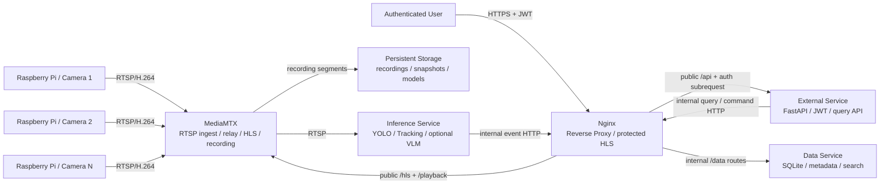

# AI_CCTV

다중 Raspberry Pi 카메라의 RTSP 영상을 중앙 서버에 수집하고, 객체 탐지·추적·이벤트 생성·영상 저장·검색·외부 조회를 제공하는 저비용 지능형 CCTV 프로젝트입니다.

> **구현 상태**
> 이 작업본은 `develop` 브랜치의 기존 프로토타입을 보존하면서 SRS와 Architecture의 기준 구조를 구현한 v0.3.0 소스 배포본입니다. Docker/Windows/Raspberry Pi 실환경 인수 시험이 필요한 항목은 [IMPLEMENTATION_STATUS.md](IMPLEMENTATION_STATUS.md)에 구분했습니다.

## 핵심 목표

- Raspberry Pi를 단순한 카메라 입력 장치로 유지
- 중앙 MediaMTX에서 여러 RTSP 스트림 집약
- 영상 relay·저장과 AI 추론을 분리
- 영상 파일은 파일시스템, 검색 정보는 SQLite에 저장
- 별도 외부 사용자 애플리케이션은 JWT 로그인 후 실시간 영상·저장 영상·이벤트 조회
- 일반 사용자는 설치 프로그램과 GUI/CLI 설정만으로 배포
- 클라우드 의존 없이 로컬 우선으로 동작

## 현재 상태

| 영역 | 구현 결과 | 주요 위치 |
| --- | --- | --- |
| Raspberry Pi 카메라 입력 | GStreamer H.264 취득, 10초 MPEG-TS 백업, 자동 재시작 | `edge/` |
| RTSP | 중앙 publish 기본 모드, Camera ID별 인증, 1~4대 구성 | `edge/`, `server/mediamtx/` |
| 중앙 미디어 | MediaMTX v1.9.0 relay·HLS·60초 fMP4 녹화 | `server/mediamtx/` |
| 객체 탐지·추적 | YOLO + ByteTrack 독립 워커, 등장·이탈 이벤트 | `server/services/inference/` |
| 데이터 | SQLite WAL, migration, ACL, 검색·보관·백업·정합성 검사 | `server/services/data/` |
| 외부 조회 | JWT access/refresh/logout, 역할·카메라 ACL, REST API | `server/services/external/` |
| 보호된 영상 | Nginx `auth_request`를 거친 HLS·Playback | `server/nginx/` |
| 장애 복구 | Edge 연결 전이 기반 자동 Recovery Job, SHA-256 원자 수신·중복 방지 인덱싱·제한 재시도 | `edge/`, Data Service |
| 중앙 배포 | Data·External·Inference·MediaMTX·Nginx 5개 컨테이너 | `server/compose.yml` |
| 설치·운영 설정 | PyQt/CLI Configurator, Edge 등록·상태·HD/FHD 제어, PyInstaller/Inno·ARM64 deb 빌드 정의 | `configurator/`, `edge/packaging/` |
| 기존 프로토타입 | 참고·회귀용 legacy 코드로 보존 | `client_code/`, `rtspv1.0/` |

## 기준 기술 스택

| 구분 | 기준 |
| --- | --- |
| Python | 3.11.9 고정, 기존 코드는 3.11.x 호환 |
| RTSP | RTSP/1.0. RTSP 2.0은 현재 범위에서 제외 |
| 영상 코덱 | H.264 |
| 엣지 파이프라인 | GStreamer 1.x |
| 중앙 미디어 서버 | MediaMTX. 현재 검증 기준 v1.9.0, Release에서는 시험한 image tag/digest 고정 |
| 사용자 영상 | HLS over HTTPS |
| 내부 추론 영상 | MediaMTX RTSP |
| 기본 영상 Profile | `hd`: 1280×720@30fps, 2,000kbps H.264 |
| 선택 영상 Profile | `fhd`: 1920×1080@30fps, 4,000kbps H.264 |
| 추론 | Ultralytics YOLO 호환 모델 + 추적기, VLM 선택 |
| API | FastAPI |
| DB | SQLite 3, WAL mode |
| 인증 | JWT |
| Reverse Proxy | Nginx |
| 중앙 배포 | Docker Compose v2 |
| 서버 설치 UI | PyQt 기반 Configurator + PyInstaller 번들 |
| Windows Installer | Inno Setup 또는 동등 도구 |
| Edge 서비스 | systemd |

## 시스템 구성



### 논리 서비스와 실제 컨테이너

애플리케이션 책임은 최대 4개로 구분합니다.

1. **Media Service**: MediaMTX, RTSP, HLS, recording
2. **Inference Service**: YOLO, tracking, optional VLM
3. **Data Service**: SQLite, 영상·이벤트 메타데이터, 검색
4. **External Service**: 로그인, JWT, 사용자 API

Nginx는 공통 인프라입니다. 따라서 기준 Docker Compose에는 애플리케이션 4개와 Nginx를 합쳐 총 5개 컨테이너가 존재할 수 있습니다.

Nginx는 외부용 `80/443` 진입점과 Docker Network 전용 내부 listener를 분리합니다. Inference와 External의 Data Service 요청은 내부 listener의 `/internal/data/` 경로를 통해 중계하며, 이 내부 listener는 Host에 publish하지 않습니다.

## 주요 데이터 흐름

### 실시간 영상

```text
Raspberry Pi
    -> RTSP/H.264
Central MediaMTX
    -> HLS
Nginx authentication boundary
    -> HTTPS
Authenticated user
```

### AI 이벤트

```text
MediaMTX RTSP
    -> Inference Service
YOLO / tracking / optional VLM
    -> event metadata + snapshot
Nginx internal route
    -> Data Service / SQLite
```

### 저장 영상 검색

```text
User query: camera + time range
    -> External Service
    -> Data Service
    -> matching recording segments
    -> protected MediaMTX Playback (fMP4/MP4)
```

실시간 사용자 영상은 HLS로 제공합니다. 저장 영상은 초기 릴리스에서 MediaMTX Playback의 fMP4/MP4 응답을 사용하고, 저장 영상까지 HLS VOD가 필요할 때 playlist 생성기나 제한된 FFmpeg 작업을 별도 확장으로 도입합니다.

### 영상 Profile과 용량 기준

카메라 하나에는 한 시점에 하나의 Profile만 적용합니다. 기본값은 `hd`이고 관리자가 Configurator 또는 관리자 API에서 `fhd`를 선택할 수 있습니다. Edge가 요청한 Profile을 지원하지 않으면 기존 Pipeline을 유지하고 변경 불가 사유를 반환합니다. HD와 FHD를 동시에 송출하는 Adaptive HLS는 현재 범위가 아닙니다.

| Profile | 해상도·FPS | 명목 Bitrate | 카메라 1대/시간 | 카메라 1대/일 | 4대 입력 대역폭 | 4대/일 |
| --- | --- | ---: | ---: | ---: | ---: | ---: |
| `hd` 기본 | 1280×720@30fps | 2Mbps | 0.9GB | 21.6GB | 8Mbps | 86.4GB |
| `fhd` 선택 | 1920×1080@30fps | 4Mbps | 1.8GB | 43.2GB | 16Mbps | 172.8GB |

계산은 `bitrate × seconds ÷ 8`의 십진 단위이며 Container, Audio, 파일시스템 여유분은 포함하지 않습니다. 4대 연속 녹화 기준 `hd`는 7일 약 604.8GB·30일 약 2.592TB, `fhd`는 7일 약 1.210TB·30일 약 5.184TB입니다. 실제 저장소는 Container overhead, 장면 복잡도와 보관 정책을 고려해 최소 10~20% 여유를 추가합니다. HLS 외부 전송은 동시 시청자 한 명당 선택 Profile의 Bitrate가 대략 추가되고, MediaMTX→Inference RTSP 트래픽은 Docker 내부망에서 별도로 발생합니다.

### UI와 구현 범위

| UI | 역할 |
| --- | --- |
| PyQt/CLI Configurator | 서버 설치·최초 설정, Edge/카메라 등록, 상태 조회, 카메라별 HD/FHD 설정, 서비스 운영 |
| `client_code/`의 기존 PyQt 관제 UI | Legacy 참고·회귀용이며 공식 사용자 UI가 아님 |
| 외부 사용자 애플리케이션 | 별도 담당자가 HTTPS REST API와 보호된 HLS/Playback으로 구현 |
| Web UI·모바일 네이티브 앱 | 이 저장소의 현재 구현 범위에서 제외 |

모바일 앱 자체는 별도 프로젝트이지만 서버 연동 계약은 [외부 애플리케이션 REST/HLS 연동](docs/external-app-integration.md)에 고정합니다. 현재 Edge 상태·제어·복구는 인증된 HTTP를 사용합니다. MQTT Telemetry, Event, Availability(LWT/retained), Command/Result는 후속 단계이며 현재 런타임 요구사항이 아닙니다.

### 네트워크 장애 복구

```text
Edge loses central connection
    -> local ring-buffer recording
Connection restored
    -> missing segments uploaded in order
Central server
    -> duplicate check
    -> persistent storage
    -> SQLite index
```

## 저장 원칙

영상 파일은 SQLite에 BLOB으로 넣지 않습니다.

```text
/data/
├── database/
│   └── ai_cctv.db
├── recordings/
│   ├── cam-001/2026/08/22/
│   │   └── 20260822T080000-000001Z.mp4
│   └── recovered/cam-001/2026/08/22/
│       └── 20260822T080000.000Z_000001.ts
├── snapshots/
├── models/
├── hls-cache/
└── logs/
```

SQLite는 다음 정보를 저장합니다.

- 사용자와 권한
- 카메라 ID와 MediaMTX 경로
- 영상 시작·종료 시각, 경로, 크기, 체크섬, 상태
- 이벤트 유형, 발생 시각, confidence, 추적 ID, 스냅샷
- 이벤트와 영상 구간의 연결 관계

모든 내부 시각은 UTC로 저장하고 UI에서 로컬 시간대로 표시합니다.

## 일반 사용자 설치

### 중앙 서버

Windows 빌드 절차로 생성하는 배포물:

```text
AI_CCTV_Server_Setup_<version>.exe
```

설치 흐름:

1. Installer 실행
2. Docker Engine과 Docker Compose 상태 검사
3. 데이터 저장 위치 선택
4. 기본 AI 모델 자동 설치 또는 사용자 모델 선택
5. 관리자 계정 생성
6. 포트, 외부 접속 여부와 공개 HTTPS Origin 설정
7. 설정 검증
8. Docker image pull 및 Compose 시작
9. 서비스 상태와 접속 주소 표시

사용자는 기본 설치에서 다음 파일을 직접 수정하지 않습니다.

- `.env`
- `compose.yml`
- `mediamtx.yml`
- `nginx.conf`
- JWT secret
- SQLite 경로

### Raspberry Pi Edge

릴리스 배포물 예시:

```text
ai-cctv-edge_<version>_arm64.deb
```

설치 흐름:

```bash
sudo apt install ./ai-cctv-edge_<version>_arm64.deb
sudo ai-cctv-edge setup
```

설정 항목:

- 장치 ID와 카메라 ID
- 중앙 서버 주소
- MediaMTX RTSP publish path
- 영상 Profile: 기본 `hd`(1280×720@30fps, 2Mbps), 선택 `fhd`(1920×1080@30fps, 4Mbps)
- 로컬 장애 백업 경로와 최대 보관량

설정 완료 후 systemd가 서비스를 자동 시작합니다.

```bash
sudo ai-cctv-edge status
sudo ai-cctv-edge doctor
sudo ai-cctv-edge logs
```

## 기존 프로토타입 실행 참고

아래 코드는 새 서비스 구조와 별도로 보존된 legacy 프로토타입입니다. 새 배포에는 [중앙 서버 실행](#중앙-서버-실행)을 사용하십시오.

### 중앙 PC

```powershell
py -3.11 -m venv venv311
.\venv311\Scripts\Activate.ps1
pip install -r requirements.txt
# PyTorch는 CPU/GPU 환경에 맞는 wheel을 별도로 설치
python client_code/main.py
```

### Raspberry Pi

```bash
cd rtspv1.0
sudo apt update
# rtspv1.0/readme.md에 기재된 GStreamer·libcamera 패키지 설치
python3 run_rtsp_server.py
```

`rtspv1.0/` 흐름은 Edge 측 MediaMTX를 사용하는 이전 방식이므로 참고·회귀 확인용으로만 유지합니다. 새 `edge/` 패키지는 중앙 publish를 기본값으로 사용합니다.

## 구현 저장소 구조

```text
AI_CCTV/
├── README.md
├── SRS.md
├── ARCHITECTURE.md
├── pyproject.toml
│
├── edge/
│   ├── src/
│   ├── packaging/
│   ├── systemd/
│   └── tests/
│
├── server/
│   ├── compose.yml
│   ├── .env.example
│   ├── mediamtx/
│   ├── nginx/
│   └── services/
│       ├── inference/
│       ├── data/
│       └── external/
│
├── configurator/
│   ├── config_core.py
│   ├── gui.py
│   ├── cli.py
│   └── packaging/
│
├── docs/
└── tests/
```

## 개발 환경 시작 예시

### 요구사항

- Git
- Docker Desktop 또는 Docker Engine
- Docker Compose v2
- 개발용 Python 3.11.9
- Raspberry Pi 테스트 시 Raspberry Pi OS 64-bit와 GStreamer 1.x

### 저장소 복제

```bash
git clone https://github.com/Eye-O-T/AI_CCTV.git
cd AI_CCTV
git switch develop
```

### 설정 생성

```bash
cp server/.env.example server/.env
cp server/config/config.example.yaml server/config/config.yaml
python server/scripts/init_runtime.py
python server/scripts/generate_secrets.py --camera-id cam-001
python server/scripts/generate_dev_cert.py
```

개발 환경에서는 Configurator 대신 예제 설정을 사용할 수 있습니다. 실제 secret은 Git에 커밋하지 않습니다.
`server/runtime/models/default.pt`에는 검증할 YOLO 모델을 배치합니다. 운영 설치에서는 Configurator가 선택한 모델을 원자적으로 복사하고 `.env`의 `MODEL_FILE`을 생성합니다.

Configurator는 `--model <custom.pt>`와 `--model-manifest <manifest.json>` 중 하나를 받습니다. Manifest 다운로드는 HTTPS·버전·라이선스·SHA-256·최대 크기를 검증합니다. 저장소의 example Manifest는 배포 모델의 URL·hash·license가 확정되기 전까지 의도적으로 활성화되지 않습니다.

운영 설치에서는 GUI의 `Public HTTPS origin` 또는 CLI의 필수 `--public-base-url https://cctv.example.com`으로 외부 앱에 반환할 Origin을 지정합니다. Configurator는 HTTPS Origin만 허용하고 경로·Query·Fragment·내장 자격증명을 거부한 뒤 Compose `.env`의 `PUBLIC_BASE_URL`을 생성합니다. 빈 값과 상대 Media URL은 Configurator를 사용하지 않는 로컬 개발 구성에서만 허용합니다.

RTSP Host bind의 Configurator/CLI 기본값은 `127.0.0.1`입니다. 원격 Raspberry Pi Edge의 게시를 받아야 할 때만 `--rtsp-bind <central-trusted-lan-ip>` 또는 GUI의 `RTSP bind`에 중앙 서버의 신뢰 LAN IP를 명시합니다. `0.0.0.0`이나 Internet-facing 주소를 편의상 사용하지 말고 OS 방화벽에서도 Edge 대역만 허용합니다.

### 중앙 서버 실행

```bash
docker compose -f server/compose.yml up -d --build
python server/scripts/bootstrap_admin.py
```

### 상태 확인

```bash
docker compose -f server/compose.yml ps
docker compose -f server/compose.yml logs --tail=200
```

### 종료

```bash
docker compose -f server/compose.yml down
```

`down`은 영속 볼륨의 DB와 영상 파일을 삭제해서는 안 됩니다. 개발자가 `-v`를 사용할 때는 데이터 삭제 가능성을 확인해야 합니다.

## 설정 파일

권장 서버 경로:

```text
C:\ProgramData\AI_CCTV\
├── config\config.yaml
├── secrets\data.env
├── secrets\external.env
├── secrets\inference.env
├── secrets\media.env
├── secrets\camera-credentials.json
├── models\
├── database\
├── recordings\
├── recovered\
├── snapshots\
└── logs\
```

`config.yaml` 예시:

```yaml
schema_version: 1

server:
  public_http_port: 80
  public_https_port: 443
  rtsp_bind_address: 127.0.0.1
  rtsp_port: 8554
  timezone: Asia/Seoul

recording:
  root: /recordings
  recovery_root: /recordings/recovered
  segment_seconds: 60
  retention_days: 7
  warning_free_percent: 15
  encryption_at_rest: false

inference:
  enabled: true
  model_path: /models/default.pt
  device: auto
  confidence_threshold: 0.5
  analysis_fps: 5
  disappear_seconds: 3

cameras:
  - camera_id: cam-001
    name: Entrance
    stream_path: cam-001
    enabled: true
```

Host의 `recovered\` 디렉터리는 Compose에서 Data 컨테이너의
`/recordings/recovered`로 중첩 마운트되므로 DB 상대 경로는
`recovered/<camera_id>/...` 형식을 사용합니다.

서비스별 Secret 분리:

```dotenv
# data.env: Data만 읽음
DATA_EXTERNAL_TOKEN=<distinct-external-data-token>
DATA_INFERENCE_TOKEN=<distinct-inference-data-token>
DATA_MEDIA_TOKEN=<distinct-media-data-token>
DATA_RECOVERY_TOKEN=<distinct-recovery-data-token>
INITIAL_ADMIN_USERNAME=admin
INITIAL_ADMIN_PASSWORD_HASH=<generated-argon2id-hash>

# external.env: External만 읽음
DATA_EXTERNAL_TOKEN=<same-external-data-token>
JWT_SECRET=<installer-generated-secret>
MEDIA_READ_USERNAME=<inference-reader>
MEDIA_READ_PASSWORD=<shared-32+-character-read-password>
MEDIA_PUBLISH_CREDENTIALS_JSON=<generated-camera-map>

# inference.env: Inference만 읽음
DATA_INFERENCE_TOKEN=<same-inference-data-token>
MEDIA_READ_USERNAME=<same-inference-reader>
MEDIA_READ_PASSWORD=<same-read-password>

# media.env: MediaMTX recording hook만 읽음
DATA_MEDIA_TOKEN=<same-media-data-token>
```

각 Token은 서로 달라야 하며 Data API가 호출 서비스별 허용 Route를 검사합니다. `MEDIA_READ_USERNAME`/`MEDIA_READ_PASSWORD`는 Inference 전용 RTSP reader이며 External의 MediaMTX 인증 callback과 Inference에만 같은 값을 공유합니다. 비밀번호는 32자 이상이고 RTSP URL userinfo에 삽입할 때 percent-encode합니다. Data와 Media secret 파일에는 이 쌍을 넣지 않습니다. Inference와 MediaMTX에는 JWT, 관리자 Hash, Edge Token, Camera 게시 자격증명을 주입하지 않습니다. 신규 Configurator/Compose 설치는 네 파일만 사용하고 `doctor`는 결합 `secrets.env` 배포, reader 쌍 누락·불일치·짧은 비밀번호를 거부합니다. `INTERNAL_SERVICE_TOKEN` 호환 처리는 Compose 밖의 직접 개발·테스트에만 남겨 둡니다. 실제 비밀번호나 Secret은 예제 파일이나 Git에 넣지 않습니다.

## 카메라 등록

카메라 설정은 Data Service의 `cameras` 테이블과 Configurator/API에서 관리합니다. 동시에 활성화할 수 있는 카메라는 최대 4대이며, 이력을 보존한 비활성 카메라는 이 한도에 포함하지 않습니다. API로 카메라를 추가하면 publish credential을 응답에서 한 번 반환하고 Argon2 hash만 Data Service에 저장합니다.

Edge 등록에는 상태·제어·이벤트용 관리 URL(기본 `http://<edge>:8003`)과 복구 전용 URL(기본 `http://<edge>:8002`)을 별도로 입력합니다. 한 URL에서 다른 Port를 추론하지 않습니다. 두 API는 Edge Bearer Token을 공유하지만 Token과 두 내부 URL은 일반 사용자 Camera/상태/Profile 응답에 포함하지 않습니다. Configurator의 신규 Edge 등록은 Device ID, 두 URL과 32자 이상 Token을 모두 요구합니다. 기존 DB의 불완전 Metadata는 읽되 제어·복구를 `CAPABILITY_UNKNOWN` 또는 `failed`로 표시하므로 `edge-update`로 완성해야 합니다.

예시:

```text
ID: cam-001
Name: Entrance
MediaMTX path: cam-001
Edge publish URL: rtsp://<central-server>:8554/cam-001
```

카메라 추가 시 다음을 검사합니다.

- `camera_id` 중복
- MediaMTX path 중복
- 최대 4개 활성 Camera 한도
- Edge Device ID·관리 URL·복구 URL·Bearer Token의 전체 입력 또는 전체 생략
- 동적 RTSP 게시 자격증명 저장 완료 후에만 활성화

RTSP 실제 연결, Encoder/Camera Capability, 저장 경로와 추론 모델 상태는 등록 후
`camera-status`, `video-profile`, `doctor`와 실환경 인수시험에서 확인합니다.

## 사용자 API 개요

```text
POST   /api/v1/auth/login
POST   /api/v1/auth/refresh
GET    /api/v1/cameras
POST   /api/v1/cameras
GET    /api/v1/cameras/{camera_id}
PATCH  /api/v1/cameras/{camera_id}
DELETE /api/v1/cameras/{camera_id}
GET    /api/v1/cameras/{camera_id}/live
GET    /api/v1/cameras/{camera_id}/status
GET    /api/v1/cameras/{camera_id}/video-profile
PATCH  /api/v1/cameras/{camera_id}/video-profile
POST   /api/v1/cameras/{camera_id}/publish-credentials/rotate
GET    /api/v1/recordings
GET    /api/v1/recordings/{recording_id}/playback
GET    /api/v1/recordings/{recording_id}/content
GET    /api/v1/events
GET    /api/v1/events/{event_id}
GET    /api/v1/openapi.json
```

대표 검색 예시:

```text
GET /api/v1/recordings?camera_id=cam-001&from=2026-08-22T08:00:00Z&to=2026-08-22T09:00:00Z
```

```text
GET /api/v1/events?camera_id=cam-001&event_type=person_detected&from=2026-08-22T08:00:00Z
```

API 상세 계약은 `/api/v1/openapi.json`, `/api/v1/docs`와 [외부 애플리케이션 REST/HLS 연동](docs/external-app-integration.md)에서 관리합니다.

## 영상 제공 정책

- 실시간 영상은 MediaMTX가 HLS로 생성하고 Nginx가 인증 경계에서 전달합니다.
- 사용자는 JWT 인증 없이 HLS playlist 또는 segment에 접근할 수 없습니다.
- REST Client는 Bearer Access Token을 사용하고 Browser/HLS 연속 재생은 로그인에서 설정된 HttpOnly Secure Access Cookie를 공식 방식으로 사용합니다.
- Nginx는 HLS Manifest와 모든 Segment 요청마다 JWT와 Camera ACL을 검증하며 Query Token은 사용하지 않습니다.
- 인증 대상 경로는 정규화 전 `%` 인코딩, 역슬래시, 중복 Slash와 dot Segment를 거부하여 HLS/Playback ACL 우회를 막습니다.
- 중앙 녹화 fMP4는 MediaMTX의 보호된 `/playback`으로, Edge 복구 MPEG-TS는 ACL과 `Range`/`If-Range`를 적용하는 보호된 `/api/v1/recordings/{id}/content`로 제공합니다. Client는 `playback_url`을 그대로 사용합니다.
- 저장 영상 HLS VOD가 필수 요구사항으로 확정되면 playlist 생성기 또는 요청 구간 변환 작업을 별도 기능으로 추가합니다.
- FFmpeg는 현재 프로토타입과 기본 live 경로의 필수 CLI가 아닙니다. VOD HLS, 클립 추출, 썸네일 생성 또는 코덱 변환에 필요한 경우에만 제한적으로 포함합니다.

## 인증과 보안

- 외부 API와 HLS는 JWT 기반 인증을 요구합니다.
- 최소 역할은 `admin`, `viewer`입니다.
- 비밀번호는 평문 저장하지 않습니다.
- Nginx만 외부 HTTP/HTTPS 포트를 공개합니다.
- Data Service와 Inference Service는 Docker 내부 네트워크에서만 접근합니다.
- 외부 운영은 HTTPS를 전제로 합니다.
- Tailscale은 사용하지 않습니다.
- 저장 영상 암호화는 현재 범위에 포함되지 않습니다.
- 내부 RTSP는 기본적으로 loopback에만 Bind합니다. 원격 Edge가 필요할 때만 중앙 서버의 신뢰 LAN IP를 명시하며 인터넷에 직접 노출하지 않습니다.
- MediaMTX RTSP read는 External과 Inference에만 공유한 전용 reader 자격증명을 요구합니다. 카메라별 게시 자격증명과 재사용하지 않습니다.

## 서비스 관리

서버 CLI:

```bash
ai-cctv-server start
ai-cctv-server stop
ai-cctv-server restart
ai-cctv-server status
ai-cctv-server doctor
ai-cctv-server logs
```

Configurator의 로컬 서비스 시작·중지·진단은 Docker CLI/Compose를 사용합니다. Edge 등록·상태·Profile 같은 중앙 운영 명령은 Nginx의 공개 HTTPS API에 관리자 JWT로 접속합니다. 관리자 비밀번호와 Edge Bearer Token은 기본적으로 숨김 입력으로 받고 출력하지 않습니다.

```bash
ai-cctv-server edge-register cam-001 --server-url https://cctv.example.com \
  --name Entrance --edge-device-id edge-001 \
  --management-url http://192.0.2.41:8003 \
  --recovery-url http://192.0.2.41:8002 \
  --edge-auth-token-file /secure/edge-001-control.token \
  --publish-credentials-output /secure/cam-001-publish.json
ai-cctv-server camera-status cam-001 --server-url https://cctv.example.com
ai-cctv-server video-profile cam-001 --server-url https://cctv.example.com
ai-cctv-server set-video-profile cam-001 fhd \
  --server-url https://cctv.example.com
ai-cctv-server edge-rotate-credentials cam-001 \
  --server-url https://cctv.example.com \
  --publish-credentials-output /secure/cam-001-publish-rotated.json
```

기존 등록의 Edge Metadata를 보완할 때도 관리/복구 URL을 각각 명시하고 Token은 파일로 전달합니다.

```bash
ai-cctv-server edge-update cam-001 --server-url https://cctv.example.com \
  --edge-device-id edge-001 \
  --management-url http://192.0.2.41:8003 \
  --recovery-url http://192.0.2.41:8002 \
  --edge-auth-token-file /secure/edge-001-control.token
```

자동화에서는 비밀값을 명령행에 직접 쓰지 않고 권한이 제한된 `--password-file`, `--edge-auth-token-file`을 사용합니다. 신규 등록 또는 재발급 응답의 일회성 RTSP 게시 자격증명은 필수 `--publish-credentials-output` 경로에 해당 카메라 정보만 원자적으로 저장하고 콘솔에는 출력하지 않습니다. POSIX에서는 `0600`, Windows에서는 상속을 제거한 명시적 DACL로 설치 계정·SYSTEM·Administrators만 허용합니다. Edge에서 `ai-cctv-edge setup --publish-credentials-file /secure/cam-001-publish.json`으로 Camera ID와 Username을 검증해 가져온 뒤 불필요한 전달본을 제거합니다. Profile 변경은 Edge의 적용 성공 응답 후에만 현재 Profile로 표시하며 거부 시 `UNSUPPORTED_VIDEO_PROFILE` 같은 오류 코드와 사유를 출력합니다.

카메라 비활성화는 DB를 먼저 disabled로 전환하여 새 RTSP 게시 인증과 Live/HLS를 차단한 뒤 해당 MediaMTX RTSP publisher session을 종료합니다. 제어 API 장애 시 disabled 상태를 유지한 채 `MEDIA_CONTROL_UNAVAILABLE`을 반환하므로 관리자가 재시도할 수 있습니다. Recording/Event/Recovery 이력이 있는 Camera 삭제는 사전검사에서 `CAMERA_HAS_HISTORY`로 거부하며 기존 활성 상태를 포함해 아무 상태도 변경하지 않습니다. 게시 자격증명 재발급은 Camera를 일시 차단하고 기존 publisher를 종료한 뒤 새 Argon2 자격증명을 저장하여 한 번만 반환하며, 성공하면 원래 활성 상태를 복원합니다.

정상 운영에서는 Edge Publisher가 기록한 `central_connection_lost/restored`를 중앙 Status Collector가 수집하면 Data Service가 `detected → waiting_for_recovery → downloading → indexing → completed` Recovery Job을 자동 실행합니다. 복구 파일은 중앙 저장 namespace의 `recovered/<camera_id>/...`에 배치합니다. 실패는 제한된 지수 Backoff로 재시도하고 최종 상태와 결과 요약을 관리자 API에 남깁니다. Inference 소비자의 `inference_stream_lost/restored`는 별도 Telemetry이며 Edge 복구 구간을 만들지 않습니다. MediaMTX 완료 Hook이 일시 장애 후 유실되면 주기 reconciliation이 표준 경로의 완료 파일을 멱등 인덱싱합니다.

아래 one-shot Coordinator는 자동 Job을 대신하는 정상 경로가 아니라 운영자가 명시적 UTC 구간을 재수집하는 수동 보정 도구입니다. Token은 명령행이 아닌 환경 또는 보호된 파일로 전달합니다.

```bash
EDGE_RECOVERY_TOKEN="$(< /secure/cam-001-recovery.token)" \
docker compose --env-file server/.env -f server/compose.yml exec -T \
  -e EDGE_RECOVERY_TOKEN data python -m app.recovery_coordinator \
  --edge-url http://192.0.2.41:8002 --camera-id cam-001 \
  --start 2026-08-22T08:00:00Z --end 2026-08-22T09:00:00Z
```

자세한 절차는 `docs/operations/`를 확인합니다.

`doctor` 출력 예시:

```text
[OK] Docker Engine
[OK] Docker Compose
[OK] MediaMTX
[OK] Data Service
[OK] SQLite storage
[OK] Inference model
[OK] Nginx
[OK] Camera cam-001
[WARN] Camera cam-002 disconnected
```

## 테스트

최소 테스트 범위:

```text
Unit
├── config schema and validation
├── filename normalization
├── recording overlap query
├── event validation
├── JWT issuance and expiry
└── retention policy

Integration
├── MediaMTX -> Inference
├── Media record hook -> Nginx internal -> Data index
├── Inference event -> Nginx internal -> Data Service
├── External Service -> Nginx internal -> Data Service
├── JWT -> protected HLS
└── Edge recovery upload

End-to-end
├── installer/configurator smoke test
├── 4-camera relay test
├── live HLS playback
├── recording search and playback
└── network disconnect and recovery
```

개발 기준 명령 예시:

```bash
pytest

docker compose -f server/compose.yml config
docker compose -f server/compose.yml build
```

## 로그와 장애 진단

모든 서비스 로그는 최소한 다음 필드를 포함합니다.

```text
timestamp_utc
service
severity
camera_id
operation
message
error_code
```

자주 확인할 항목:

- MediaMTX path publish 상태
- 카메라 코덱과 해상도
- 녹화 volume 쓰기 권한
- SQLite migration 상태
- 모델 파일 존재 여부와 체크섬
- Nginx upstream 상태
- JWT secret 존재 여부
- Edge와 중앙 서버 시각 동기화

## 데이터 보관과 삭제

- 보관 기간은 설정 가능해야 합니다.
- 기준 예시는 7일이며 운영 환경에 맞게 변경합니다.
- 삭제 순서는 파일 삭제와 DB 상태 변경이 불일치하지 않도록 처리합니다.
- 삭제 중 실패한 항목은 `deleting`으로 남겨 시작 시와 주기 reconciliation에서 파일 유무를 확인해 `deleted`로 수렴시킵니다.
- 컨테이너 삭제와 영상 데이터 삭제는 별개 동작이어야 합니다.

## 릴리스 상태

### v0.1 기반

- 기존 코드 정리
- Python 3.11.9 기준 통일
- 설정 외부화
- 테스트 기반 마련

### v0.2 기반

- 중앙 MediaMTX
- 멀티카메라
- 중앙 녹화
- SQLite 메타데이터
- 추론 서비스 분리

### v0.3 현재 구현

- JWT 로그인
- HLS
- 외부 조회 API
- Nginx
- 이벤트·저장 영상 검색

### v1.0 인수·배포 단계

- Windows Installer와 ARM64 `.deb`를 목표 운영체제에서 빌드
- 실제 Raspberry Pi 카메라와 1~4개 동시 스트림 인수 시험
- CPU/GPU별 모델 성능 측정과 배포 Manifest·라이선스 확정
- 신뢰 TLS 인증서와 방화벽을 적용한 운영 인수 시험

## 기여

기여 전 다음 원칙을 따릅니다.

1. 현재 동작하는 기능을 검증 없이 전면 재작성하지 않습니다.
2. 요청된 범위 밖의 리팩터링과 포맷 변경을 같은 PR에 포함하지 않습니다.
3. 서비스 경계와 API 변경은 `ARCHITECTURE.md` 또는 ADR에 먼저 기록합니다.
4. DB schema 변경에는 migration과 rollback 또는 복구 절차를 포함합니다.
5. 영상·계정·token·개인 IP가 포함된 테스트 데이터를 커밋하지 않습니다.

자세한 절차는 향후 `CONTRIBUTING.md`에 작성합니다.

## 라이선스

최종 오픈소스 배포 전 다음을 함께 검토하여 `LICENSE`를 확정해야 합니다.

- 프로젝트 코드
- PyQt 또는 대체 GUI toolkit
- Ultralytics 및 사용 모델 weight
- MediaMTX
- OpenCV·GStreamer·FFmpeg
- 설치 프로그램에 포함하거나 자동 다운로드하는 제3자 구성 요소

라이선스가 확정되기 전에는 README에 특정 라이선스를 단정적으로 표시하지 않습니다.

## 문서

- [SRS.md](SRS.md): 검증 가능한 기능·비기능 요구사항
- [ARCHITECTURE.md](ARCHITECTURE.md): 서비스 경계, 데이터 흐름, 저장·보안·배포 구조
