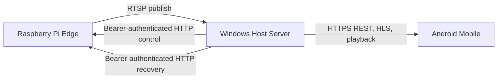

# AI CCTV

AI CCTV는 Raspberry Pi 카메라, Windows 중앙 서버, Android 앱을 연결해 영상을
녹화하고 사람 감지 이벤트와 관련 녹화를 조회하는 영상 모니터링 시스템이다.

## 📑 Table of Contents

1. [Project Overview](#-project-overview)
2. [System Requirements & Hardware Setup](#-system-requirements--hardware-setup)
3. [Installation & Execution Guide](#-installation--execution-guide)
4. [System Workflow & Verification](#-system-workflow--verification)
5. [Documentation Links](#-documentation-links)
6. [Troubleshooting](#-troubleshooting)
7. [Team Members & Roles](#-team-members--roles)
8. [License](#-license)

## 📌 Project Overview

### 1.1 Summary & Objectives

Edge는 카메라 영상을 중앙 MediaMTX로 송출하면서 연결 장애에 대비한 로컬 녹화를
유지한다. 중앙 서버는 영상 녹화, 사람 감지·추적, 인물 특징 연결, 이벤트·미디어 저장을
담당한다. Android 앱과 Server Desktop은 로그인한 사용자가 실시간 영상, 이벤트 이미지,
관련 녹화와 장치 상태를 확인하게 한다.

### 1.2 Key Features

- Raspberry Pi 및 로컬 카메라의 RTSP 수신과 중앙 녹화
- YOLO/ByteTrack 사람 감지·추적과 OSNet 기반 외관 특징 연결
- Snapshot, Person Crop, 선택적 Annotated Snapshot, 관련 녹화 조회
- Desktop의 RTSP 우선 재생과 인증 HLS fallback, Android의 인증 HLS 재생
- Edge 상태 수집, HD/FHD 변경, 장애 구간 녹화 복구
- 선택적 Firebase Cloud Messaging 알림
- CPU 실행과 NVIDIA CUDA 실행 정책 지원

### 1.3 System Overview


```mermaid
flowchart LR
    Edge[Raspberry Pi Edge] -->|RTSP publish| Server[Windows Host Server]
    Server -->|HTTPS REST, HLS, playback| Mobile[Android Mobile]
    Server -->|Bearer-authenticated HTTP control| Edge
    Server -->|Bearer-authenticated HTTP recovery| Edge
```

REST 외에도 UDP Discovery, RTSP, HLS가 사용된다. 서비스별 연결과 포트, WSL 2/Docker
Desktop 경계는 [Architecture & Network Topology](docs/architecture.md)를 따른다.

### 1.4 Tech Stack

| 영역 | 주요 기술 |
| --- | --- |
| Host Server | Windows 10/11 x64, Docker Desktop, Docker Compose v2, Nginx, FastAPI, SQLite, MediaMTX |
| AI | Python 3.11, YOLO/ByteTrack, ONNX Runtime, OSNet, OpenCV |
| Edge | Raspberry Pi OS Bookworm ARM64, Python 3.11, systemd, MediaMTX, rpicam/GStreamer |
| Mobile | Flutter, Dart, Android SDK, HLS, Firebase Cloud Messaging(선택) |
| Server Desktop | Python 3.11, PyQt5, RTSP/HLS client |

## 🖥 System Requirements & Hardware Setup

### 2.1 Hardware Setup

- **Host PC:** Windows 10/11 x64, 중앙 녹화와 모델 실행에 충분한 저장 공간. GPU는 선택이다.
- **Edge:** Raspberry Pi OS Bookworm ARM64를 실행할 수 있는 Raspberry Pi와 지원 카메라.
- **Mobile:** 서버의 HTTP(S) 주소에 접근할 수 있는 Android 기기.
- 최초 Edge 발견·등록 시 Host PC와 Raspberry Pi를 같은 신뢰 IPv4 LAN에 연결한다.

GPIO 센서·액추에이터 배선은 현재 제품 설치 계약에 포함되지 않는다. Edge가 보고하는
전원·배터리 수치는 운영체제가 제공할 때만 표시되며 센서가 없으면 `null`일 수 있다.

### 2.2 Software Prerequisites

| 경로 | 필수 항목 |
| --- | --- |
| Server 설치 파일 | Docker Desktop Linux container mode, Docker Compose v2 |
| Server source | 위 항목 + Git, Python 3.11.x, `uv` |
| Edge 패키지 | Raspberry Pi OS Bookworm ARM64와 패키지 설치용 네트워크 |
| Edge 패키지 빌드 | ARM64 Linux, Python 3.11/pip, dpkg 도구, 검증된 ARM64 MediaMTX |
| Mobile 개발 | 프로젝트 lockfile과 호환되는 Flutter/Dart, Android SDK, JDK 17 |

Docker Desktop은 WSL 2 backend를 사용할 수 있지만 WSL 내부에서 서버를 별도로 실행하는
방식은 공식 경로가 아니다. Node.js는 현재 Server·Edge·Mobile 빌드 요구사항이 아니다.

AI profile에는 YOLO 호환 감지 모델과 OSNet ONNX 모델이 필요하다. HTTPS는 인증서와 PEM
개인키가 필요하며, 신뢰 LAN에서만 명시적으로 HTTP를 선택할 수 있다. NVIDIA GPU 실행은
호환 드라이버와 Docker GPU 지원 환경이 추가로 필요하다.

## 🛠 Installation & Execution Guide

공개 GitHub Release에 실제 설치 자산이 있는 경우에만 해당 자산을 사용한다. 필요한 자산이
없으면 아래 source/build 경로를 사용한다. GitHub의 자동 `Source code.zip`은 Windows 설치
파일, Edge DEB 또는 서명된 APK가 아니다.

### 3.1 Host Server Setup

Windows PowerShell에서 저장소를 준비하고 Install Helper를 실행한다.

```powershell
git clone https://github.com/Eye-O-T/new_structure.git
cd new_structure
python --version
uv --version
docker --version
docker compose version
uv sync --project server/setup/install_helper --locked
uv run --project server/setup/install_helper --locked python -m server.setup.install_helper
```

GUI에서 Docker·Compose·모델·TLS 조건을 검사하고 저장 위치, 공개 주소, 관리자 계정을
설정한 뒤 **설치 및 시작**을 실행한다. 기본 설치 저장소는
`C:\ProgramData\AI_CCTV`이고 Compose 환경 파일은
`C:\ProgramData\AI_CCTV\config\compose.env`다. 저장 위치를 바꿨다면 해당 경로의
`config\compose.env`를 사용한다.

설치 후 상태와 실시간 로그는 다음처럼 확인한다. `Ctrl+C`는 로그 조회만 종료하며 서버
컨테이너는 계속 실행된다.

```powershell
uv run --project server/setup/install_helper --locked python -m server.setup.install_helper.cli status --env-file 'C:\ProgramData\AI_CCTV\config\compose.env'
uv run --project server/setup/install_helper --locked python -m server.setup.install_helper.cli logs --env-file 'C:\ProgramData\AI_CCTV\config\compose.env'
```

GUI는 서버 로그를 터미널에 계속 출력하는 명령이 아니다. 개발자가 수동 source 배포를
구성하지 않았다면 `server/.env`가 존재한다고 가정하지 않는다. 자세한 Install Helper 동작은
[Server Install Helper](server/setup/install_helper/README.md)를 참고한다.

### 3.2 Edge Setup

Release에 ARM64 DEB와 같은 이름의 checksum이 있으면 Raspberry Pi에서 검증 후 설치한다.
`<version>`은 실제 파일의 버전으로 바꾼다.

```bash
sha256sum -c ai-cctv-edge_<version>_arm64.deb.sha256
test "$(dpkg --print-architecture)" = arm64
sudo apt update
sudo apt install ./ai-cctv-edge_<version>_arm64.deb
sudo ai-cctv-edge pair --device-id edge-001 --camera-id cam-001
```

`pair`는 UDP/37020으로 미설정 Edge를 광고하고 TCP/8003에서 최초 설정을 기다린다.
Server Desktop의 **카메라 연결**에서 **Edge 찾기** → 장치 선택 → 카메라 이름·연결 설정
확인 → **선택한 Edge 연결** 순서로 진행한다. 현재 구현은 등록 시 32자 이상의 Edge 운영
인증 토큰을 요구하고, 같은 값을 중앙 등록과 Edge Control/Recovery에 사용한다. 이미 설정된
장치에는 `pair`를 다시 실행하지 않는다.

Edge는 GPIO 센서 REST client가 아니다. 카메라 캡처·RTSP 송출·로컬 녹화와
Bearer 인증 Control/Recovery API를 제공하는 systemd 서비스다. 설치·수동 등록·패키지
빌드는 [Raspberry Pi Edge](edge/README.md)를 참고한다.

### 3.3 Mobile Client Setup

Release에 서명된 `app-release.apk`가 있으면 Android 기기에서 설치한다. 앱 로그인 화면에는
`https://cctv.example.com`처럼 Host Server의 HTTP(S) base URL과 서버 계정을 입력하고
`/api/v1`은 붙이지 않는다. 휴대전화의 `localhost`는 Host Server가 아니다.

Source build는 `mobile/`에서 수행한다.

```sh
cd mobile
flutter pub get
flutter analyze
flutter test
flutter build apk --release --dart-define=API_BASE_URL=https://cctv.example.com
```

Release APK에는 배포용 서명 키가 필요하다. Flutter/Dart 버전, JDK 17, Firebase 설정과
서명 파일 형식은 [AI CCTV Android](mobile/README.md)를 따른다.

## 🔄 System Workflow & Verification

### 4.1 Startup Sequence

1. Docker Desktop을 시작하고 Install Helper에서 Server 상태가 ready인지 확인한다.
2. Raspberry Pi Edge 서비스를 시작하고 RTSP 송출·Control/Recovery 상태를 확인한다.
3. Server Desktop에서 로그인하고 등록된 카메라의 live view를 확인한다.
4. Android 앱에 Server base URL과 계정을 입력해 로그인한다.

### 4.2 End-to-End Test Scenarios

1. **Live:** Edge 영상이 MediaMTX에 게시되고 Desktop RTSP 및 Mobile HLS에서 재생되는지 확인한다.
2. **Detection:** 사람이 등장했을 때 객체 좌표와 새 이벤트가 생성되는지 확인한다.
3. **Event media:** Snapshot, Person Crop, 선택적 Annotated Snapshot과 관련 녹화를 확인한다.
4. **Control:** 관리자 계정으로 HD/FHD를 변경하고 Edge와 중앙 상태가 같은 profile을 보고하는지 확인한다.
5. **Recovery:** 중앙 연결을 일시 중단한 뒤 Edge 로컬 조각이 복구되고 크기·SHA-256 검증을 통과하는지 확인한다.
6. **Mobile:** 로그인·토큰 갱신·HLS·이벤트·녹화 재생을 확인하고, Firebase 사용 시 실제 알림 도착을 별도로 확인한다.

실제 Raspberry Pi 카메라, GPU, WAN, Android 알림은 해당 장비와 외부 구성을 준비해야 검증할
수 있다. 단위 테스트나 컨테이너 healthcheck만으로 하드웨어 성공을 주장하지 않는다.

## 📚 Documentation Links

- [Architecture & Network Topology](docs/architecture.md)
- [Unified REST API Specification — OpenAPI 3.1](docs/openapi.yaml)
- [Server Install Helper](server/setup/install_helper/README.md)
- [Raspberry Pi Edge](edge/README.md)
- [Android Mobile](mobile/README.md)
- [Model Preparation and Release Records](server/tools/README.md)
- [Preprocessing Service](server/services/preprocessing/README.md)
- [Analysis Service](server/services/analysis/README.md)
- [Data Service](server/services/data/README.md)
- [External API Service](server/services/external/README.md)

## 🧰 Troubleshooting

### 6.1 WSL 2, Docker Desktop, and Host IP

- Mobile과 Edge에는 WSL 2 내부 IP가 아니라 Windows Host의 LAN IP 또는 DNS를 사용한다.
- `docker info`와 `docker compose version`으로 Linux engine과 Compose를 확인한다.
- LAN 접근이 필요하면 공개 HTTP(S)와 RTSP bind 주소가 loopback에만 묶여 있지 않은지 확인한다.
- Windows Defender Firewall에는 필요한 LAN source와 포트만 허용한다. RTSP와 Edge 관리 포트를
  WAN에 직접 공개하지 않는다.

### 6.2 Raspberry Pi Discovery and HTTP Timeouts

- Host와 Pi가 같은 IPv4 LAN인지, 공유기의 AP isolation이 꺼져 있는지 확인한다.
- UDP/37020, Pi TCP/8003·8002, Host RTSP/TCP 8554의 방향별 방화벽을 확인한다.
- Pi에서 `sudo ai-cctv-edge doctor`, `status`, `logs`를 실행한다.
- 중앙 서버에서는 Install Helper의 `doctor`, `status`, `logs`를 사용한다.
- IP가 바뀌었다면 중앙에 저장된 management/recovery URL을 갱신한다. MAC은 인증 비밀값이
  아니며 Control/Recovery는 operational Bearer token으로 인증한다.

## 👥 Team Members & Roles

현재 저장소 문서에는 확정된 팀원 명단과 역할이 선언되어 있지 않다. 이름이나 역할을
추정해서 기록하지 않으며, 프로젝트 관리자가 확정한 정보가 있을 때 이 절을 갱신한다.

## 📄 License

이 프로젝트의 자체 소스 코드는 [MIT License](LICENSE)로 제공한다. 외부 라이브러리,
컨테이너 이미지와 AI 모델에는 각각의 라이선스가 적용된다.
