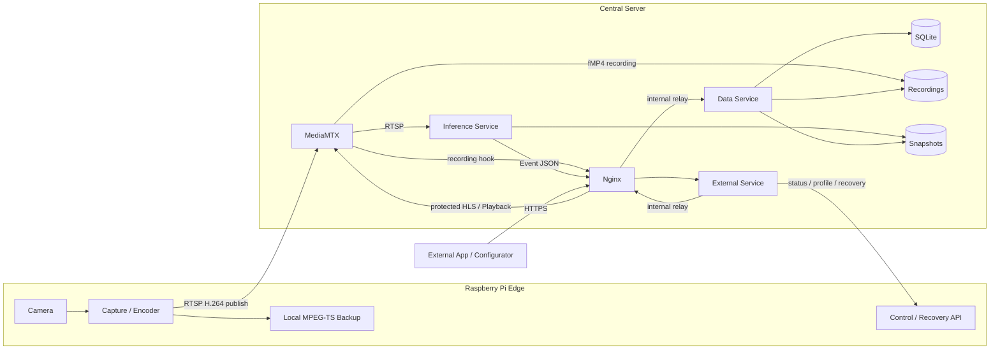
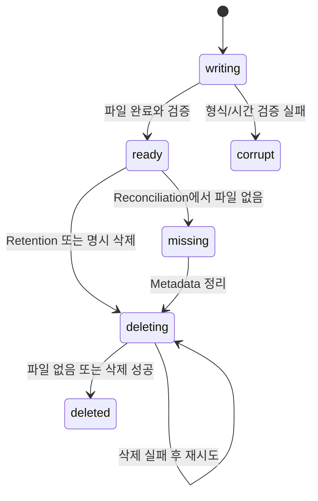
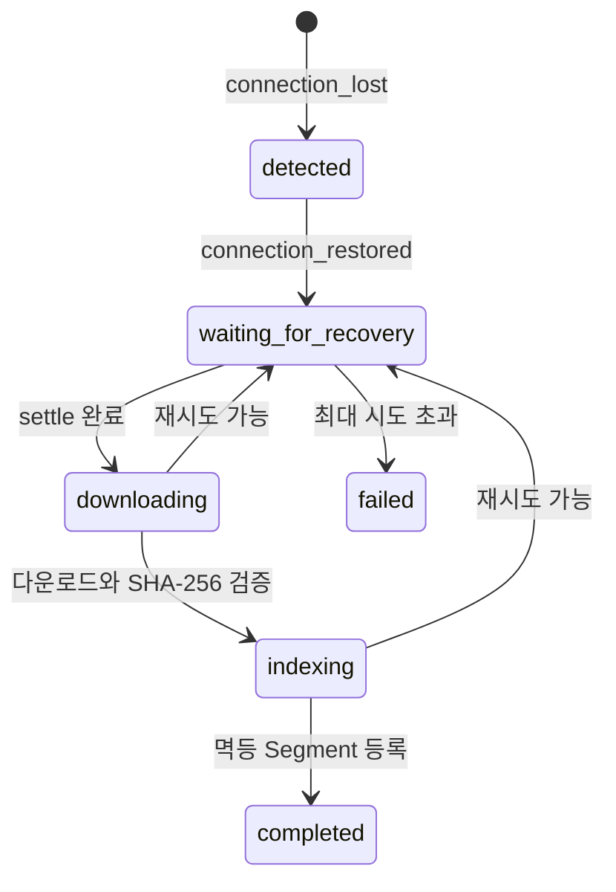
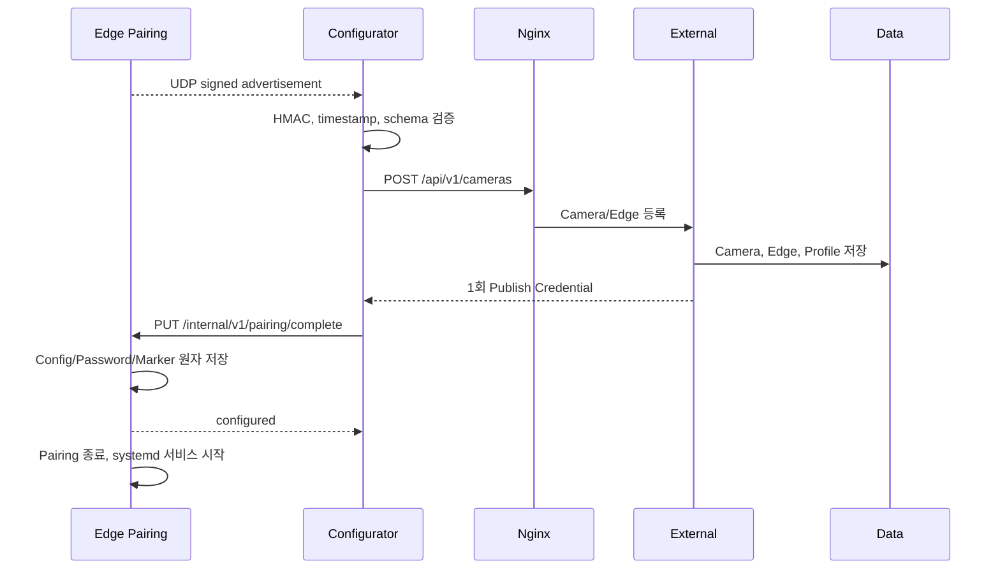
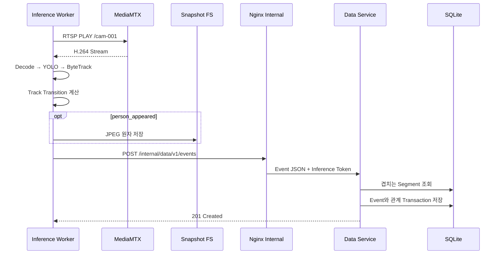
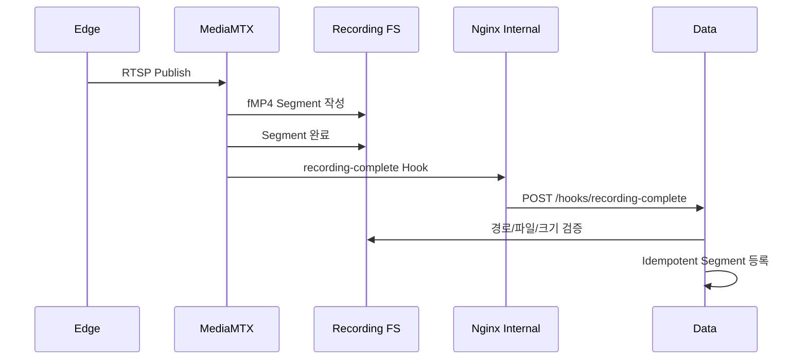
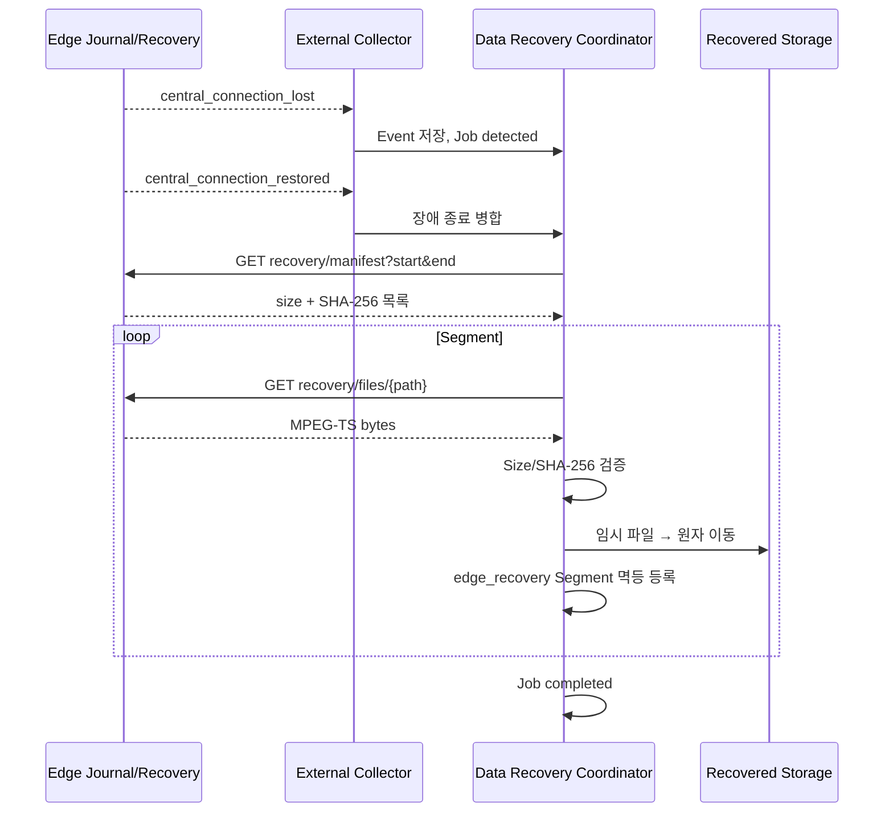

# AI_CCTV 소프트웨어 설계 명세서

## 목차

- [1. 문서 정보](#1-문서-정보)
- [2. 목적과 범위](#2-목적과-범위)
- [3. 설계 기준과 정본](#3-설계-기준과-정본)
- [4. 설계 원칙](#4-설계-원칙)
- [5. 시스템 설계 개요](#5-시스템-설계-개요)
- [6. 공통 설계 규칙](#6-공통-설계-규칙)
- [7. Configurator와 Installer 상세 설계](#7-configurator와-installer-상세-설계)
- [8. Edge 상세 설계](#8-edge-상세-설계)
- [9. MediaMTX 상세 설계](#9-mediamtx-상세-설계)
- [10. Inference Service 상세 설계](#10-inference-service-상세-설계)
- [11. Data Service 상세 설계](#11-data-service-상세-설계)
- [12. External Service 상세 설계](#12-external-service-상세-설계)
- [13. Nginx 상세 설계](#13-nginx-상세-설계)
- [14. 인터페이스 설계](#14-인터페이스-설계)
- [15. 데이터 설계](#15-데이터-설계)
- [16. 주요 처리 시퀀스](#16-주요-처리-시퀀스)
- [17. 상태와 동시성 설계](#17-상태와-동시성-설계)
- [18. 보안 설계](#18-보안-설계)
- [19. 장애 처리와 관측성](#19-장애-처리와-관측성)
- [20. 배포·설정·영속성 설계](#20-배포설정영속성-설계)
- [21. 계층 교체와 확장 규칙](#21-계층-교체와-확장-규칙)
- [22. 테스트 설계와 요구사항 추적성](#22-테스트-설계와-요구사항-추적성)
- [23. 현재 제한과 후속 설계](#23-현재-제한과-후속-설계)

## 1. 문서 정보

| 항목 | 값 |
| --- | --- |
| 문서명 | Software Design Specification |
| 대상 시스템 | AI_CCTV |
| 대상 저장소 | `Eye-O-T/AI_CCTV` |
| 설계 기준 버전 | `0.3.0-draft` |
| 설정 Schema | `schema_version: 1` |
| 기준일 | 2026-08-23 |
| 중앙 기준 환경 | Windows 10/11 x64, Docker Desktop, Docker Compose v2 |
| Edge 기준 환경 | Raspberry Pi OS Bookworm 64-bit, Python 3.11, GStreamer |
| 구현 기준 | 중앙 MediaMTX, 최대 4개 활성 Camera, RTSP/HLS/Recording, Inference/Data/External 분리, Edge Pairing·상태·복구 |
| 문서 상태 | 현재 구현 정합화 설계안 |

## 2. 목적과 범위

이 문서는 [SRS](SRS.md)에 정의된 요구사항을 코드와 배포 단위로 어떻게 실현하는지
명세한다. [아키텍처 설계서](ARCHITECTURE.md)가 시스템 경계와 설계 결정을 설명한다면,
이 문서는 각 구성 요소의 책임, 내부 모듈, 데이터 구조, 인터페이스, 알고리즘, 상태 전이,
보안, 장애 처리와 시험 지점을 구현 가능한 수준으로 정의한다.

포함 범위는 다음과 같다.

- Windows 중앙 서버 Configurator와 Installer
- Raspberry Pi Edge Capture, Control, Pairing, Monitoring, Recovery
- 중앙 Nginx, MediaMTX, Inference, Data, External Service
- RTSP, HLS, HTTPS REST, 내부 HTTP, UDP Discovery 인터페이스
- SQLite Schema, 파일 저장 구조와 데이터 정합성 처리
- 사용자 인증, 내부 서비스 인증, Camera 게시 인증
- Docker Compose 배포, Health Check, 로그와 자동 검증
- 구현 계층 교체와 AI Metadata 확장 규칙

다음 항목은 설계 범위 밖이거나 확장 지점으로만 정의한다.

- 모바일·Web 최종 사용자 UI 구현
- Cloud 기반 대규모 분산 처리
- 얼굴 식별과 생체정보 기반 사용자 식별
- 저장 영상 암호화 구현
- 모델 자동 다운로드와 모델 라이선스 판정
- MQTT 기반 운영 Event Bus

`client_code/`, `rtsp/`, `rtspv1.0/`은 회귀와 아이디어 검증을 위한 Legacy 코드다.
운영 설계의 정본은 `server/`, `edge/`, `configurator/`, `src/ai_cctv_core/`이다.

## 3. 설계 기준과 정본

설계와 구현을 변경할 때 다음 문서를 함께 갱신한다.

| 관심사 | 정본 |
| --- | --- |
| 시스템 요구사항과 합격 기준 | [SRS.md](SRS.md) |
| 서비스 경계와 신뢰 경계 | [ARCHITECTURE.md](ARCHITECTURE.md) |
| 구현 상세와 계층 교체 계약 | 이 문서 |
| 공개 REST/HLS 계약 | [docs/external-app-integration.md](docs/external-app-integration.md), `/api/v1/openapi.json` |
| 공개 API Request/Response 검증 | `server/services/external/app/schemas.py` |
| 내부 Data API 검증 | `server/services/data/app/schemas.py` |
| 영속 DB Schema | `server/services/data/app/migrations/*.sql` |
| 중앙 배포 Topology | `server/compose.yml` |
| 중앙 설정 Schema | `src/ai_cctv_core/config.py` |
| Edge 설정 Schema | `edge/src/ai_cctv_edge/config.py` |

문서와 실행 코드가 충돌하면 충돌을 구현 차이로 기록한 뒤 수정한다. 문서만으로 실제
API 검증 규칙이나 DB Migration을 덮어쓰지 않는다. 외부 연동자는 배포 중인 서버의
OpenAPI를 우선 사용한다.

## 4. 설계 원칙

### 4.1 책임 분리

- MediaMTX는 영상 수신, Remux, HLS, 녹화와 Playback만 담당한다.
- Inference Service는 영상 소비, 탐지, 추적과 AI Event 생성만 담당한다.
- Data Service는 SQLite와 영속 파일 Metadata의 유일한 소유자다.
- External Service는 사용자 인증, 권한 검사와 공개 API 조합을 담당한다.
- Nginx는 외부 단일 진입점과 내부 Relay를 담당하며 영상 Frame 처리에 참여하지 않는다.
- Edge는 Camera 취득, H.264 Encoding, 중앙 게시와 장애 중 로컬 Segment 생성을 담당한다.

### 4.2 단일 Writer와 파일·Metadata 분리

SQLite는 Data Service만 직접 연다. 영상과 Snapshot은 파일시스템에 저장하고 SQLite에는
상대 경로, 시간, 크기, Checksum, 상태와 관계만 기록한다. 다른 서비스는 내부 HTTP API로
Data Service를 호출한다.

### 4.3 실패 격리

- 추론 실패는 RTSP 중계, HLS와 녹화를 중단하지 않는다.
- 외부 API 실패는 MediaMTX의 중앙 녹화 프로세스를 중단하지 않는다.
- 중앙 연결 실패는 Edge Camera 취득과 로컬 백업을 중단하지 않는다.
- 하나의 Camera Worker 실패는 다른 Camera Worker를 종료하지 않는다.

### 4.4 계약 우선 교체 가능성

각 계층의 언어, Framework와 모델은 교체할 수 있다. 교체 구현은 프로토콜, Payload,
인증, 상태 의미, 파일 소유권, Health Check와 배포 계약을 유지해야 한다.

### 4.5 최소 권한과 기본 비공개

외부에는 Nginx의 HTTP/HTTPS와 필요한 경우 Camera 게시용 RTSP만 노출한다. Data,
External, Inference와 MediaMTX 제어·HLS 원본 Port는 Docker 내부 Network에서만 접근한다.

## 5. 시스템 설계 개요

### 5.1 구성 요소



### 5.2 런타임 단위와 소유권

| 단위 | 구현 위치 | 소유 상태 | 주요 출력 |
| --- | --- | --- | --- |
| Configurator | `configurator/` | 설치 요청, 생성 파일 경로 | Config, Secret, Compose 제어 |
| Edge Capture | `edge/.../runner.py`, `pipeline.py` | Capture Process 상태 | RTSP H.264, MPEG-TS Segment |
| Edge Control | `edge/.../control.py` | Runtime/Video Profile 상태 | Status, Capability, Event Journal |
| Edge Recovery | `edge/.../recovery.py` | 로컬 Backup 조회 | Manifest, Segment Download |
| MediaMTX | `server/mediamtx/` | Stream Session, Recording | RTSP, HLS, Recording, Playback |
| Inference | `server/services/inference/` | Camera Worker, Track 상태 | Event JSON, JPEG Snapshot |
| Data | `server/services/data/` | SQLite와 Metadata 정합성 | 내부 CRUD, 검색, 복구 Job |
| External | `server/services/external/` | 인증 Session 조합, Status Poller | 공개 REST, Media 인증 |
| Nginx | `server/nginx/` | Proxy Routing | HTTPS 단일 진입점 |

### 5.3 중앙 Network

모든 중앙 컨테이너는 `${COMPOSE_PROJECT_NAME}_internal` Bridge Network에 연결된다.

| Port | 소유자 | 노출 | 용도 |
| --- | --- | --- | --- |
| 80/TCP | Nginx | Host Publish | HTTP Health 또는 HTTPS Redirect |
| 443/TCP | Nginx | Host Publish | 공개 HTTPS API/HLS/Playback |
| 8554/TCP | MediaMTX | 설정에 따라 Host Publish | Edge RTSP Publish |
| 8080/TCP | Nginx | Docker 내부 `expose` | `/internal/*` Relay |
| 8000/TCP | Data/External/Inference | Docker 내부 `expose` | 각 Python Service |
| 8888/TCP | MediaMTX | Docker 내부 | HLS Origin |
| 9996/TCP | MediaMTX | Docker 내부 | Playback Origin |
| 9997/TCP | MediaMTX | Docker 내부 | Control API |

## 6. 공통 설계 규칙

### 6.1 식별자

- `camera_id`는 `^[a-z0-9][a-z0-9_-]{0,63}$`를 만족한다.
- Schema Version 1에서 `stream_path`는 `camera_id`와 같아야 한다.
- `edge_device_id`는 장치 단위 식별자이며 Camera ID와 별개다.
- `track_id`는 한 Camera Worker의 추적 Session 안에서만 유효한 임시 ID다.
- DB의 정수 `id`는 내부 Resource 식별자이며 외부 Camera 식별자로 사용하지 않는다.

### 6.2 시각

- 저장과 서비스 간 교환은 UTC를 사용한다.
- JSON Timestamp는 `Z`가 붙은 ISO 8601/RFC 3339 문자열을 사용한다.
- 시간 구간은 가능한 한 반개방 구간 `[start, end)`로 처리한다.
- Segment 겹침 판정은 `segment.start_time < query_end AND segment.end_time > query_start`다.
- 사용자 현지 시간 변환은 Client 표시 계층의 책임이다.

### 6.3 경로

- DB에는 Storage Root 기준 POSIX 형식 상대 경로를 저장한다.
- 절대 경로, `..`, Root 밖으로 해석되는 경로와 역슬래시 기반 우회는 거부한다.
- 파일을 최종 경로에 노출하기 전에 임시 파일 작성, `fsync`, 검증, 원자 Rename 순서를 사용한다.
- Snapshot 경로와 Recording 경로는 서로 다른 Root를 사용한다.

### 6.4 JSON과 오류

- HTTP JSON은 UTF-8과 `application/json`을 사용한다.
- Request Model은 알 수 없는 필드를 기본적으로 거부한다.
- Data Service 오류는 다음 안정 형식을 사용한다.

```json
{
  "error": {
    "code": "VALIDATION_ERROR",
    "message": "요청 값이 유효하지 않습니다.",
    "details": []
  }
}
```

- Validation 오류의 `details`에는 위치, 메시지와 유형만 포함하고 입력 Secret 값은 반사하지 않는다.
- 공개 API는 `400`, `401`, `403`, `404`, `409`, `422`, `429`, `503`의 의미를 구분한다.

### 6.5 활성 Camera 제한

현재 기준은 최대 4개의 활성 Camera다. Data Service는 활성 Camera 수를 검증하고,
Inference Supervisor도 활성 목록의 처음 4개만 Worker로 구성한다. Camera 비활성화는
이력 삭제와 다르며 비활성 Camera는 활성 한도에 포함하지 않는다.

## 7. Configurator와 Installer 상세 설계

### 7.1 모듈

| 모듈 | 책임 |
| --- | --- |
| `config_core.py` | 설치 입력 검증, Config/Secret/Certificate/Model 원자 배치 |
| `model_manager.py` | 확장자·크기·읽기 권한·SHA-256 검증과 모델 복사 |
| `private_files.py` | Unix Mode 또는 Windows DACL 기반 Private File 처리 |
| `compose_adapter.py` | Compose 시작·정지·재시작·상태 조회 |
| `doctor.py` | Docker, Compose, 경로, Model, Service Health 진단 |
| `server_api.py` | 관리자 API를 이용한 Camera/Edge/Profile 관리 |
| `edge_discovery.py` | UDP 광고 수신, Schema/HMAC/Timestamp/중복 검증 |
| `edge_pairing.py` | 중앙 Camera 등록과 일회 게시 자격증명 전달 조정 |
| `cli.py`, `gui.py` | 동일 Config Core를 사용하는 CLI/GUI Adapter |

### 7.2 초기화 입력과 출력

Configurator는 다음 입력을 검증한다.

- 저장 Root와 Config/Secret/Model/Certificate 대상 경로
- 관리자 Username과 Password
- 공개 HTTPS Origin, HTTP/HTTPS/RTSP Port와 Bind Address
- 사용자가 내려받은 `.pt`, `.onnx`, `.engine` 모델 파일
- 함께 일치하는 PEM Certificate와 Private Key
- 선택적인 초기 Camera와 Edge 정보

초기화는 다음 산출물을 생성한다.

```text
<runtime-root>/
├── config/config.yaml
├── secrets/data.env
├── secrets/external.env
├── secrets/inference.env
├── secrets/media.env
├── models/<validated-model>
├── database/
├── recordings/
├── recovered/
├── snapshots/
├── logs/
└── certs/tls.crt, tls.key
```

Config, Secret과 Credential 파일은 임시 파일에 작성한 뒤 원자 교체한다. 기존 파일이
있으면 덮어쓰기 전에 Backup을 만들며, Secret과 Private Key는 일반 사용자에게 노출되지
않는 권한을 적용한다.

### 7.3 Windows Installer

Inno Setup Script는 Configurator GUI와 CLI 실행 파일, Compose 자원과 문서를 설치한다.
프로그램 코드는 Program Files, 변경 가능한 운영 데이터는 ProgramData에 둔다. 제거 시
Runtime Data는 자동 삭제하지 않는다. Docker Desktop이 없어도 파일 설치는 완료할 수
있지만 서비스 시작 전에는 Docker와 Compose v2를 검사한다.

### 7.4 Edge Discovery와 Pairing

설정 전 Edge는 UDP 37020 Broadcast로 최대 8192 Byte의 JSON 광고를 전송한다.

```json
{
  "message_type": "AI_CCTV_EDGE_ADVERTISE",
  "version": 1,
  "message_id": "4bd6931f-64bf-4d8c-8668-a9f739ecb45b",
  "sent_at": 1787460000,
  "device_id": "edge-001",
  "camera_id": "cam-001",
  "management_port": 8003,
  "recovery_port": 8002,
  "supported_profiles": ["hd", "fhd"],
  "signature": "<HMAC-SHA256 hex>"
}
```

서명 대상은 `signature`를 제외한 Canonical JSON이다. Configurator는 사용자가 입력한
32자 이상 Pairing Key로 서명을 검증한다. UDP Payload의 IP 문자열은 신뢰하지 않고 실제
UDP Peer 주소와 광고된 Port로 Management/Recovery URL을 만든다. 잘못된 Schema,
만료 Timestamp, 중복 Message ID, 비정상 Port/Profile과 서명 불일치는 무시한다.

중앙 Camera 생성에 성공하면 한 번만 반환된 RTSP 게시 자격증명을 Pairing API로 전달한다.
Pairing API는 Device/Camera 일치를 검사하고 Config, Password와 `.configured` Marker를
원자 저장한 뒤 Discovery와 임시 API를 종료한다. 실패하면 제한 권한 Handoff File을
사용하는 수동 절차로 복구한다.

## 8. Edge 상세 설계

### 8.1 프로세스 분리

| Process/Service | 기본 생명주기 | 책임 |
| --- | --- | --- |
| `ai-cctv-edge.service` | systemd | Camera Capture, Encoding, Backup, RTSP Publish |
| `ai-cctv-edge-control.service` | systemd | Status, Capability, Profile 변경, Event Journal |
| `ai-cctv-edge-recovery.service` | systemd | 장애 구간 Manifest와 Segment Download |
| Pairing Listener | 설정 전 임시 | UDP Discovery와 Pairing 완료 API |

Recovery Service는 Capture와 분리하여 Capture 장애 중에도 이미 완료된 Segment를 제공한다.

### 8.2 Capture Pipeline

기본 GStreamer Pipeline은 다음 논리 구조다.

```text
libcamerasrc
  → raw caps(width, height, fps)
  → watchdog
  → videoconvert
  → x264enc 또는 v4l2h264enc
  → h264parse(config-interval=1)
  → tee
      ├─ splitmuxsink(mpegtsmux, 기본 10초 Segment)
      └─ shmsink → RTSP Publisher
```

기본 `hd` Profile은 1280×720, 30fps, 2,000kbps다. 선택 `fhd` Profile은
1920×1080, 30fps, 4,000kbps다. Encoder는 `x264enc` 또는 `v4l2h264enc`를 사용한다.
RTSP 전송 Branch는 `leaky=downstream` Queue를 사용하여 중앙 전송 지연이 Capture와
로컬 Segment 생성을 역압으로 정지시키지 않게 한다.

`central_publish`가 운영 기본이다. Edge Publisher가 Camera별 자격증명으로 중앙
`rtsp://<central>:8554/<camera_id>`에 게시한다. `central_pull`은 Edge MediaMTX를
기동하고 중앙이 읽는 전환·시험용 모드다.

### 8.3 Local Backup과 Retention

Segment는 다음 구조로 저장한다.

```text
<backup-root>/<camera_id>/YYYY/MM/DD/<UTC timestamp>_<sequence>.ts
```

완료되지 않았을 가능성이 있는 최신 파일은 Recovery Manifest에서 보수적으로 제외한다.
Retention은 `max_bytes`와 `max_age_hours`를 적용하되 작성 중인 파일을 삭제하지 않는다.
복구 성공이 Edge 원본의 즉시 삭제를 의미하지 않는다.

### 8.4 Status와 Event Journal

Control Service는 시스템 사용량, 전원, Camera 입력, 중앙 연결, 현재/요청 Profile과
Capture 상태를 합성한다. Camera 입력은 프로세스 존재만이 아니라 마지막 실제 Frame
활동과 Watchdog 결과를 기준으로 판단한다.

주요 Edge Event Type은 다음과 같다.

- `camera_input_lost`, `camera_input_restored`
- `central_connection_lost`, `central_connection_restored`
- `external_power_lost`, `external_power_restored`
- `battery_low`, `battery_critical`
- `video_profile_changed`, `video_profile_change_failed`

Event Journal은 Cursor 기반 페이지를 제공한다. External Status Collector는 마지막 Cursor
이후 Event만 가져오고 `edge_event_id`로 중앙 저장을 멱등 처리한다.

### 8.5 Video Profile 변경 Transaction

1. 요청 Profile이 `hd` 또는 `fhd`인지 검사한다.
2. Camera index 0의 Sensor Mode와 최대 FPS를 조사한다.
3. 요청 해상도와 FPS를 Camera가 지원하는지 검사한다.
4. 선택 Encoder 존재 여부와 제한된 Test Pipeline을 검사한다.
5. 요청 Profile을 Generation과 함께 원자 저장한다.
6. Capture Runtime이 새 Pipeline을 시작하고 실제 상태를 보고한다.
7. 성공하면 `current_profile`을 갱신한다.
8. 실패하면 이전 Profile로 Rollback하고 오류 Event를 기록한다.

Capability를 판정할 수 없으면 `CAPABILITY_UNKNOWN`, 지원하지 않으면
`UNSUPPORTED_VIDEO_PROFILE`로 거부한다. 실패 시 기존 Pipeline을 유지한다.

### 8.6 Edge HTTP API

모든 `/internal/v1/*` 요청은 Edge Bearer Token을 요구한다.

| Method | Path | 책임 |
| --- | --- | --- |
| GET | `/health/live` | Process 생존 확인 |
| GET | `/internal/v1/status` | Runtime/Resource/Power 상태 |
| GET | `/internal/v1/capabilities/video` | 지원 Profile과 Encoder Capability |
| PUT | `/internal/v1/config/video-profile` | Profile 변경 Transaction 시작 |
| GET | `/internal/v1/events` | Cursor 기반 운영 Event Journal |
| GET | `/v1/recovery/manifest` | 겹치는 완료 Segment 목록 |
| GET | `/v1/recovery/files/{path}` | 검증된 상대 경로 Segment Download |
| PUT | `/internal/v1/pairing/complete` | 설정 전 Pairing 완료 |

## 9. MediaMTX 상세 설계

### 9.1 역할

MediaMTX 1.9.0은 중앙의 단일 Media Gateway다. RTSP 수신, 내부 RTSP Reader 제공,
HLS Remux, fMP4 Recording, Playback과 Control API를 제공한다. RTMP, WebRTC, SRT,
Metrics와 PPROF는 기준 배포에서 비활성화한다.

### 9.2 Path와 인증

- Media Path는 Camera ID와 동일하다.
- Publish 요청은 External Service의 Media Authentication Callback으로 검증한다.
- Camera별 Publish Username/Password는 해당 Camera Path에만 권한을 갖는다.
- RTSP Read는 Publish 자격증명과 분리된 Inference Reader 자격증명을 사용한다.
- HLS와 Playback 원본은 Nginx와 External 인증 뒤에만 노출한다.

### 9.3 Recording

기본 Recording은 Camera별 60초 fMP4 Segment다. 완료 Hook는 Nginx 내부 경로를 거쳐
Data Service에 파일 경로와 Camera 정보를 전달한다. Data Service가 실제 파일을 확인하고
시간, 크기와 상대 경로를 정규화한 뒤 `recording_segments`에 멱등 등록한다.

공식 MediaMTX Image가 Scratch 기반이므로 작은 Alpine Wrapper에 Shell, CA Certificate와
`curl`을 추가하여 Hook와 HTTP Health Check를 실행한다.

## 10. Inference Service 상세 설계

### 10.1 모듈

| 모듈 | 책임 |
| --- | --- |
| `settings.py` | 내부 API, RTSP Reader, Model, FPS와 Timeout 설정 검증 |
| `data_client.py` | 활성 Camera 조회, Camera 상태와 Event 전송 |
| `supervisor.py` | Camera 목록 Reconciliation과 Worker 생명주기 |
| `pipeline.py` | RTSP Decode, YOLO/ByteTrack, Snapshot, Event 전송 |
| `event_state.py` | Frame Detection을 출현·퇴장 Transition으로 변환 |
| `main.py` | Lifespan, Health와 내부 상태 API |

### 10.2 Supervisor

Supervisor는 `REFRESH_SECONDS` 주기로 `GET /internal/data/v1/cameras/enabled`를 호출한다.
활성 Camera별 하나의 Thread Worker를 유지하고, 비활성·삭제된 Camera Worker를 정상
종료한다. 죽은 Worker는 다시 생성한다. Data API 실패는 기존 Worker를 즉시 제거하지 않고
Readiness와 `last_error`에 반영한다.

### 10.3 Camera Worker

Camera Worker는 다음 순서로 동작한다.

1. 별도 Username/Password로 MediaMTX RTSP URL을 만든다.
2. OpenCV FFmpeg Backend로 RTSP를 연다.
3. `analysis_fps`에 맞춰 분석 Frame을 Sampling한다.
4. YOLO Person Class만 탐지하고 ByteTrack ID를 얻는다.
5. Detection을 `track_id`, `confidence`, `bbox`로 정규화한다.
6. 새 Track은 `person_appeared`, 제한 시간 동안 보이지 않는 Track은
   `person_disappeared`로 변환한다.
7. 출현 시 JPEG Snapshot을 공유 Snapshot Root에 저장한다.
8. Event JSON을 Data Service에 전송한다.
9. RTSP 실패 시 최대 15초까지 지수 Backoff로 재접속한다.

기본값은 Confidence 0.4, 분석 5fps, 사라짐 판정 3초다. `track_id`는 영구적인 사람
식별자가 아니며 Process 재시작, Stream 재연결과 장시간 가림 후 재사용을 보장하지 않는다.

### 10.4 Event Payload

Inference가 `POST /internal/data/v1/events`로 보내는 기준 Payload는 다음과 같다.

```json
{
  "camera_id": "cam-001",
  "event_type": "person_appeared",
  "occurred_at": "2026-08-23T12:34:56.123456Z",
  "person_id": "42",
  "track_id": "42",
  "confidence": 0.91,
  "snapshot_path": "cam-001/2026/08/23/20260823T123456.123456Z_42.jpg",
  "metadata": {}
}
```

필수 필드는 `camera_id`, `event_type`, `occurred_at`이다. `confidence`는 `0..1`,
`event_type`은 소문자로 시작하는 `snake_case` 식별자다. `snapshot_path`는 Snapshot Root
기준 상대 경로다. 현재 구현은 출현 Event에만 Snapshot을 생성한다.

### 10.5 실패 동작

- Model Load 실패: `model_ready=false`로 표시하고 영상 감시는 비추론 모드로 계속한다.
- 추론 실행 실패: 해당 Worker의 Tracker를 비활성화하되 Stream Loop는 계속한다.
- RTSP Open/Read 실패: `inference_stream_lost`를 한 번 기록하고 재접속한다.
- RTSP 복구: 이전 실패가 있었을 때만 `inference_stream_restored`를 기록한다.
- Event API 실패: 경고를 기록하되 Video 소비 Thread를 종료하지 않는다.

Inference Stream 장애 Event는 Edge의 중앙 연결 장애와 다르며 Recovery Job을 만들지 않는다.

### 10.6 AI Attribute 확장

복장, 성별, 나이와 VLM 결과는 기본 Event 필드를 변경하지 않고 versioned `metadata`에
추가한다.

```json
{
  "schema_version": "1.0",
  "bbox": [120, 80, 410, 690],
  "attributes": {
    "hat": {"value": true, "confidence": 0.87},
    "top": {"category": "jacket", "color": "black", "confidence": 0.82},
    "bottom": {"category": "pants", "color": "blue", "confidence": 0.79},
    "bag": {"value": true, "category": "backpack", "confidence": 0.88},
    "gender": {"value": "unknown", "confidence": 0.54},
    "age": {"range": "30-39", "confidence": 0.61}
  }
}
```

`unknown`을 허용하고 각 추정값에 개별 Confidence를 둔다. 민감 Attribute는 접근 제어,
보관 기간과 사용 목적 검토 후 공개 API에 노출한다. 현재 v0.3 구현은 이 Attribute
추론을 제공하지 않는다.

## 11. Data Service 상세 설계

### 11.1 모듈

| 모듈 | 책임 |
| --- | --- |
| `config.py` | DB/Storage/Internal Token 설정 |
| `database.py` | SQLite Connection, Transaction, Migration, Backup, Health |
| `repository.py` | Entity CRUD, Search, 관계와 상태 전이 |
| `schemas.py` | 내부 API Request 검증 |
| `operations.py` | Recording Hook, Reconciliation, Retention, Path 정규화 |
| `recovery_coordinator.py` | Edge 장애 구간 병합, Download, 검증, Indexing, Retry |
| `errors.py` | 안정 JSON 오류 형식과 Secret 비반사 처리 |
| `main.py` | 내부 Router, Token Scope, Lifespan과 Health |

### 11.2 SQLite 사용

- Process 시작 시 Migration을 번호 순서로 한 Transaction 안에서 적용한다.
- `PRAGMA foreign_keys=ON`을 적용한다.
- WAL Mode와 Busy Timeout으로 읽기·쓰기 충돌을 줄인다.
- Repository의 복합 갱신은 명시적 Transaction을 사용한다.
- 다른 Container는 DB 파일을 직접 Mount하거나 열지 않는다.
- Backup은 SQLite Backup API를 사용하고 Database Root 밖 경로를 허용하지 않는다.

### 11.3 Recording 등록

Recording Hook 또는 Recovery 등록 시 다음 검증을 수행한다.

1. Camera 존재 여부와 ID 형식을 확인한다.
2. 상대 경로를 정규화하고 허용 Root 안의 실제 경로로 해석한다.
3. 파일 존재, 일반 파일 여부와 크기를 확인한다.
4. 시작·종료 시각과 Duration 일치를 검증한다.
5. `idempotency_key` 또는 Unique Path로 중복을 차단한다.
6. `ready` 상태 Segment를 생성한다.

Event 생성 시 발생 시각과 Pre/Post Roll 범위에 겹치는 Segment를 검색하여
`event_recording_segments` 관계를 만든다.

### 11.4 Reconciliation과 Retention

Reconciliation은 다음 차이를 수렴시킨다.

- DB에는 있으나 파일이 없음: `missing`으로 전이
- 표준 Recording 경로에 완료 파일이 있으나 DB에 없음: 멱등 Indexing
- 검증할 수 없는 파일: 삭제하지 않고 `orphaned` 진단 결과에 포함
- 중단된 `deleting`: 파일 유무에 따라 삭제 재시도 또는 `deleted`로 전이

Retention은 먼저 DB 상태를 `deleting`으로 전이하고 파일을 삭제한 뒤 `deleted`로
확정한다. 파일 삭제 실패 시 상태를 남겨 다음 Reconciliation에서 보상 처리한다.

### 11.5 Recovery Coordinator

Edge의 `central_connection_lost/restored` Event를 권위 있는 장애 경계로 사용한다.
동일 Camera에서 중복되거나 순서가 바뀐 Event는 시작 최솟값과 종료 최댓값으로 병합한다.
종료가 확인되고 Settle 시간이 지나면 다음 과정을 실행한다.

1. Edge Recovery Manifest 조회
2. 대상 Segment를 임시 파일로 Download
3. Content Length, Manifest Size와 SHA-256 검증
4. 최종 Recovery Root로 원자 이동
5. `source=edge_recovery`와 Idempotency Key로 Segment 등록
6. Summary 저장 후 Job 완료

실패 시 `attempt_count`, `last_error`, `next_retry_at`을 기록하고 제한된 지수 Backoff를
사용한다. 최대 횟수 초과 시 `failed`로 전이한다.

### 11.6 내부 Token Scope

Data Service는 Token별 호출자 Scope를 구분한다.

| Token | 주요 호출자 | 허용 책임 |
| --- | --- | --- |
| `DATA_EXTERNAL_TOKEN` | External | 사용자·Camera·검색·상태·Credential 조정 |
| `DATA_INFERENCE_TOKEN` | Inference | 활성 Camera 조회, 상태 갱신, Event 생성 |
| `DATA_MEDIA_TOKEN` | MediaMTX Hook | Recording 완료 등록 |
| `DATA_RECOVERY_TOKEN` | Recovery Coordinator | Segment와 Recovery Job 처리 |

## 12. External Service 상세 설계

### 12.1 역할과 모듈

External Service는 공개 API의 유일한 Application 계층이다.

| 모듈 | 책임 |
| --- | --- |
| `main.py` | 공개 Route, RBAC, Camera Lifecycle 조정, Media 인증 |
| `security.py` | Argon2id, JWT, Login Backoff |
| `dependencies.py` | Principal 해석과 Admin/Camera 권한 검사 |
| `data_client.py` | 내부 Data API Adapter와 오류 변환 |
| `media_client.py` | MediaMTX Control API Adapter |
| `edge_client.py` | Edge Control/Recovery Adapter |
| `status_collector.py` | Edge Status/Event Polling과 중앙 저장 |
| `schemas.py` | 공개 Request/Response Model |

### 12.2 인증

- Password는 Argon2id로 Hash한다.
- Access/Refresh JWT는 HS256과 256-bit 이상 Secret을 사용한다.
- Claim은 `sub`, `role`, `type`, `iat`, `exp`, `jti`, `iss`, `aud`를 포함한다.
- 기본 Access TTL은 15분, Refresh TTL은 7일이다.
- Refresh Token 원문은 저장하지 않고 Hash와 Family/Rotation 관계를 저장한다.
- Token 재사용과 Logout은 Refresh/Revoke 상태로 차단한다.
- Browser는 HttpOnly Secure Cookie, API Client는 Bearer Token을 사용할 수 있다.
- Login 실패는 Client/Username Key별 지수 Backoff를 적용한다.

### 12.3 권한

- `admin`: 사용자, Camera, Edge, Profile, Publish Credential과 운영 관리
- `viewer`: 명시적으로 허용된 Camera의 Live, Recording과 Event 조회
- Camera ACL은 `user_camera_permissions`로 관리한다.
- 목록과 상세 조회 모두 같은 ACL을 적용한다.
- HLS/Playback의 각 Manifest와 Segment 요청도 `/internal/auth/verify`로 검사한다.

### 12.4 Camera Lifecycle 조정

Camera 등록은 Data Record, Edge 정보, Video Profile과 Media Publish 인증을 함께 다룬다.
Camera별 Async Lock으로 등록·수정·삭제·Credential Rotation의 경쟁을 직렬화한다.
RTSP 게시 Password 원문은 생성 응답에서 한 번만 반환하고 DB에는 Hash만 저장한다.

Camera 삭제는 Media Session, Recording/Event 참조와 파일 상태를 확인한다. History 또는
파일 참조가 남아 있으면 즉시 물리 삭제하지 않고 비활성/삭제 상태를 통해 정합성을
보존한다.

### 12.5 Status Collector

기본 5초마다 등록된 Edge Management URL을 Poll한다. 수집 결과는 Edge/Camera Runtime
상태와 Video Profile에 반영한다. Event Journal은 Cursor 이후 항목만 가져와 Data Service에
저장하고, Cursor 만료 시 API가 알려주는 안전한 재동기화 경계를 사용한다. Poll 실패는
Camera 영상 자체를 삭제하거나 Recovery 장애로 오인하지 않고 `edge_unreachable` 상태로
기록한다.

## 13. Nginx 상세 설계

### 13.1 공개 Routing

| 공개 경로 | Upstream | 보호 방식 |
| --- | --- | --- |
| `/api/v1/*` | External Service | JWT/RBAC |
| `/hls/*` | MediaMTX HLS | `auth_request` → External |
| `/playback/*` | MediaMTX Playback | `auth_request` → External |
| `/healthz` | Nginx 자체 | 단순 생존 응답 |

HTTP는 개발 Health 용도를 제외하고 HTTPS로 전환한다. 원본 Host, Client IP와 Protocol은
제한된 Forwarded Header로 전달한다.

### 13.2 내부 Routing

Docker 내부 8080 Listener만 `/internal/data/*`와 `/internal/media/*`를 제공한다. Host에는
Publish하지 않는다. 내부 Relay는 서비스별 `X-Internal-Token`을 그대로 전달하지만 로그에
Header 값을 남기지 않는다.

### 13.3 Media 경로 정규화

HLS와 Playback 인증 전에 URI Encoding, 역슬래시, 중복 Slash와 Dot Segment를 검사한다.
인증에 사용한 정규화 Camera Path와 실제 Upstream Path가 달라지지 않아야 한다. Nginx는
영상 파일을 Python Service로 복사하지 않고 MediaMTX 또는 Data의 검증된 Streaming
Response로 전달한다.

## 14. 인터페이스 설계

### 14.1 프로토콜 요약

| 송신자 | 수신자 | 프로토콜 | 인증 | 데이터 |
| --- | --- | --- | --- | --- |
| Edge Capture | MediaMTX | RTSP/1.0 TCP, H.264 | Camera Publish Credential | Video Stream |
| MediaMTX | Inference | RTSP/1.0 TCP, H.264 | Inference Reader Credential | Video Stream |
| User App | Nginx/External | HTTPS REST | JWT Cookie/Bearer | UTF-8 JSON |
| User App | Nginx/MediaMTX | HTTPS HLS/Playback | `auth_request` | fMP4/Media |
| Internal Service | Nginx/Data | HTTP | `X-Internal-Token` | UTF-8 JSON |
| External | Edge | HTTP(S) | Bearer Token | Status/Profile/Recovery |
| Edge Pairing | Configurator | UDP Broadcast | HMAC-SHA256 | Discovery JSON |
| MediaMTX Hook | Data | 내부 HTTP | Media Token | Recording Metadata |

### 14.2 공개 API 그룹

정확한 Request/Response는 OpenAPI와 [외부 연동 계약](docs/external-app-integration.md)을
정본으로 사용한다.

| 그룹 | 대표 경로 |
| --- | --- |
| 인증 | `/api/v1/auth/login`, `/refresh`, `/logout` |
| Camera | `/api/v1/cameras`, `/{camera_id}`, `/live`, `/status` |
| Profile | `/api/v1/cameras/{camera_id}/video-profile` |
| 게시 인증 | `/api/v1/cameras/{camera_id}/publish-credentials/rotate` |
| Recording | `/api/v1/recordings`, `/{id}`, `/playback`, `/content` |
| Event | `/api/v1/events`, `/{id}` |
| Recovery | `/api/v1/recovery-jobs` |
| 운영 | `/api/v1/system/status` |
| 사용자/ACL | `/api/v1/admin/users`, Camera Permission 하위 경로 |

### 14.3 내부 Data API 그룹

Base URL은 `http://nginx:8080/internal/data/v1`이다.

| 그룹 | 대표 Method/Path | 호출자 |
| --- | --- | --- |
| Camera Discovery | `GET /cameras/enabled` | Inference |
| Camera Status | `PATCH /cameras/{id}/status` | Inference/External |
| Runtime/Profile | `GET/PUT /cameras/{id}/runtime-status`, `GET/PATCH .../video-profile` | External |
| Event | `POST /events`, `GET /events` | Inference/External |
| Recording | `POST /recording-segments`, `GET /recording-segments/search` | Media/Recovery/External |
| Recording Hook | `POST /hooks/recording-complete` | MediaMTX |
| Recovery Job | `GET /recovery-jobs` | External/Coordinator |
| Token | `/tokens/refresh`, `/tokens/revoked` | External |
| 운영 | `POST /reconcile`, `/retention/cleanup`, `/backup` | 운영/Coordinator |

### 14.4 Recovery Manifest

```json
{
  "camera_id": "cam-001",
  "items": [
    {
      "start_time": "2026-08-23T12:30:00Z",
      "end_time": "2026-08-23T12:30:10Z",
      "relative_path": "2026/08/23/20260823T123000Z_000001.ts",
      "size": 2516582,
      "sha256": "<64 hex characters>"
    }
  ]
}
```

Manifest는 요청 `[start, end)`와 겹치고 작성이 완료된 Segment만 반환한다. Download 후
`size`와 `sha256`을 모두 검증해야 한다.

## 15. 데이터 설계

### 15.1 Entity

| Table | 주 Key | 주요 관계와 제약 |
| --- | --- | --- |
| `users` | 정수 `id` | `username` Unique, `role ∈ {admin, viewer}` |
| `cameras` | 정수 `id`, `camera_id` Unique | `stream_path` Unique, 상태와 활성 여부 |
| `user_camera_permissions` | `(user_id, camera_id)` | 사용자–Camera ACL |
| `camera_publish_credentials` | `camera_id` | Username Unique, Password Hash만 저장 |
| `edge_devices` | `edge_device_id` | Management URL Unique, Recovery URL, Edge Token |
| `edge_runtime_status` | `edge_device_id` | CPU/Memory/Storage/Battery/Power/Last Seen |
| `camera_runtime_status` | `camera_id` | Camera 입력, 중앙 연결, Profile, Event Cursor |
| `camera_video_profiles` | `camera_id` | Current/Desired/Supported Profile |
| `recording_segments` | 정수 `id` | Camera FK, Relative Path Unique, 시간·상태·Source |
| `events` | 정수 `id` | Camera FK, Event Type/Time, Track, Snapshot, Metadata |
| `event_recording_segments` | `(event_id, recording_segment_id)` | Event–Segment 다대다 관계 |
| `recovery_jobs` | 정수 `id` | Camera/장애 시작 Unique, 상태와 Retry |
| `refresh_tokens` | 정수 `id`, `jti` Unique | User, Family, Rotation 관계 |
| `revoked_tokens` | `jti` | 만료와 철회 사유 |

### 15.2 Recording 상태



상태 값은 `writing`, `ready`, `missing`, `corrupt`, `deleting`, `deleted`다. 삭제는
DB 상태 선반영과 보상 가능한 후속 파일 작업으로 구현한다.

### 15.3 Recovery Job 상태



### 15.4 필수 Index

- `recording_segments(camera_id, start_time, end_time)`
- `recording_segments(status, end_time)`
- `events(camera_id, occurred_at)`
- `events(camera_id, occurred_at, event_type)`
- `events(event_type, occurred_at)`
- `events(camera_id, edge_event_id)` Unique Partial Index
- `recovery_jobs(status, next_retry_at, id)`
- Refresh/Revoke Token 만료와 사용자 조회 Index

### 15.5 파일 구조

```text
recordings/<camera_id>/YYYY/MM/DD/<segment>.mp4
recovered/<camera_id>/YYYY/MM/DD/<segment>.ts
snapshots/<camera_id>/YYYY/MM/DD/<timestamp>_<track_id>.jpg
database/ai_cctv.db
database/backups/<backup>.db
```

실제 MediaMTX 파일명 형식은 설정된 Recording Template을 따르되 Data Service가 Camera와
UTC 시간을 정규화한다.

## 16. 주요 처리 시퀀스

### 16.1 최초 Edge Pairing



Camera 중앙 등록이 실패하면 Edge 설정을 완료하지 않는다. Edge 설정 저장이 실패하면
Configurator는 Credential 원문을 로그에 남기지 않고 제한 권한 Handoff File 위치만
관리자에게 제공한다.

### 16.2 AI Event 생성



### 16.3 중앙 Recording Indexing



### 16.4 Edge 장애 복구



## 17. 상태와 동시성 설계

### 17.1 Camera 상태

Camera 관리 상태는 `online`, `offline`, `degraded`, `disabled`다. Edge Runtime의
`camera_input_status`와 `central_connection_status`는 별도 축으로 저장한다. Process 생존,
Camera 입력, 중앙 연결과 Inference 소비 상태를 하나의 Boolean으로 합치지 않는다.

### 17.2 Inference Track 상태

Worker는 `track_id → (last_seen_monotonic, confidence)` Map을 유지한다.

- 처음 본 ID: `person_appeared`
- 같은 ID 재관측: `last_seen`과 Confidence 갱신
- `disappear_seconds` 이상 미관측: `person_disappeared` 후 Map에서 제거
- Worker 종료/재생성: 모든 Track 상태 소멸

### 17.3 Lock과 직렬화

- SQLite 복합 변경은 Database Transaction으로 직렬화한다.
- External Camera Lifecycle은 Camera ID별 Async Lock을 사용한다.
- Edge Profile 변경은 Apply Lock과 Generation을 사용한다.
- Edge Pairing 완료는 Session Apply Lock과 `.configured` Marker로 중복 적용을 방지한다.
- Inference Worker Dictionary는 Supervisor Thread만 조정한다.
- Event 전달 실패가 Video Loop Lock을 점유하지 않도록 네트워크 호출 범위를 제한한다.

### 17.4 멱등성

- Recording: `relative_path`와 `idempotency_key`
- Edge Event: `(camera_id, edge_event_id)`
- Recovery Job: `(camera_id, outage_started_at)`와 Revision
- Pairing 완료: Configured Marker와 Device/Camera 일치
- Token Rotation: `jti`, Family와 `rotated_from_jti`

## 18. 보안 설계

### 18.1 신뢰 경계

| 경계 | 위협 | 통제 |
| --- | --- | --- |
| Internet/LAN → Nginx | 무단 API/영상 접근 | TLS, JWT, RBAC, HLS `auth_request` |
| Edge → MediaMTX | 다른 Camera Path 게시 | Camera별 Publish Credential과 Path 검사 |
| Service → Data | 내부 권한 상승 | 서비스별 Token과 Route Scope |
| External → Edge | 무단 상태/설정/복구 | 32자 이상 Bearer Token |
| UDP Discovery | 위조/Replay | HMAC-SHA256, Timestamp, UUID v4, Peer IP 사용 |
| DB Path → Filesystem | Path Traversal | 상대 경로 정규화와 Root 포함 검사 |
| Installer → Secret Files | 로컬 정보 노출 | 0600 또는 제한 DACL, 원자 쓰기, 출력 Redaction |

### 18.2 Secret 취급

- Secret은 Git에 Commit하지 않는다.
- URL 기본 설정에 자격증명을 포함하지 않는다.
- RTSP URL을 만들 때 Username/Password를 Percent-Encoding한다.
- Log에는 Password, JWT, Internal Token, Edge Token과 RTSP Password를 기록하지 않는다.
- Password 검증 실패와 존재하지 않는 User는 가능한 한 같은 외부 오류로 응답한다.
- Publish Password 원문은 생성·Rotation 응답에서 한 번만 전달한다.
- Model과 Certificate 원본 경로는 검증 후 관리 디렉터리에 복사한다.

### 18.3 저장 데이터

현재 Recording, Recovery Segment, Snapshot과 SQLite는 암호화하지 않는다. OS 계정과
Directory ACL로 보호하며 설치 문서에 이를 명시한다. 향후 암호화는 Storage Adapter와
Key Management 설계를 추가한 뒤 도입한다.

## 19. 장애 처리와 관측성

### 19.1 Health

| Component | Liveness | Readiness 기준 |
| --- | --- | --- |
| Nginx | `/healthz` | Process와 설정 Load |
| Data | `/health/live` | Process 생존 | DB, Migration, Storage 접근 |
| External | `/health/live` | Process 생존 | Data 내부 API 접근 |
| Inference | `/health/live` | Process 생존 | Data 접근과 Supervisor 상태 |
| MediaMTX | Control API | Process와 Control API 응답 |
| Edge Control/Recovery | `/health/live` | 각 Process 생존 | 상세 상태는 Status/Doctor에서 판단 |

Compose Health Check는 기본 10초 주기, 5초 Timeout, 6회 Retry와 Start Period를 사용한다.
Health는 Camera 한 대의 일시적 Offline과 Service 자체의 실패를 구분한다.

### 19.2 재시도

| 실패 | 전략 |
| --- | --- |
| Edge RTSP Publish | Capture 유지, Publisher 재연결, 연결 전이 Event |
| Inference RTSP Read | 1초부터 최대 15초 지수 Backoff |
| Inference Event POST | 경고 후 다음 Event 처리, Worker 유지 |
| Edge Status Poll | 다음 Poll 주기에 재시도, Last Seen 유지 |
| Recovery Download/Index | Job 상태와 제한된 지수 Backoff |
| Retention Delete | `deleting` 유지 후 Reconciliation 재시도 |

### 19.3 로그

구조화 가능한 공통 필드는 다음과 같다.

- UTC `timestamp`
- `service`, `level`, `message`
- `camera_id`, `edge_device_id`
- `event_type`, `error_code`
- `request_id` 또는 작업 ID
- Secret을 제외한 재시도 횟수와 상태

Container 로그는 `json-file`, 10MiB×5 Rotation을 사용한다. Edge는 systemd Journal과
제한된 상태 파일을 사용한다.

### 19.4 Doctor

중앙 Doctor는 Docker/Compose, Config, Secret 권한, Model, Certificate, 저장 경로,
서비스 Health와 Port를 검사한다. Edge Doctor는 Camera, GStreamer Plugin, Encoder,
RTSP 설정, 저장 공간, 중앙 연결과 systemd 상태를 검사한다. 오류 메시지는 원인, 영향과
조치 방법을 함께 제공한다.

## 20. 배포·설정·영속성 설계

### 20.1 중앙 Compose

`server/compose.yml`은 `data`, `external`, `mediamtx`, `nginx`, `inference` 다섯
Container를 정의한다. 모든 Service는 `restart: unless-stopped`와 Init Process를 사용한다.
Data, MediaMTX와 Inference는 Host UID/GID를 사용하여 Bind Mount 권한 충돌을 줄인다.

Startup 의존성은 다음 방향을 따른다.

```text
Data healthy
  └─ External start
       └─ MediaMTX start
            └─ Nginx healthy
                 └─ Inference start
```

순환 Readiness를 피하기 위해 MediaMTX는 External의 완전한 Readiness가 아니라 Process
시작을 기준으로 의존한다.

### 20.2 설정 계층

공개 비밀이 아닌 설정은 `config.yaml`, Secret은 서비스별 `.env`, 운영 경로와 Compose
치환값은 배포 `.env`에 둔다. Environment Variable은 Container Path와 배포별 Runtime
값을 주입하고, 공통 의미는 versioned Config Schema가 관리한다.

주요 Inference 설정은 다음과 같다.

| 설정 | 기본값 | 제약 |
| --- | --- | --- |
| `enabled` | `true` | Boolean |
| `model_path` | `/models/default.pt` | 읽기 가능한 관리 Model |
| `device` | `auto` | CPU/GPU Device 문자열 |
| `confidence_threshold` | `0.4` | `0..1` |
| `analysis_fps` | `5` | `>0`, `≤30` |
| `disappear_seconds` | `3` | `>0` |
| `event_pre_roll_seconds` | `5` | `0..300` |
| `event_post_roll_seconds` | `10` | `0..300` |

### 20.3 Bind Mount

| Host 경로 | Container | 권한/소유자 |
| --- | --- | --- |
| Config | `/app/config/config.yaml` | 모든 Python Service Read-only |
| Database | `/data/database` | Data Read/Write |
| Recordings | `/recordings` | MediaMTX/Data Read/Write |
| Recovered | `/recordings/recovered` | Data Read/Write |
| Snapshots | `/snapshots` | Inference/Data Read/Write |
| Models | `/models` | Inference Read-only |
| Certificates | `/etc/nginx/certs` | Nginx Read-only |

Container 제거, 재생성이나 Image Upgrade는 Bind Mount 데이터를 삭제하지 않는다.

### 20.4 Upgrade

Upgrade 전 Config와 DB Backup을 생성한다. 새 Image는 Release Tag로 고정한다. Data
Migration은 Forward 적용 전에 Backup 가능 여부를 확인하고, 실패하면 서비스를 Ready로
표시하지 않는다. 제거 프로그램은 운영 데이터를 자동 삭제하지 않는다.

## 21. 계층 교체와 확장 규칙

### 21.1 공통 교체 절차

1. 교체 대상 계층의 입력, 출력, 인증과 상태 계약을 목록화한다.
2. 기존 Consumer가 의존하는 필수 필드와 의미를 Contract Test로 고정한다.
3. 새 구현을 동일 Docker Network와 Health 계약으로 배치한다.
4. 녹화·이벤트·권한·장애 처리의 실패 격리를 검증한다.
5. 구형과 신형 Payload가 공존하면 Schema Version과 하위 호환 Adapter를 제공한다.
6. Rollback 시 DB와 파일을 이전 구현이 읽을 수 있는지 확인한다.

### 21.2 계층별 필수 보존 계약

| 교체 계층 | 입력 계약 | 출력 계약 | 운영 계약 |
| --- | --- | --- | --- |
| Edge | Camera, Profile, 중앙 주소/자격증명 | RTSP/1.0 H.264, Status/Event, Recovery Segment | 로컬 Backup, 재연결, systemd 분리 |
| MediaMTX | Camera별 RTSP Publish | 내부 RTSP, HLS, Recording, Playback, Hook | Path/인증, Port, 파일 Template |
| Inference | 활성 Camera API, RTSP H.264, Model | Event JSON, Snapshot 상대 경로, 상태 Event | Worker 격리, 재접속, Health |
| Data | 내부 HTTP와 파일 Root | 안정 JSON, SQLite/파일 정합성 | 단일 Writer, Migration, Transaction, Backup |
| External | 공개 HTTPS Request, 내부 Data/Media/Edge API | OpenAPI 호환 Response, JWT/Media 인증 | RBAC, Token Rotation, Status Polling |
| Nginx | 공개·내부 HTTP | 동일 경로와 Header/Stream 의미 | TLS, 내부 8080 비공개, URI 정규화 |

### 21.3 Inference 교체 판정

YOLO/ByteTrack을 다른 모델, 다른 언어 또는 GPU Runtime으로 교체할 수 있다. 다음 조건을
모두 만족해야 한다.

- `GET /cameras/enabled`를 이용하거나 동일 의미의 Camera Reconciliation을 수행한다.
- MediaMTX Reader 자격증명으로 Camera별 RTSP Path를 읽는다.
- `person_appeared`, `person_disappeared`의 Transition 의미를 유지한다.
- `camera_id`, UTC `occurred_at`, `track_id`, `confidence`의 의미와 범위를 유지한다.
- Snapshot을 만들면 기존 상대 경로와 공유 Volume 계약을 유지한다.
- Data API에는 `X-Internal-Token`과 기존 Event Schema를 사용한다.
- Model/추론 실패가 Recording과 HLS에 영향을 주지 않는다.
- RTSP 장애를 Edge 장애 복구 Event로 잘못 변환하지 않는다.
- `/health/live`, `/health/ready`, `/internal/v1/status`의 의미를 유지한다.

새 Model이 전역 Person Re-identification을 제공하더라도 `track_id`의 기존 의미를 바꾸지
않는다. 영구 식별자는 별도의 Versioned Field와 개인정보 설계를 거쳐 추가한다.

### 21.4 Schema 확장

- 선택 필드는 기존 Consumer가 무시할 수 있도록 추가한다.
- 필수 필드 삭제·이름 변경·의미 변경은 Major Contract 변경이다.
- `metadata.schema_version`은 AI Metadata 내부 구조의 Version을 나타낸다.
- DB의 검색 대상이 되는 Attribute는 JSON에만 두지 말고 Migration과 Index를 설계한다.
- 공개 API 노출 전 External Response Model과 Camera ACL을 함께 갱신한다.

## 22. 테스트 설계와 요구사항 추적성

### 22.1 자동 테스트 단위

| Test | 대상 |
| --- | --- |
| `tests/test_core.py` | Config, ID, UTC, 안전 경로 |
| `tests/test_configurator.py` | 초기화, Model/Certificate, Secret, Compose Adapter |
| `tests/test_windows_packaging.py` | Installer Script와 산출물 구성 |
| `tests/test_data_service.py` | Migration, CRUD, 검색, 오류, Retention/Reconciliation |
| `tests/test_recovery_coordinator.py` | 장애 병합, Manifest, SHA-256, Retry, 멱등성 |
| `tests/test_external_service.py` | JWT, RBAC, Camera/Media/Edge 조정, 공개 API |
| `tests/test_inference.py` | Worker, Track Event, Snapshot, Stream 실패 |
| `tests/test_edge_pairing.py` | Discovery HMAC, Replay 방지, Pairing 완료 |
| `edge/tests/test_edge.py` | Pipeline, Status, Capability, Profile, Recovery |

### 22.2 Contract Test

계층 교체 전에 다음 Fixture를 고정한다.

- Inference Event Request와 Data Validation
- Recording Hook와 멱등 Segment 등록
- 공개 Login/Refresh/Logout과 Token Claim
- Camera ACL에 따른 HLS/Playback 인증
- Edge Status/Capability/Profile Request와 오류 코드
- Discovery Canonical JSON과 HMAC Test Vector
- Recovery Manifest Size/SHA-256 검증
- 공통 Error Body와 Secret 비반사

### 22.3 통합 시나리오

1. Configurator가 Runtime을 초기화하고 Compose를 시작한다.
2. [MP4 Mock Edge](mock_edge/README.md) 또는 실제 Edge를 Pairing하여 Camera를 등록한다.
3. Edge가 RTSP H.264를 게시하고 MediaMTX가 HLS와 Recording을 생성한다.
4. Inference가 사람 출현/퇴장 Event와 Snapshot을 저장한다.
5. Viewer가 허용 Camera의 Live, Recording과 Event를 조회한다.
6. 중앙 연결을 차단하고 Edge Local Segment 생성을 확인한다.
7. 연결 복구 후 Recovery Job, SHA-256 검증과 멱등 Indexing을 확인한다.
8. Container를 재생성하고 DB, Recording, Snapshot과 Model이 유지되는지 확인한다.

### 22.4 요구사항 추적성

| 설계 영역 | 주요 요구사항 | 구현/검증 위치 |
| --- | --- | --- |
| 설치와 설정 | `FR-INSTALL-001~031`, `NFR-UX-*`, `NFR-PORT-*` | Configurator, Installer, Pairing Test |
| Edge Capture/Profile | `FR-EDGE-001~021` | Edge Pipeline/Control, Edge Test |
| 장애 복구 | `FR-RECOVERY-001~013` | Recovery API/Coordinator Test |
| Media Gateway | `FR-MEDIA-001~013` | MediaMTX Config, Compose/E2E |
| 저장과 정합성 | `FR-STORAGE-001~013`, `FR-DATA-001~012` | Data Operations/Migration Test |
| AI Event | `FR-AI-001~013`, `FR-MODEL-001~008` | Inference/Model Manager Test |
| 인증과 사용자 | `FR-AUTH-001~015`, `FR-USER-001~010` | External Service Test |
| Gateway | `FR-NGINX-001~012` | Nginx Config/Integration Test |
| 운영 | `FR-OPS-001~012`, `FR-UPDATE-001~006` | Doctor, Health, Packaging/E2E |
| 성능·신뢰성 | `NFR-PERF-*`, `NFR-REL-*` | 4-Camera Benchmark, Restart Test |
| 보안 | `NFR-SEC-*` | Auth/Path/Secret Contract Test |
| 유지보수 | `NFR-MAINT-*` | OpenAPI, Pin, Migration, 이 문서 |

## 23. 현재 제한과 후속 설계

| 항목 | 현재 상태 | 후속 설계 조건 |
| --- | --- | --- |
| Camera 수 | 최대 4개 활성 | 부하 시험, Inference Scheduling, DB 확장 검토 |
| 영상 Profile | Camera당 `hd` 또는 `fhd` 하나 | Adaptive Bitrate는 별도 Encoder/HLS 설계 필요 |
| AI Attribute | Person 탐지·추적만 구현 | Metadata Version, 모델 계약, 민감정보 정책 필요 |
| Person ID | Session 범위 `track_id` | Re-identification은 별도 개인정보·정확도 설계 필요 |
| 저장 암호화 | 미적용 | Key 관리, Streaming 복호화, Rotation 설계 필요 |
| DB | 단일 SQLite Writer | 다중 Writer/고부하 시 PostgreSQL Migration 검토 |
| Event 전달 | 동기 HTTP | 유실 허용 범위 확정 후 Outbox/Queue 검토 |
| Notification | 핵심 경로에 없음 | Discord 등 Adapter를 Event 저장 뒤 비동기로 추가 |
| MQTT | 미구현 | HTTP 계약을 깨지 않는 선택 Adapter로 추가 |
| Installer 검증 | Script와 자동 Test 중심 | 실제 Windows/Docker Desktop 인수 시험 필요 |

후속 기능은 현재 RTSP, Event, 공개 API와 영속 Schema 계약을 암묵적으로 변경해서는 안
된다. 계약 변경이 필요한 경우 SRS, Architecture, SDS, OpenAPI, Migration과 Contract
Test를 한 변경 단위로 갱신한다.
