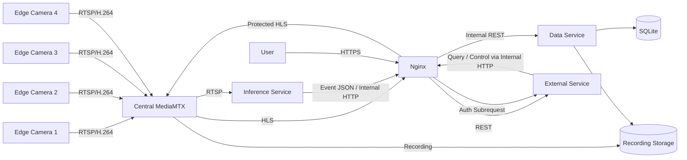

# AI_CCTV 소프트웨어 요구사항 명세서

## 1. 문서 정보

| 항목 | 값 |
| --- | --- |
| 문서명 | Software Requirements Specification |
| 대상 시스템 | AI_CCTV |
| 대상 저장소 | `Eye-O-T/AI_CCTV` |
| 기준 브랜치 | `develop` |
| 문서 버전 | `0.3.0-draft` |
| 기준일 | 2026-08-22 |
| 문서 상태 | 아키텍처 전환 기준안 |
| 현재 구현 기준 | 단일 카메라 Python/PyQt 프로토타입 |
| 목표 구현 기준 | 멀티카메라·Docker Compose·중앙 MediaMTX 기반 시스템 |

이 문서에서 **하여야 한다**는 필수 요구사항, **권장한다**는 우선 적용하되 합리적인 사유가 있으면 변경할 수 있는 요구사항, **할 수 있다**는 선택 요구사항을 의미한다.

---

## 2. 목적

AI_CCTV는 Raspberry Pi 기반 카메라 장치에서 영상을 수집하고 중앙 서버에서 스트림 중계, 저장, AI 추론, 이벤트 기록 및 사용자 조회를 제공하는 저비용 지능형 CCTV 시스템이다.

본 명세서는 현재 `develop` 브랜치에 구현된 단일 카메라 프로토타입을 다음 목표 구조로 전환하기 위한 요구사항을 정의한다.

- 2대 이상, 기본 목표 4대 이하의 멀티카메라 지원
- Raspberry Pi에서 중앙 서버로 RTSP 영상 입력
- 중앙 MediaMTX를 통한 스트림 집약, 녹화 및 HLS 제공
- 영상 파일과 SQLite 메타데이터의 분리 저장
- YOLO·ByteTrack 기반 추론과 선택적 VLM 분석
- JWT 로그인 기반 외부 사용자 접근
- Nginx 기반 HTTP/HTTPS 진입점 및 Reverse Proxy
- Docker Compose 기반 중앙 서버 배포
- 일반 사용자를 위한 서버 GUI 설정 도구와 Edge CLI/TUI 설치 도구

---

## 3. 범위

### 3.1 포함 범위

시스템은 다음 기능을 포함하여야 한다.

1. Raspberry Pi Camera 영상 취득과 H.264 인코딩
2. 카메라별 고유 RTSP/1.0 스트림 제공 또는 중앙 서버로 게시
3. 중앙 MediaMTX에서 다중 RTSP 경로 집약
4. 내부 추론 서비스에 RTSP 스트림 제공
5. 사용자에게 HLS 기반 실시간 영상 제공
6. 중앙 서버의 영상 분할 저장
7. 영상 파일 메타데이터의 SQLite 인덱싱
8. 사람 탐지·추적 및 이벤트 생성
9. 이벤트와 관련 영상 구간의 연결
10. 사용자 로그인, JWT 발급 및 권한 검증
11. 실시간 영상, 저장 영상, 이벤트 검색 및 조회
12. Nginx를 통한 API·HLS·재생 요청 중계
13. Docker Compose 기반 서비스 실행 및 영속 볼륨 관리
14. 서버 및 Edge 설치·설정·진단 도구
15. Edge 네트워크 장애 시 로컬 임시 저장과 복구 전송

### 3.2 제외 범위

다음 항목은 현재 목표 릴리스의 필수 범위에서 제외한다.

- 저장 영상의 파일 단위 암호화 또는 암호화 파일시스템 적용
- Tailscale 또는 별도 Overlay VPN 도입
- Kubernetes, Docker Swarm, Service Mesh
- Kafka, RabbitMQ, Redis 등 별도 메시지 브로커
- RTSP 2.0 지원
- 클라우드 영상 저장을 전제로 한 구조
- 대규모 분산 DB 또는 다중 중앙 서버 클러스터
- 생체정보 기반 신원 식별의 정확성 보장
- 모바일 네이티브 애플리케이션

단, HTTPS, JWT, 비밀번호 해시, 비밀정보 보호는 저장 영상 암호화와 별개로 현재 범위에 포함한다.

---

## 4. 현재 구현 기준과 목표 기준

### 4.1 현재 `develop` 브랜치 기준

현재 프로토타입은 다음 특성을 가진다.

| 영역 | 현재 상태 |
| --- | --- |
| Python | 3.11 계열 권장, patch 버전 미고정 |
| RTSP | RTSP/1.0 기반 |
| Edge 영상 처리 | GStreamer 1.x, H.264, 기본 1920×1080@30fps |
| Edge MediaMTX | `v1.9.0`을 Raspberry Pi에서 실행 |
| Edge 백업 | 10초 단위 MPEG-TS 파일 |
| 중앙 수신 | OpenCV 기반 영상 스트림 수신 |
| 중앙 녹화 | OpenCV `VideoWriter`, 분할 MP4 저장 |
| 추론 | Ultralytics YOLO, ByteTrack, 안정 ID 보정 |
| VLM | 비동기 분석 후 Discord 전달 경로 존재 |
| GUI | PyQt5 단일 카메라 관제 화면 |
| 멀티카메라 | 미구현에 가까움 |
| Docker Compose | 미구현 |
| SQLite 검색 인덱스 | 미구현 |
| HLS 사용자 제공 | 미구현 |
| JWT 로그인 | 미구현 |
| Nginx | 미구현 |

### 4.2 목표 기준

목표 시스템은 다음 기준을 적용하여야 한다.

| 항목 | 목표 기준 |
| --- | --- |
| 중앙 런타임 | Docker Compose |
| Python 런타임 | 컨테이너별 Python 3.11.9 고정 권장 |
| Edge 런타임 | Raspberry Pi OS 64-bit, native service |
| 입력 프로토콜 | RTSP/1.0 |
| 입력 영상 코덱 | H.264 |
| 실시간 사용자 영상 | HLS over HTTP/HTTPS |
| 미디어 서버 | 중앙 MediaMTX, 검증된 버전 고정 |
| 데이터베이스 | SQLite, Data Service 단독 소유 |
| 외부 진입점 | Nginx 80/443 |
| 사용자 인증 | JWT 기반 로그인 |
| 서비스 규모 | 영상·데이터·추론·외부의 4개 논리 역할 |
| 배포 컨테이너 | MediaMTX, Inference, Data, External, Nginx |
| 카메라 수 | 최소 2대 검증, 기본 목표 최대 4대 |

MediaMTX의 현재 검증 기준은 `v1.9.0`이다. 중앙화 과정에서 버전을 변경할 경우 HLS, 녹화, Playback, Hook, JWT 또는 HTTP 인증 연동을 회귀 테스트한 뒤 이미지 태그 또는 digest를 고정하여야 한다.

---

## 5. 용어

| 용어 | 정의 |
| --- | --- |
| Edge | Raspberry Pi와 카메라로 구성된 영상 취득 장치 |
| Central Server | MediaMTX, 추론, 데이터, 외부 API, Nginx가 실행되는 서버 |
| Camera ID | 시스템 전체에서 카메라를 식별하는 고유 문자열 |
| Stream Path | MediaMTX에서 카메라 스트림을 식별하는 경로 |
| Segment | 일정 시간 단위로 분할 저장된 영상 파일 |
| Event | 사람 출현, 사라짐, 네트워크 장애 등 의미 있는 상태 변화 |
| Live HLS | 현재 RTSP 입력을 HLS로 remux하여 사용자에게 제공하는 스트림 |
| Playback | 저장된 영상 구간을 사용자에게 재생하는 기능 |
| Data Service | SQLite와 검색 메타데이터를 단독 관리하는 서비스 |
| External Service | 로그인, JWT, 사용자용 REST API를 제공하는 서비스 |
| Inference Service | RTSP 스트림을 읽고 탐지·추적·VLM 분석을 수행하는 서비스 |
| Configurator | 서버 설치 및 설정을 GUI/CLI로 관리하는 프로그램 |

---

## 6. 이해관계자와 사용자 유형

### 6.1 관리자

관리자는 다음 작업을 수행할 수 있어야 한다.

- 초기 관리자 계정 설정
- 카메라 추가, 수정, 비활성화 및 삭제
- RTSP 연결 시험
- 모델 선택, 다운로드 또는 사용자 모델 경로 지정
- 저장 경로와 보관 기간 설정
- 서비스 시작, 중지, 재시작 및 상태 확인
- 사용자 계정과 권한 관리
- 시스템 로그 및 진단 결과 확인

### 6.2 일반 사용자 또는 관제 사용자

일반 사용자는 권한이 부여된 카메라에 대해 다음 작업을 수행할 수 있어야 한다.

- 로그인 및 로그아웃
- 실시간 영상 조회
- 시간 범위로 저장 영상 검색
- 이벤트 유형과 시간 범위로 이벤트 검색
- 이벤트와 연결된 영상 구간 재생

### 6.3 운영 개발자

운영 개발자는 다음 작업을 수행할 수 있어야 한다.

- Docker Compose 상태 점검
- 서비스 로그 확인
- DB 마이그레이션 실행
- 모델과 서비스 버전 교체
- 백업과 복구 수행

---

## 7. 운영 환경 및 제약

### 7.1 Edge 환경

- Raspberry Pi 4B 4GB를 기본 검증 장비로 한다.
- Raspberry Pi Camera Module 3 Wide를 기본 검증 카메라로 한다.
- Raspberry Pi OS 64-bit를 우선 지원한다.
- GStreamer 1.x와 libcamera 계열 인터페이스를 사용한다.
- Edge는 모니터가 없는 Headless 환경을 지원하여야 한다.
- Edge 프로그램은 systemd 서비스로 자동 시작할 수 있어야 한다.

### 7.2 중앙 서버 환경

- 초기 기준 운영체제는 Windows 11 64-bit이다.
- Docker Desktop 또는 호환 Docker Engine과 Docker Compose v2가 필요하다.
- GPU 추론은 선택 기능이며, CPU 전용 동작도 가능하여야 한다.
- 실제 동시 카메라 수와 추론 FPS는 서버 CPU, GPU 및 네트워크 성능에 따라 달라질 수 있다.

### 7.3 네트워크 제약

- Edge와 중앙 서버는 기본적으로 동일 LAN에 위치한다.
- RTSP 8554 포트는 LAN 또는 신뢰 네트워크에서만 접근 가능하여야 한다.
- 인터넷에는 Nginx의 80/443 포트만 노출하는 것을 원칙으로 한다.
- Tailscale은 사용하지 않는다.
- 외부 접속에 필요한 공인 IP, DNS, Router Port Forwarding 또는 터널링은 배포 환경 책임으로 둔다.

---

## 8. 시스템 컨텍스트



---

## 9. 기능 요구사항

### 9.1 설치 및 초기 설정

| ID | 요구사항 |
| --- | --- |
| FR-INSTALL-001 | 서버 배포본은 일반 사용자가 실행할 수 있는 Windows 설치 프로그램을 제공하여야 한다. |
| FR-INSTALL-002 | 서버 설치 프로그램은 Docker Engine과 Docker Compose 사용 가능 여부를 검사하여야 한다. |
| FR-INSTALL-003 | Docker가 없거나 실행되지 않은 경우 원인과 조치 방법을 사용자에게 표시하여야 한다. |
| FR-INSTALL-004 | 서버 설치 프로그램은 Configurator GUI를 설치하고 최초 실행할 수 있어야 한다. |
| FR-INSTALL-005 | Configurator는 저장 위치, 관리자 계정, 모델, 서비스 포트와 초기 카메라를 설정할 수 있어야 한다. |
| FR-INSTALL-006 | Configurator는 JWT 비밀키를 암호학적으로 안전한 난수로 자동 생성하여야 한다. |
| FR-INSTALL-007 | Configurator는 사용자 입력을 검증한 후 `config.yaml`과 비밀 설정 파일을 생성하여야 한다. |
| FR-INSTALL-008 | Configurator는 Docker Compose 서비스를 시작, 중지, 재시작하고 상태를 표시할 수 있어야 한다. |
| FR-INSTALL-009 | Edge 배포본은 ARM64 `.deb` 패키지 또는 동등한 설치 스크립트를 제공하여야 한다. |
| FR-INSTALL-010 | Edge 설치 후 `ai-cctv-edge setup` 또는 동등한 대화형 설정 명령을 제공하여야 한다. |
| FR-INSTALL-011 | Edge 설정 도구는 장치 ID, 카메라 ID, 중앙 서버 주소, 해상도, FPS, bitrate, 백업 위치를 입력받아야 한다. |
| FR-INSTALL-012 | Edge 설정 도구는 카메라, 네트워크, 중앙 RTSP 경로를 시험하는 진단 기능을 제공하여야 한다. |
| FR-INSTALL-013 | 서버 GUI와 서버 CLI는 동일한 Config Core 및 Validation 규칙을 사용하여야 한다. |
| FR-INSTALL-014 | 설치와 설정 과정에서 사용자가 `.env`, Compose YAML, MediaMTX YAML을 직접 편집하도록 요구하지 않아야 한다. |

### 9.2 Edge 영상 취득 및 RTSP 제공

| ID | 요구사항 |
| --- | --- |
| FR-EDGE-001 | Edge는 카메라 영상을 취득하여 H.264로 인코딩하여야 한다. |
| FR-EDGE-002 | 기본 영상 설정은 1920×1080, 30fps, 4Mbps로 하되 Configurator에서 변경할 수 있어야 한다. |
| FR-EDGE-003 | Edge는 카메라마다 고유한 Camera ID와 Stream Path를 사용하여야 한다. |
| FR-EDGE-004 | Camera ID는 `^[a-z0-9][a-z0-9_-]{0,63}$` 형식을 따라야 한다. |
| FR-EDGE-005 | Edge는 중앙 MediaMTX가 읽거나 수신할 수 있는 RTSP/1.0 스트림을 제공하여야 한다. |
| FR-EDGE-006 | RTSP 전송은 H.264 elementary stream을 유지하여 HLS remux가 가능하여야 한다. |
| FR-EDGE-007 | Edge는 네트워크 전송 장애가 영상 취득 프로세스 전체를 영구 정지시키지 않도록 재연결하여야 한다. |
| FR-EDGE-008 | Edge 서비스는 부팅 후 자동으로 시작하고 비정상 종료 시 재시작할 수 있어야 한다. |
| FR-EDGE-009 | Edge는 동일 Camera ID의 중복 실행을 방지하여야 한다. |
| FR-EDGE-010 | Edge는 상태, 최근 오류, 현재 중앙 서버 연결 여부를 CLI로 확인할 수 있어야 한다. |

RTSP 게시 방식은 GStreamer RTSP client publish, Edge RTSP server를 중앙 MediaMTX가 pull하는 방식 등으로 구현할 수 있다. 외부 인터페이스는 RTSP/1.0과 Camera ID 경로 규칙을 만족하여야 한다.

### 9.3 Edge 로컬 백업 및 복구

| ID | 요구사항 |
| --- | --- |
| FR-RECOVERY-001 | Edge는 중앙 서버와의 통신 장애 중에도 로컬 영상 저장을 계속할 수 있어야 한다. |
| FR-RECOVERY-002 | Edge 로컬 백업은 기본 10초 단위 MPEG-TS Segment를 사용하여야 한다. |
| FR-RECOVERY-003 | Edge는 백업 파일을 Camera ID와 날짜별 디렉터리로 구분하여야 한다. |
| FR-RECOVERY-004 | 중앙 서버는 누락 시작 시각과 종료 시각을 지정하여 Edge 백업을 요청할 수 있어야 한다. |
| FR-RECOVERY-005 | Edge는 요청 시간과 겹치는 Segment만 선택하여 반환하여야 한다. |
| FR-RECOVERY-006 | 복구 전송된 Segment는 중앙 저장소에 수용되고 SQLite에 `edge_recovery` 출처로 인덱싱되어야 한다. |
| FR-RECOVERY-007 | 중복 복구 요청은 동일 파일을 중복 등록하지 않아야 한다. |
| FR-RECOVERY-008 | 복구 성공 후 Edge 파일 삭제 여부는 보관 정책에 따라 결정하며 기본값은 즉시 삭제하지 않음으로 한다. |

### 9.4 중앙 MediaMTX 및 멀티카메라

| ID | 요구사항 |
| --- | --- |
| FR-MEDIA-001 | 중앙 서버는 MediaMTX를 단일 미디어 게이트웨이로 실행하여야 한다. |
| FR-MEDIA-002 | MediaMTX는 Camera ID와 동일한 Stream Path를 사용하여 스트림을 분리하여야 한다. |
| FR-MEDIA-003 | 시스템은 최소 2개의 동시 카메라 스트림을 지원하여야 한다. |
| FR-MEDIA-004 | 기본 목표 환경에서 최대 4개의 동시 카메라 스트림을 등록할 수 있어야 한다. |
| FR-MEDIA-005 | MediaMTX는 내부 추론 서비스에 RTSP 스트림을 제공하여야 한다. |
| FR-MEDIA-006 | MediaMTX는 사용자용 HLS 스트림을 생성하여야 한다. |
| FR-MEDIA-007 | MediaMTX는 카메라별 중앙 녹화를 수행하여야 한다. |
| FR-MEDIA-008 | MediaMTX의 RTSP, HLS, Playback, Control API 포트는 필요한 네트워크 범위에만 노출하여야 한다. |
| FR-MEDIA-009 | 카메라 등록, 수정, 비활성화가 기존 다른 카메라 스트림을 불필요하게 중단하지 않아야 한다. |
| FR-MEDIA-010 | MediaMTX 설정 변경은 검증 후 원자적으로 적용하거나 Hot Reload를 사용하여야 한다. |
| FR-MEDIA-011 | 카메라 연결 상태는 `online`, `offline`, `degraded`, `disabled` 중 하나로 관리하여야 한다. |
| FR-MEDIA-012 | 동일 Stream Path에 다른 장치가 무단 게시하지 못하도록 게시 인증을 적용하여야 한다. |

### 9.5 중앙 영상 저장

| ID | 요구사항 |
| --- | --- |
| FR-STORAGE-001 | 중앙 녹화 영상은 DB BLOB이 아니라 파일시스템에 저장하여야 한다. |
| FR-STORAGE-002 | 기본 중앙 Segment 길이는 60초로 하여야 한다. |
| FR-STORAGE-003 | Segment 길이는 10초 이상 300초 이하 범위에서 설정 가능하여야 한다. |
| FR-STORAGE-004 | 기본 저장 포맷은 H.264를 담은 fMP4 또는 재생 가능한 MP4로 하여야 한다. |
| FR-STORAGE-005 | 저장 경로는 Camera ID와 UTC 날짜 기준으로 정규화하여야 한다. |
| FR-STORAGE-006 | 완료되지 않은 Segment와 완료된 Segment를 상태 또는 임시 확장자로 구분하여야 한다. |
| FR-STORAGE-007 | Segment 완료 후 시작 시각, 종료 시각, Camera ID, 상대 경로, 크기, 상태를 DB에 기록하여야 한다. |
| FR-STORAGE-008 | 파일 검색은 파일명 전체 순회가 아니라 SQLite 인덱스를 우선 사용하여야 한다. |
| FR-STORAGE-009 | 저장 파일 삭제 시 DB 상태도 트랜잭션 또는 보상 처리로 동기화하여야 한다. |
| FR-STORAGE-010 | 컨테이너를 삭제하거나 재생성하여도 영상 파일과 DB가 유지되어야 한다. |
| FR-STORAGE-011 | 보관 기간은 일 단위로 설정할 수 있어야 한다. |
| FR-STORAGE-012 | 저장 공간 임계치 도달 시 경고를 생성하여야 한다. |
| FR-STORAGE-013 | 현재 릴리스에서는 저장 영상 암호화를 적용하지 않되 향후 암호화 계층을 추가할 수 있도록 저장 인터페이스를 분리하여야 한다. |

권장 파일 구조는 다음과 같다.

```text
runtime/
├── recordings/
│   └── {camera_id}/
│       └── {YYYY}/
│           └── {MM}/
│               └── {DD}/
│                   └── {start_utc_compact}_{sequence}.{ext}
├── snapshots/
│   └── {camera_id}/{YYYY}/{MM}/{DD}/...
├── database/
│   └── ai_cctv.db
└── logs/
```

### 9.6 SQLite 메타데이터 관리

| ID | 요구사항 |
| --- | --- |
| FR-DATA-001 | SQLite 파일은 Data Service 하나만 직접 열고 수정하여야 한다. |
| FR-DATA-002 | 다른 서비스는 기본적으로 Nginx의 Docker 내부 전용 경로를 거쳐 Data Service HTTP API를 호출하여야 한다. |
| FR-DATA-003 | Data Service는 SQLite Foreign Key를 활성화하여야 한다. |
| FR-DATA-004 | Data Service는 WAL 모드를 사용하여 읽기와 쓰기의 충돌을 줄이는 것을 권장한다. |
| FR-DATA-005 | 모든 저장 시각은 DB에서 UTC ISO 8601 또는 UTC epoch로 저장하여야 한다. |
| FR-DATA-006 | 사용자 화면에서는 설정된 현지 시간대로 변환하여 표시하여야 한다. |
| FR-DATA-007 | 기록 구간 검색은 `segment.start_time < query_end AND segment.end_time > query_start` 겹침 조건을 사용하여야 한다. |
| FR-DATA-008 | Camera ID와 시간 범위에 대한 복합 인덱스를 생성하여야 한다. |
| FR-DATA-009 | Event 유형과 발생 시각에 대한 인덱스를 생성하여야 한다. |
| FR-DATA-010 | 파일 경로는 가능한 한 Storage Root 기준 상대 경로로 저장하여야 한다. |
| FR-DATA-011 | SQLite 백업과 Schema Migration 절차를 제공하여야 한다. |
| FR-DATA-012 | 파일이 DB에는 있으나 실제로 없거나, 파일은 있으나 DB에 없는 경우를 검사하는 Reconciliation 기능을 제공하여야 한다. |

### 9.7 AI 추론 및 이벤트

| ID | 요구사항 |
| --- | --- |
| FR-AI-001 | Inference Service는 MediaMTX의 RTSP 스트림을 직접 읽어야 한다. |
| FR-AI-002 | Video 또는 JPEG Frame을 지속적으로 HTTP 전송하는 구조를 기본 경로로 사용하지 않아야 한다. |
| FR-AI-003 | 사람 탐지는 Ultralytics YOLO 계열 모델을 기본 구현으로 사용할 수 있어야 한다. |
| FR-AI-004 | 객체 추적은 ByteTrack 또는 동등한 추적기를 사용할 수 있어야 한다. |
| FR-AI-005 | 추론 이벤트는 Camera ID, Event Type, 발생 시각, Person/Track ID, Confidence를 포함하여야 한다. |
| FR-AI-006 | 출현, 사라짐, 네트워크 장애, 네트워크 복구 이벤트를 지원하여야 한다. |
| FR-AI-007 | 선택적으로 VLM 분석 결과를 Event Metadata에 추가할 수 있어야 한다. |
| FR-AI-008 | VLM 실패가 기본 녹화와 실시간 스트림을 중단시키지 않아야 한다. |
| FR-AI-009 | AI 모델 로딩 실패 시 해당 카메라는 비추론 CCTV 모드로 계속 동작할 수 있어야 한다. |
| FR-AI-010 | 추론 결과는 Data Service에 JSON으로 전달하여야 한다. |
| FR-AI-011 | 이벤트는 발생 시점과 겹치는 Recording Segment에 연결되어야 한다. |
| FR-AI-012 | 사용자는 이벤트 전후 재생 여유 구간을 설정할 수 있어야 한다. 기본값은 전 5초, 후 10초를 권장한다. |
| FR-AI-013 | Discord 알림은 선택적 Notification Adapter로 유지할 수 있으며 핵심 저장 경로와 분리하여야 한다. |

### 9.8 모델 관리

| ID | 요구사항 |
| --- | --- |
| FR-MODEL-001 | Configurator는 기본 모델 자동 설치와 사용자 모델 지정 중 하나를 선택할 수 있게 하여야 한다. |
| FR-MODEL-002 | 기본 모델 다운로드 시 버전, 다운로드 위치, SHA-256을 포함한 Manifest를 사용하여야 한다. |
| FR-MODEL-003 | 다운로드된 모델은 SHA-256 검증을 통과하여야 한다. |
| FR-MODEL-004 | 사용자 모델 경로는 파일 존재, 읽기 권한, 지원 형식을 검사하여야 한다. |
| FR-MODEL-005 | 모델은 Docker Volume을 통해 Inference Service에 읽기 전용으로 마운트하는 것을 권장한다. |
| FR-MODEL-006 | 모델 변경 시 서비스 재시작 필요 여부를 사용자에게 알려야 한다. |
| FR-MODEL-007 | GPU가 없는 경우 CPU 모드를 선택할 수 있어야 한다. |
| FR-MODEL-008 | GPU 설정 실패 시 명확한 진단 정보를 제공하여야 한다. |

### 9.9 사용자 인증과 권한

| ID | 요구사항 |
| --- | --- |
| FR-AUTH-001 | External Service는 사용자 ID와 비밀번호 기반 로그인 API를 제공하여야 한다. |
| FR-AUTH-002 | 비밀번호는 평문으로 저장하지 않아야 한다. |
| FR-AUTH-003 | 비밀번호는 Argon2id, bcrypt 또는 동등한 적응형 해시로 저장하여야 한다. |
| FR-AUTH-004 | 로그인 성공 시 JWT Access Token을 발급하여야 한다. |
| FR-AUTH-005 | JWT는 `sub`, `role`, `iat`, `exp`, `jti` Claim을 포함하여야 한다. |
| FR-AUTH-006 | JWT 서명 키는 코드나 Git 저장소에 포함하지 않아야 한다. |
| FR-AUTH-007 | 초기 구현에서 HMAC을 사용할 경우 256-bit 이상의 난수 Secret을 사용하여야 한다. |
| FR-AUTH-008 | Access Token 만료 시간은 설정 가능하여야 하며 기본값은 15분을 권장한다. |
| FR-AUTH-009 | Refresh Token을 도입하는 경우 서버에서 철회할 수 있어야 한다. |
| FR-AUTH-010 | 웹 클라이언트는 HLS Segment 요청에도 인증이 유지되도록 HttpOnly Secure Cookie 방식을 우선 고려하여야 한다. |
| FR-AUTH-011 | API 클라이언트는 `Authorization: Bearer <token>`을 사용할 수 있어야 한다. |
| FR-AUTH-012 | 역할은 최소 `admin`, `viewer`를 지원하여야 한다. |
| FR-AUTH-013 | 카메라 설정, 사용자 관리, 모델 설정은 관리자만 수행할 수 있어야 한다. |
| FR-AUTH-014 | 로그인 실패 횟수 제한 또는 지연 정책을 적용하여야 한다. |
| FR-AUTH-015 | 로그아웃 또는 토큰 철회 후 보호 자원 접근을 차단하여야 한다. |

### 9.10 외부 사용자 기능

| ID | 요구사항 |
| --- | --- |
| FR-USER-001 | 로그인한 사용자는 접근 권한이 있는 카메라 목록을 조회할 수 있어야 한다. |
| FR-USER-002 | 사용자는 Camera ID별 실시간 HLS 재생 URL 또는 재생 정보를 얻을 수 있어야 한다. |
| FR-USER-003 | 사용자는 Camera ID와 시간 범위로 저장 영상을 검색할 수 있어야 한다. |
| FR-USER-004 | 사용자는 Event Type, Camera ID, 시작 시각, 종료 시각으로 이벤트를 검색할 수 있어야 한다. |
| FR-USER-005 | 이벤트 상세에는 발생 시각, 유형, 메타데이터, 스냅샷, 연관 영상 구간을 포함할 수 있어야 한다. |
| FR-USER-006 | 사용자는 선택한 저장 영상 또는 이벤트 구간을 보호된 HTTP Playback으로 재생할 수 있어야 한다. 초기 기본 형식은 fMP4 또는 MP4로 한다. |
| FR-USER-007 | 존재하지 않거나 삭제된 영상은 404와 이해 가능한 오류 정보를 반환하여야 한다. |
| FR-USER-008 | 권한이 없는 카메라의 영상, 이벤트 및 메타데이터는 반환하지 않아야 한다. |
| FR-USER-009 | 검색 결과는 페이지네이션을 지원하여야 한다. |
| FR-USER-010 | API 응답은 UTF-8 JSON을 사용하여야 한다. |

### 9.11 Nginx와 외부 진입점

| ID | 요구사항 |
| --- | --- |
| FR-NGINX-001 | Nginx는 외부 HTTP/HTTPS 요청의 단일 진입점이어야 한다. |
| FR-NGINX-002 | Nginx는 `/api/`를 External Service로 Reverse Proxy하여야 한다. |
| FR-NGINX-003 | Nginx는 `/hls/`를 MediaMTX HLS Endpoint로 Reverse Proxy하여야 한다. |
| FR-NGINX-004 | Nginx는 저장 영상 Playback 요청을 보호된 경로로 중계하여야 한다. |
| FR-NGINX-005 | 보호된 HLS와 Playback 요청은 External Service의 인증 검증을 통과하여야 한다. |
| FR-NGINX-006 | Nginx는 원본 Host, Client IP, Protocol 정보를 적절한 Forwarded Header로 전달하여야 한다. |
| FR-NGINX-007 | 외부 배포에서는 HTTPS를 사용하여야 한다. |
| FR-NGINX-008 | MediaMTX HLS, Data Service, External Service의 내부 포트를 인터넷에 직접 공개하지 않아야 한다. |
| FR-NGINX-009 | HLS 전송은 불필요한 Python 파일 복사를 피하고 Nginx 또는 MediaMTX가 직접 담당하여야 한다. |
| FR-NGINX-010 | Nginx는 영상 프레임 전달용 서비스 버스나 이벤트 큐로 사용하지 않아야 한다. |
| FR-NGINX-011 | Nginx는 `/internal/` 경로를 Docker 내부 네트워크에만 제공하고 Media, Inference, External Service의 제어·메타데이터 요청을 Data Service로 중계하여야 한다. |

### 9.12 서비스 운영과 진단

| ID | 요구사항 |
| --- | --- |
| FR-OPS-001 | 각 컨테이너는 Health Check를 제공하여야 한다. |
| FR-OPS-002 | Configurator는 각 서비스의 상태를 `running`, `starting`, `unhealthy`, `stopped`로 표시하여야 한다. |
| FR-OPS-003 | `ai-cctv-server doctor` 명령은 Docker, Compose, 저장 경로, DB, 모델, MediaMTX, Nginx, 카메라 연결을 검사하여야 한다. |
| FR-OPS-004 | `ai-cctv-edge doctor` 또는 `status` 명령은 카메라, GStreamer, RTSP, 저장 공간, 중앙 연결을 검사하여야 한다. |
| FR-OPS-005 | 서비스 로그는 Container stdout/stderr와 영속 로그 디렉터리 중 적어도 하나에서 확인할 수 있어야 한다. |
| FR-OPS-006 | 로그에는 비밀번호, JWT 전체 값, Discord Token, RTSP 비밀번호를 기록하지 않아야 한다. |
| FR-OPS-007 | 시스템은 저장 공간 사용량과 카메라 연결 상태를 조회할 수 있어야 한다. |
| FR-OPS-008 | 비정상 종료 후 완료된 Segment와 DB가 손상되지 않아야 한다. |
| FR-OPS-009 | DB 손상 또는 영상 디렉터리 접근 불가 시 서비스를 무조건 계속 실행하지 말고 명확한 상태를 보고하여야 한다. |

### 9.13 업데이트와 제거

| ID | 요구사항 |
| --- | --- |
| FR-UPDATE-001 | 서버 업데이트는 기존 영상, DB, 설정, 모델을 삭제하지 않아야 한다. |
| FR-UPDATE-002 | Compose Image는 Release Version으로 고정하여야 하며 운영 배포에서 `latest`만 사용하지 않아야 한다. |
| FR-UPDATE-003 | 업데이트 전 DB와 설정 백업을 수행할 수 있어야 한다. |
| FR-UPDATE-004 | Migration 실패 시 이전 버전으로 복원할 수 있는 절차를 제공하여야 한다. |
| FR-UPDATE-005 | 제거 프로그램은 Runtime Data 삭제 여부를 사용자에게 별도로 물어야 한다. |
| FR-UPDATE-006 | Edge 패키지 제거 시 영상 백업 파일과 설정 삭제 여부를 분리하여야 한다. |

---

## 10. 외부 인터페이스 요구사항

### 10.1 RTSP 인터페이스

| 항목 | 기준 |
| --- | --- |
| 프로토콜 | RTSP/1.0 |
| 기본 포트 | 8554/TCP |
| 영상 코덱 | H.264 |
| 기본 해상도 | 1920×1080 |
| 기본 FPS | 30 |
| 기본 Bitrate | 4Mbps |
| 경로 예 | `rtsp://central-server:8554/cam-001` |
| 권장 Transport | LAN 환경에서 TCP 우선 검증 |

RTSP 포트는 외부 사용자용 인터넷 인터페이스가 아니다.

### 10.2 실시간 HLS 인터페이스

| 항목 | 기준 |
| --- | --- |
| 프로토콜 | HLS over HTTP/HTTPS |
| 외부 진입점 | Nginx 443 |
| 내부 원본 | MediaMTX HLS 8888 |
| 경로 예 | `/hls/cam-001/index.m3u8` |
| 인증 | JWT Cookie 또는 Bearer 검증 |
| 실시간 Variant | fMP4 또는 Low-Latency HLS 중 호환성 시험 후 고정 |

### 10.3 저장 영상 Playback 인터페이스

| 항목 | 기준 |
| --- | --- |
| 프로토콜 | HTTP/HTTPS |
| 외부 진입점 | Nginx 443 |
| 내부 원본 | MediaMTX Playback 9996 또는 동등한 Playback Adapter |
| 검색 기준 | Camera ID와 UTC 시간 범위 |
| 초기 응답 형식 | fMP4 또는 MP4 |
| 인증 | JWT Cookie 또는 Bearer 검증 |
| Range 요청 | 사용 Client 호환성 시험 후 지원 |

실시간 사용자 영상은 HLS로 고정한다. 저장 영상 HLS VOD는 초기 필수 경로로 간주하지 않으며, 필요 시 fMP4 Segment playlist 생성기 또는 제한된 FFmpeg 변환 작업으로 확장한다.

### 10.4 REST API

초기 API Prefix는 `/api/v1`로 한다.

| Method | Path | 설명 | 권한 |
| --- | --- | --- | --- |
| POST | `/api/v1/auth/login` | 로그인 | Public |
| POST | `/api/v1/auth/refresh` | Access Token 갱신 | Authenticated |
| POST | `/api/v1/auth/logout` | 로그아웃/철회 | Authenticated |
| GET | `/api/v1/cameras` | 카메라 목록 | Viewer |
| POST | `/api/v1/cameras` | 카메라 등록 | Admin |
| GET | `/api/v1/cameras/{camera_id}` | 카메라 상세 | Viewer |
| PATCH | `/api/v1/cameras/{camera_id}` | 카메라 수정 | Admin |
| GET | `/api/v1/cameras/{camera_id}/live` | Live HLS 정보 | Viewer |
| GET | `/api/v1/recordings` | 저장 영상 검색 | Viewer |
| GET | `/api/v1/recordings/{id}` | Segment 상세 | Viewer |
| GET | `/api/v1/recordings/{id}/playback` | Playback 정보 | Viewer |
| GET | `/api/v1/events` | 이벤트 검색 | Viewer |
| GET | `/api/v1/events/{id}` | 이벤트 상세 | Viewer |
| GET | `/api/v1/system/status` | 시스템 상태 | Admin |
| GET | `/health/live` | 프로세스 생존 확인 | Internal |
| GET | `/health/ready` | 의존성 준비 확인 | Internal |

API 오류 응답은 다음 형식을 권장한다.

```json
{
  "error": {
    "code": "RECORDING_NOT_FOUND",
    "message": "요청한 영상 구간을 찾을 수 없습니다.",
    "details": {}
  }
}
```

### 10.5 내부 서비스 인터페이스

- Inference Service → Nginx 내부 경로 → Data Service: 이벤트 생성
- MediaMTX Segment Complete Hook 또는 Indexer → Nginx 내부 경로 → Data Service: Segment 등록
- External Service → Nginx 내부 경로 → Data Service: 카메라·영상·이벤트 조회
- Nginx → External Service: JWT 검증 Subrequest
- Configurator → Docker CLI/Compose: 서비스 관리

내부 API는 Docker Network에서만 접근 가능하여야 한다.

---

## 11. 데이터 요구사항

### 11.1 `users`

| 필드 | 타입 | 제약 |
| --- | --- | --- |
| `id` | integer | PK |
| `username` | text | UNIQUE, NOT NULL |
| `password_hash` | text | NOT NULL |
| `role` | text | `admin`, `viewer` |
| `is_active` | integer | boolean |
| `created_at` | text/integer | UTC |
| `updated_at` | text/integer | UTC |

### 11.2 `cameras`

| 필드 | 타입 | 제약 |
| --- | --- | --- |
| `id` | integer | PK |
| `camera_id` | text | UNIQUE, NOT NULL |
| `name` | text | NOT NULL |
| `stream_path` | text | UNIQUE, NOT NULL |
| `edge_device_id` | text | nullable |
| `source_url` | text | 민감정보 마스킹 필요 |
| `enabled` | integer | boolean |
| `status` | text | online/offline/degraded/disabled |
| `created_at` | text/integer | UTC |
| `updated_at` | text/integer | UTC |

### 11.3 `recording_segments`

| 필드 | 타입 | 제약 |
| --- | --- | --- |
| `id` | integer | PK |
| `camera_id` | text | FK 또는 논리 FK |
| `start_time` | text/integer | UTC, NOT NULL |
| `end_time` | text/integer | UTC, NOT NULL |
| `relative_path` | text | UNIQUE, NOT NULL |
| `format` | text | fmp4/mp4/mpegts |
| `codec` | text | 기본 h264 |
| `duration_ms` | integer | 0 이상 |
| `file_size` | integer | bytes |
| `source` | text | central/edge_recovery/import |
| `status` | text | writing/ready/missing/deleted/corrupt |
| `checksum` | text | optional |
| `created_at` | text/integer | UTC |

필수 인덱스:

```sql
CREATE INDEX idx_segments_camera_time
ON recording_segments(camera_id, start_time, end_time);
```

### 11.4 `events`

| 필드 | 타입 | 제약 |
| --- | --- | --- |
| `id` | integer | PK |
| `camera_id` | text | NOT NULL |
| `event_type` | text | NOT NULL |
| `occurred_at` | text/integer | UTC, NOT NULL |
| `person_id` | text | nullable |
| `confidence` | real | nullable, 0..1 |
| `recording_segment_id` | integer | nullable FK |
| `snapshot_path` | text | nullable |
| `metadata_json` | text | 유효한 JSON |
| `created_at` | text/integer | UTC |

필수 인덱스:

```sql
CREATE INDEX idx_events_camera_time_type
ON events(camera_id, occurred_at, event_type);
```

### 11.5 데이터 일관성

- Segment 파일 생성 완료 후 DB에 `ready` 상태로 등록하여야 한다.
- 이벤트 시각과 Segment가 겹치면 `recording_segment_id`를 연결하여야 한다.
- 연관 Segment가 아직 완료되지 않은 경우 Event를 먼저 저장하고 비동기 연결할 수 있다.
- 보관 정책으로 파일을 삭제한 경우 Event 자체는 유지할 수 있으나 영상 이용 불가 상태를 표시하여야 한다.

---

## 12. 비기능 요구사항

### 12.1 성능

| ID | 요구사항 |
| --- | --- |
| NFR-PERF-001 | 기준 서버에서 2개의 1080p@30fps H.264 스트림을 동시에 수신·중계·저장할 수 있어야 한다. |
| NFR-PERF-002 | 4개 카메라 지원은 검증 대상이며 하드웨어 요구사항과 실제 추론 FPS를 문서화하여야 한다. |
| NFR-PERF-003 | LAN 기준 Live HLS 재생은 요청 후 10초 이내 시작하는 것을 초기 합격 기준으로 한다. |
| NFR-PERF-004 | 30일분 4카메라 Segment 메타데이터에서 시간 범위 검색은 기준 데이터셋에서 2초 이내 응답하여야 한다. |
| NFR-PERF-005 | 이벤트 목록 검색은 기준 데이터셋에서 2초 이내 응답하여야 한다. |
| NFR-PERF-006 | AI 추론 지연이 녹화와 HLS 전달을 차단하지 않아야 한다. |

### 12.2 신뢰성

| ID | 요구사항 |
| --- | --- |
| NFR-REL-001 | 컨테이너 재시작 후 영속 영상과 DB가 유지되어야 한다. |
| NFR-REL-002 | 완료된 Segment는 서비스 비정상 종료 후에도 재생 가능하여야 한다. |
| NFR-REL-003 | 서비스 시작 후 60초 이내에 Health 상태가 결정되어야 한다. |
| NFR-REL-004 | 카메라 연결이 복구되면 운영자 수동 재실행 없이 재연결을 시도하여야 한다. |
| NFR-REL-005 | DB Writer 충돌로 인한 `database is locked` 오류를 줄이기 위해 단일 Data Service Writer 원칙을 유지하여야 한다. |

### 12.3 보안

| ID | 요구사항 |
| --- | --- |
| NFR-SEC-001 | 외부 사용자 트래픽은 HTTPS를 사용하여야 한다. |
| NFR-SEC-002 | 내부 서비스 포트는 기본적으로 Host에 Publish하지 않아야 한다. |
| NFR-SEC-003 | RTSP 게시에는 카메라별 또는 Edge별 인증정보를 사용하여야 한다. |
| NFR-SEC-004 | 모든 사용자 입력과 경로 파라미터를 검증하여야 한다. |
| NFR-SEC-005 | Path Traversal을 방지하기 위해 DB 경로와 Storage Root 결합 결과를 검증하여야 한다. |
| NFR-SEC-006 | Secret, Token, Password는 로그와 오류 응답에 노출하지 않아야 한다. |
| NFR-SEC-007 | 기본 관리자 비밀번호를 소스코드에 포함하지 않아야 한다. |
| NFR-SEC-008 | 비활성 사용자와 만료 토큰은 보호 자원에 접근할 수 없어야 한다. |
| NFR-SEC-009 | CORS 허용 Origin은 배포 환경에서 명시적으로 제한하여야 한다. |
| NFR-SEC-010 | 저장 영상 암호화 미적용 사실을 설치 문서에 명시하여야 한다. |

### 12.4 유지보수성

| ID | 요구사항 |
| --- | --- |
| NFR-MAINT-001 | 영상, 데이터, 추론, 외부 책임을 모듈 또는 서비스 경계로 분리하여야 한다. |
| NFR-MAINT-002 | 서비스 간 계약은 OpenAPI 또는 명시된 JSON Schema로 문서화하여야 한다. |
| NFR-MAINT-003 | Python 패키지 버전은 Release 단위로 고정하여야 한다. |
| NFR-MAINT-004 | Docker Image Tag와 모델 버전을 Release Manifest에 기록하여야 한다. |
| NFR-MAINT-005 | 설정 Schema는 버전 필드를 포함하여야 한다. |
| NFR-MAINT-006 | 기존 설정을 새 Schema로 변환하는 Migration을 제공하여야 한다. |

### 12.5 사용성

| ID | 요구사항 |
| --- | --- |
| NFR-UX-001 | 일반 사용자가 코드 파일을 수정하지 않고 설치와 설정을 완료할 수 있어야 한다. |
| NFR-UX-002 | 오류 메시지는 원인, 영향, 사용자가 취할 조치를 포함하여야 한다. |
| NFR-UX-003 | 카메라 등록 화면은 저장 전 연결 시험을 제공하여야 한다. |
| NFR-UX-004 | 모델 기본 자동 설치를 기본 선택으로 제공하여야 한다. |
| NFR-UX-005 | GUI 없이도 Headless 서버와 Edge에서 CLI로 동일 작업을 수행할 수 있어야 한다. |

### 12.6 이식성

| ID | 요구사항 |
| --- | --- |
| NFR-PORT-001 | 중앙 Python 실행환경은 컨테이너 내부에 포함하여 Host Python 설치를 요구하지 않아야 한다. |
| NFR-PORT-002 | Host 저장 경로는 Windows와 Linux Path 차이를 Configurator가 처리하여야 한다. |
| NFR-PORT-003 | Edge는 ARM64 패키지를 우선 제공하여야 한다. |

---

## 13. 설정 요구사항

권장 설정 구조:

```text
AI_CCTV/
├── config/
│   ├── config.yaml
│   └── secrets.env
├── models/
├── runtime/
│   ├── recordings/
│   ├── snapshots/
│   ├── database/
│   └── logs/
└── compose.yaml
```

`config.yaml` 예시:

```yaml
schema_version: 1

server:
  public_port: 443
  timezone: Asia/Seoul

recording:
  root: D:/AI_CCTV/runtime/recordings
  segment_seconds: 60
  retention_days: 7
  encryption_at_rest: false

inference:
  enabled: true
  model_path: D:/AI_CCTV/models/default.pt
  device: auto
  confidence_threshold: 0.4

cameras:
  - camera_id: cam-001
    name: entrance
    stream_path: cam-001
    enabled: true
```

`secrets.env` 예시:

```dotenv
JWT_SECRET=<generated-secret>
INITIAL_ADMIN_PASSWORD_HASH=<generated-hash>
MEDIAMTX_PUBLISH_CAM_001_USER=<generated-user>
MEDIAMTX_PUBLISH_CAM_001_PASSWORD=<generated-password>
```

실제 Secret 값은 Git에 Commit하지 않아야 한다.

`cameras` 목록은 최초 설치 또는 복구 시 사용하는 Bootstrap 입력으로 본다. 운영 중 카메라 정보의 최종 Source of Truth는 Data Service의 `cameras` 테이블이며, Configurator와 관리자 API가 이를 갱신하여야 한다.

---

## 14. 서비스 배포 요구사항

권장 Compose 서비스:

```text
mediamtx          # 영상 논리 서비스
inference         # 추론 서비스
data              # SQLite 및 메타데이터 서비스
external          # 사용자 API 및 JWT
nginx             # 인프라: Reverse Proxy와 HTTPS
```

- Nginx는 논리 도메인 서비스 수에 포함하지 않는 인프라 컴포넌트로 본다.
- 모든 서비스는 하나의 내부 Docker Network를 공유할 수 있다.
- SQLite, 녹화 파일, 모델, 설정은 명시적 Volume으로 마운트하여야 한다.
- 외부에는 Nginx의 80/443만 기본 공개한다.
- Edge RTSP 수신을 위해 MediaMTX 8554는 LAN 인터페이스에 제한적으로 공개할 수 있다.

---

## 15. 검증 및 합격 기준

### 15.1 기능 합격 시나리오

| ID | 시나리오 | 합격 기준 |
| --- | --- | --- |
| AT-001 | 서버 신규 설치 | 설치 프로그램 실행 후 GUI에서 설정하고 Compose 서비스가 정상 상태가 됨 |
| AT-002 | Edge 신규 설치 | `.deb` 또는 스크립트 설치 후 CLI 설정, 부팅 재시작 뒤 RTSP 자동 송출 |
| AT-003 | 2카메라 Live | `cam-001`, `cam-002`가 동시에 MediaMTX에 연결되고 HLS로 재생됨 |
| AT-004 | 4카메라 등록 | 4개 Camera ID와 Stream Path가 충돌 없이 등록됨 |
| AT-005 | 중앙 녹화 | 각 카메라 영상이 60초 Segment로 저장되고 DB에 등록됨 |
| AT-006 | 영상 검색 | Camera ID와 시간 범위로 겹치는 Segment만 반환됨 |
| AT-007 | 사람 이벤트 | 탐지 이벤트가 DB에 저장되고 관련 Segment와 연결됨 |
| AT-008 | JWT 보호 | 미인증 사용자는 HLS, Playback, Event API에 접근하지 못함 |
| AT-009 | 역할 제한 | Viewer가 카메라 설정 API를 호출하면 403이 반환됨 |
| AT-010 | 네트워크 장애 | Edge 연결 단절 중 로컬 저장 후 복구 영상이 중앙에 수용됨 |
| AT-011 | 컨테이너 재생성 | `down` 후 `up`하여도 DB와 영상 파일이 유지됨 |
| AT-012 | 모델 실패 | 모델 로딩 실패 시 녹화와 HLS는 계속되고 추론 오류가 표시됨 |
| AT-013 | 저장 공간 경고 | 설정한 임계치 도달 시 관리자 상태 화면에 경고가 표시됨 |
| AT-014 | Secret 보호 | 로그와 API 응답에서 JWT Secret과 Password가 노출되지 않음 |

### 15.2 자동 검증 범위

| 영역 | 권장 테스트 |
| --- | --- |
| Config Schema | Unit Test |
| Camera ID와 Path Validation | Unit Test |
| Segment 시간 겹침 검색 | Unit Test |
| SQLite Repository | Unit/Integration Test |
| JWT 발급·만료·권한 | Unit/Integration Test |
| Data ↔ External API | Integration Test |
| MediaMTX RTSP → HLS | Black-box Integration Test |
| MediaMTX Recording Hook → DB | Integration Test |
| Nginx 인증 Subrequest | Integration Test |
| Docker Compose 기동 | CI Smoke Test |
| 2~4 카메라 동시 처리 | 실제 장비 System Test |
| Edge 장애 복구 | 실제 LAN Black-box Test |
| Installer와 Uninstaller | Windows VM Acceptance Test |

---

## 16. 구현 우선순위

### Phase 1 — 현행 코드 정리

1. Python 런타임 및 Dependency 고정
2. Camera ID 도입
3. 단일 `VideoWorker` 결합도 축소
4. 설정값의 코드 하드코딩 제거
5. 현행 기능 회귀 테스트 작성

### Phase 2 — 중앙 미디어·저장 계층

1. 중앙 MediaMTX Container 도입
2. Edge RTSP 입력 경로 전환
3. 2개 카메라 동시 수신
4. MediaMTX 중앙 녹화
5. SQLite Segment Index와 검색 API

### Phase 3 — 서비스 분리

1. Inference Service 분리
2. Data Service 단독 SQLite 소유
3. External Service와 Versioned API
4. Docker Compose와 영속 Volume

### Phase 4 — 외부 접속

1. HLS 사용자 제공
2. JWT 로그인과 역할
3. Nginx Reverse Proxy
4. HTTPS와 보호된 HLS/Playback

### Phase 5 — 배포 자동화

1. Server Configurator GUI/CLI
2. Windows Installer
3. Edge `.deb`와 systemd
4. Model Download Manifest
5. Doctor와 업데이트/복구 절차

---

## 17. 추적성 요약

| 목표 | 주요 요구사항 |
| --- | --- |
| 멀티카메라 | FR-EDGE-003~005, FR-MEDIA-002~004 |
| 중앙 MediaMTX | FR-MEDIA-001~012 |
| 영상 저장과 검색 | FR-STORAGE-001~013, FR-DATA-001~012 |
| AI 이벤트 | FR-AI-001~013 |
| 외부 로그인 | FR-AUTH-001~015 |
| Live/저장/이벤트 조회 | FR-USER-001~010 |
| 실시간 HLS | FR-MEDIA-006, FR-USER-002, FR-NGINX-003/005 |
| 저장 영상 Playback | FR-USER-003/005/006, FR-NGINX-004/005 |
| Nginx | FR-NGINX-001~011 |
| Docker 배포 | FR-INSTALL-002/008, 제14장 |
| 일반 사용자 설치 | FR-INSTALL-001~014 |
| Edge 장애 복구 | FR-RECOVERY-001~008 |
| 저장 암호화 연기 | FR-STORAGE-013, NFR-SEC-010 |
| Tailscale 미사용 | 제3.2절, 제7.3절 |

---

## 18. 미결정 사항

다음 항목은 구현 전에 ADR 또는 Issue로 최종 결정하여야 한다.

1. 중앙 MediaMTX의 최종 고정 버전과 Docker Image Digest
2. Live HLS Variant: `fmp4` 또는 `lowLatency`
3. 저장 영상 기본 응답을 MediaMTX Playback의 `fmp4`와 `mp4` 중 무엇으로 고정할지, HLS VOD를 어느 릴리스에서 추가할지
4. Edge RTSP 게시 구현: GStreamer publish 또는 Edge RTSP server pull
5. Windows GPU Container 지원 범위
6. 최종 오픈소스 라이선스
7. 기본 YOLO 모델과 VLM 모델의 배포·라이선스 정책
8. 외부 공개 배포에서 인증서 자동 발급 방안

미결정 사항은 기능을 임의로 구현하기보다 작은 기술 검증 후 문서에 반영하여야 한다.

