# Data Service ER Diagram

This diagram reflects the SQLite schema under `server/services/data/app/database/migrations/`.

```mermaid
erDiagram
    USERS {
        INTEGER id PK "AUTOINCREMENT"
        TEXT username UK
        TEXT password_hash
        TEXT role
        INTEGER is_active
        TEXT created_at
        TEXT updated_at
    }

    CAMERAS {
        INTEGER id PK "AUTOINCREMENT"
        TEXT camera_id UK
        TEXT name
        TEXT stream_path UK
        TEXT edge_device_id
        TEXT source_url
        INTEGER enabled
        TEXT status
        TEXT created_at
        TEXT updated_at
    }

    USER_CAMERA_PERMISSIONS {
        INTEGER user_id PK, FK
        INTEGER camera_id PK, FK
        TEXT created_at
    }

    EDGE_DEVICES {
        TEXT edge_device_id PK
        TEXT management_url UK
        TEXT recovery_url
        TEXT auth_token
        TEXT mac_address UK
        TEXT created_at
        TEXT updated_at
    }

    EDGE_RUNTIME_STATUS {
        TEXT edge_device_id PK, FK
        INTEGER online
        REAL cpu_percent
        REAL memory_percent
        REAL storage_percent
        REAL battery_percent
        TEXT power_source
        TEXT last_seen_at
        TEXT last_error_code
        TEXT updated_at
    }

    CAMERA_RUNTIME_STATUS {
        TEXT camera_id PK, FK
        TEXT camera_input_status
        TEXT central_connection_status
        TEXT current_video_profile
        TEXT event_cursor
        TEXT last_seen_at
        TEXT last_error_code
        TEXT updated_at
    }

    CAMERA_VIDEO_PROFILES {
        TEXT camera_id PK, FK
        TEXT current_profile
        TEXT desired_profile
        TEXT supported_profiles_json
        TEXT encoder
        TEXT last_error_code
        TEXT created_at
        TEXT updated_at
    }

    CAMERA_PUBLISH_CREDENTIALS {
        TEXT camera_id PK, FK
        TEXT username UK
        TEXT password_hash
        TEXT created_at
        TEXT updated_at
    }

    RECORDING_SEGMENTS {
        INTEGER id PK "AUTOINCREMENT"
        TEXT camera_id FK
        TEXT start_time
        TEXT end_time
        TEXT relative_path UK
        TEXT format
        TEXT codec
        INTEGER duration_ms
        INTEGER file_size
        TEXT source
        TEXT status
        TEXT checksum
        TEXT idempotency_key UK
        TEXT created_at
        TEXT updated_at
    }

    EVENTS {
        INTEGER id PK "AUTOINCREMENT"
        TEXT camera_id FK
        TEXT event_type
        TEXT occurred_at
        TEXT person_id
        INTEGER global_person_id
        REAL confidence
        INTEGER recording_segment_id FK
        TEXT snapshot_path
        TEXT metadata_json
        TEXT edge_event_id
        TEXT source_event_id
        TEXT created_at
    }

    EVENT_RECORDING_SEGMENTS {
        INTEGER event_id PK, FK
        INTEGER recording_segment_id PK, FK
        TEXT created_at
    }

    OBJECT_JOBS {
        INTEGER id PK "AUTOINCREMENT"
        INTEGER event_id FK
        TEXT stage
        TEXT state
        INTEGER attempts
        TEXT next_attempt_at
        TEXT lease_id
        TEXT lease_until
        TEXT created_at
        TEXT updated_at
    }

    GLOBAL_PERSONS {
        INTEGER id PK "AUTOINCREMENT"
        TEXT legacy_id UK
        TEXT created_at
    }

    PERSON_IDENTITY_LINKS {
        TEXT camera_id PK, FK
        TEXT tracking_session_id PK
        TEXT person_id PK
        INTEGER global_person_id
        TEXT created_at
    }

    IDENTITY_GALLERY {
        INTEGER id PK "AUTOINCREMENT"
        INTEGER global_person_id
        TEXT space_id
        TEXT camera_id FK
        TEXT tracking_session_id
        TEXT person_id
        INTEGER dimensions
        TEXT features_json
        TEXT observed_at
        TEXT created_at
        TEXT updated_at
    }

    PERSON_TRACK_PRESENCE {
        TEXT camera_id PK, FK
        TEXT tracking_session_id PK
        TEXT person_id PK
        TEXT first_seen_at
        TEXT last_seen_at
        TEXT ended_at
    }

    LIVE_OBJECTS {
        TEXT camera_id PK, FK
        TEXT payload_json
        TEXT observed_at
        TEXT received_at
    }

    RECOVERY_JOBS {
        INTEGER id PK "AUTOINCREMENT"
        TEXT camera_id FK
        TEXT edge_device_id FK
        TEXT outage_started_at
        TEXT outage_ended_at
        TEXT status
        INTEGER attempt_count
        INTEGER max_attempts
        INTEGER revision
        TEXT next_retry_at
        TEXT last_error
        TEXT recovery_summary_json
        TEXT created_at
        TEXT updated_at
    }

    REFRESH_TOKENS {
        INTEGER id PK "AUTOINCREMENT"
        INTEGER user_id FK
        TEXT jti UK
        TEXT token_hash
        TEXT family_id
        TEXT expires_at
        TEXT revoked_at
        TEXT rotated_from_jti FK
        TEXT replaced_by_jti
        TEXT created_at
    }

    REVOKED_TOKENS {
        TEXT jti PK
        INTEGER user_id FK
        TEXT expires_at
        TEXT revoked_at
        TEXT reason
    }

    MOBILE_DEVICES {
        TEXT device_id PK
        INTEGER user_id FK
        TEXT family_id
        TEXT role
        TEXT token UK
        TEXT platform
        INTEGER enabled
        TEXT event_types_json
        TEXT created_at
        TEXT updated_at
    }

    PUSH_DELIVERIES {
        INTEGER id PK "AUTOINCREMENT"
        INTEGER event_id FK
        TEXT device_id FK
        TEXT state
        INTEGER attempt_count
        TEXT next_attempt_at
        TEXT expires_at
        TEXT lease_id
        TEXT lease_until
        TEXT last_error_code
        TEXT created_at
        TEXT updated_at
    }

    MAINTENANCE_CURSORS {
        TEXT name PK
        TEXT value_json
        TEXT updated_at
    }

    SCHEMA_MIGRATIONS {
        TEXT version PK
        TEXT applied_at
    }

    USERS ||--o{ USER_CAMERA_PERMISSIONS : grants
    CAMERAS ||--o{ USER_CAMERA_PERMISSIONS : permits

    EDGE_DEVICES ||--o| EDGE_RUNTIME_STATUS : reports
    CAMERAS ||--o| CAMERA_RUNTIME_STATUS : tracks
    CAMERAS ||--o| CAMERA_VIDEO_PROFILES : configures
    CAMERAS ||--o| CAMERA_PUBLISH_CREDENTIALS : authenticates

    CAMERAS ||--o{ RECORDING_SEGMENTS : contains
    CAMERAS ||--o{ EVENTS : produces
    RECORDING_SEGMENTS o|--o{ EVENTS : primary_segment
    EVENTS ||--o{ EVENT_RECORDING_SEGMENTS : links
    RECORDING_SEGMENTS ||--o{ EVENT_RECORDING_SEGMENTS : links

    EVENTS ||--o{ OBJECT_JOBS : schedules
    EVENTS ||--o{ PUSH_DELIVERIES : triggers
    MOBILE_DEVICES ||--o{ PUSH_DELIVERIES : receives
    USERS ||--o{ MOBILE_DEVICES : registers

    USERS ||--o{ REFRESH_TOKENS : owns
    USERS o|--o{ REVOKED_TOKENS : revokes
    REFRESH_TOKENS o|--o{ REFRESH_TOKENS : rotates

    CAMERAS ||--o{ RECOVERY_JOBS : recovers
    EDGE_DEVICES o|--o{ RECOVERY_JOBS : originates

    CAMERAS ||--o{ PERSON_IDENTITY_LINKS : tracks
    CAMERAS ||--o{ IDENTITY_GALLERY : observes
    CAMERAS ||--o{ PERSON_TRACK_PRESENCE : observes
    CAMERAS ||--o| LIVE_OBJECTS : publishes

    GLOBAL_PERSONS ||--o{ PERSON_IDENTITY_LINKS : assigns
    GLOBAL_PERSONS ||--o{ IDENTITY_GALLERY : represents
    GLOBAL_PERSONS ||--o{ EVENTS : labels
```

## Notes

- `GLOBAL_PERSONS.id` is the system-wide auto-incrementing integer ID.
- `EVENTS.global_person_id`, `PERSON_IDENTITY_LINKS.global_person_id`, and `IDENTITY_GALLERY.global_person_id` are logical references to `GLOBAL_PERSONS.id`. The current SQLite migrations do not declare these three columns with SQL `REFERENCES` constraints.
- `CAMERAS.edge_device_id` is a logical association to `EDGE_DEVICES.edge_device_id`; the camera column is not declared as a foreign key.
- `EVENTS` and `RECORDING_SEGMENTS` have both a primary recording relationship and the many-to-many `EVENT_RECORDING_SEGMENTS` relationship.
- `SCHEMA_MIGRATIONS` is maintained by the database bootstrap code and is not part of the application domain model.
