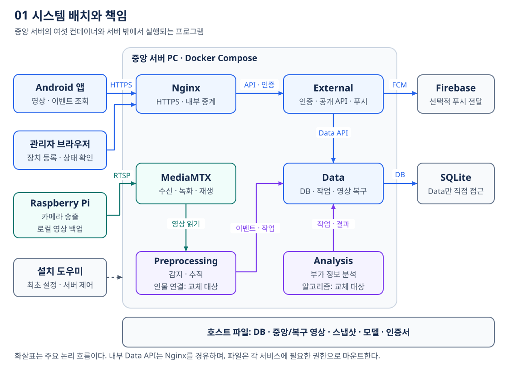
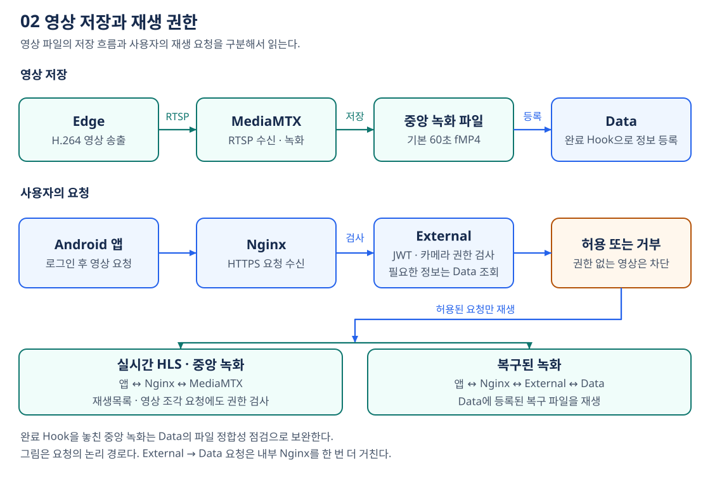
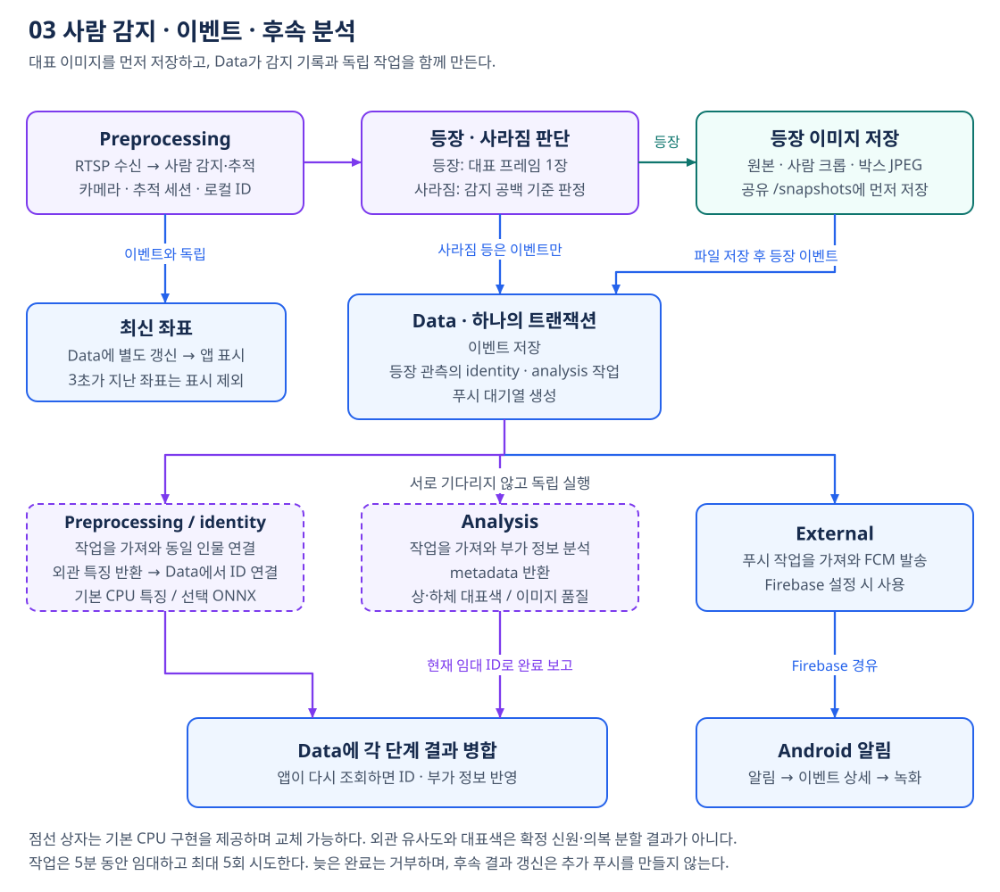
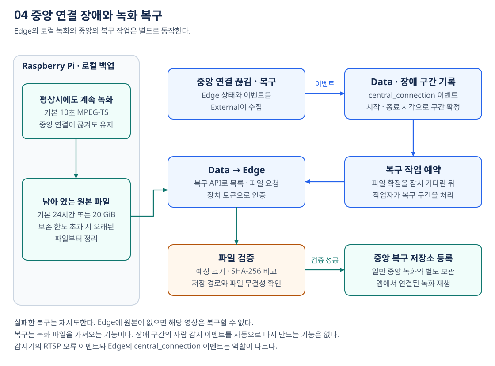
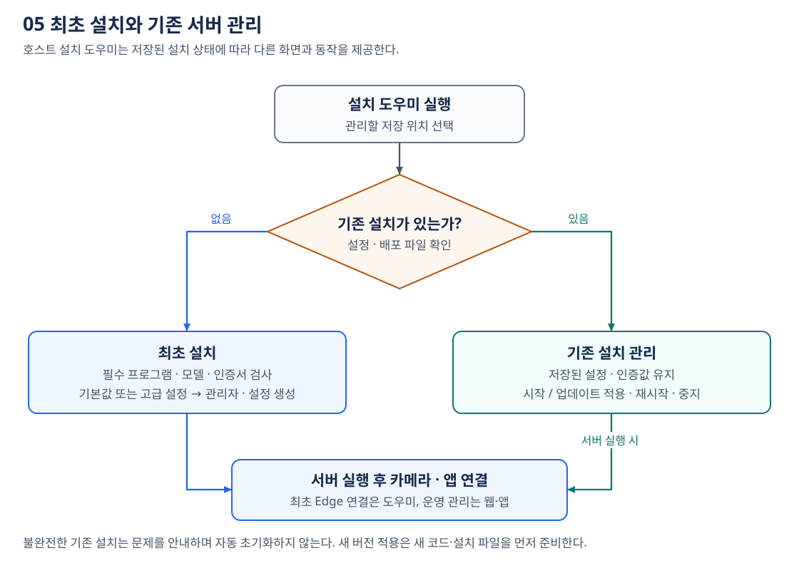

# 시스템 구조와 주요 처리 흐름

AI CCTV는 카메라 영상을 중앙에서 녹화·감지하고 Android 앱으로 조회하는 시스템이다. 아래 그림은 **현재 코드의 구성과 처리 순서**를 설명한다. 그림의 화살표는 주요 흐름을 요약하며, 정확한 HTTP 경유지·포트·저장 경로는 [상세 설정 부록](guide.md#상세-설정-부록)을 참고한다. 그림을 클릭하면 원본 SVG를 확대할 수 있으며 Mermaid 확장은 필요하지 않다.

## 시스템 구조

중앙 서버는 한 PC에서 [여섯 컨테이너](../server/compose.yml)를 실행한다. Edge·앱·설치 도우미는 서버 밖에서 실행되는 별도 프로그램이다. Nginx는 외부 접속과 내부 HTTP 중계를 담당하고, Data만 중앙 업무 SQLite를 직접 연다. 다른 서비스는 Data API로 업무 데이터를 읽고 쓴다. Preprocessing의 전송 전 이벤트 대기열은 별도 로컬 SQLite 파일이다.

DB·영상·모델·설정은 호스트에 남으므로 컨테이너를 교체해도 같은 저장소를 이어서 사용한다. 별도 DB 서버나 메시지 브로커 없이 구성 요소를 줄인 구조이며, Data·Nginx 또는 서버 PC의 장애가 여러 기능에 영향을 줄 수 있다. 다중 호스트 분산·고가용성 구성은 제공하지 않는다.

## 영상 저장과 조회

MediaMTX는 Edge에서 받은 영상을 녹화하고 실시간 HLS를 제공한다. 녹화 조각이 완성되면 완료 Hook으로 Data에 파일 정보를 등록하고, 놓친 등록은 파일 정합성 점검으로 보완한다. **영상 저장·재생과 AI 감지는 분리되어 있어**, 감지 모델에 오류가 나더라도 영상 기능은 독립적으로 동작할 수 있다.

External은 사용자 인증과 카메라 접근 권한을 검사한다. Nginx의 HLS·중앙 녹화 경로는 재생목록과 영상 조각을 요청할 때도 권한 검사를 거친다. 복구 녹화는 External의 공개 API를 통해 Data가 제공한다. 관리자 웹은 장치·상태 관리에 사용하고, 영상·이벤트 조회는 앱에서 수행한다.

access·refresh 토큰은 로그인 계열 식별자 `sid`로 연결한다. 매 보호 요청에서 Data의 활성 계열을 확인하고, 로그아웃은 해당 계열의 후속 refresh와 access까지 무효화한다. 모바일은 로그인·갱신·로그아웃의 저장을 직렬화해 이전 서버의 지연된 토큰이 새 서버의 세션을 덮어쓰지 않게 한다.

## 사람 감지와 이벤트 처리

**등장 뒤 기본 1초 동안 대표 프레임을 골라 crop 한 장을 저장하고, 최신 좌표는 즉시 별도로 갱신한다.** 정보가 있는 크롭·선명도·크기를 비교하며 특징 평균은 하지 않는다. 후보 메모리는 카메라당 기본 32 MiB이고 상한에 도달하거나 사람이 떠나면 조기에 확정한다. 등장 시각은 최초 관측 시각을 유지하고 선택 시각·품질은 `metadata.observation_selection`에 기록한다. 모두 품질이 낮으면 `insufficient`를 남겨 후속 실패 원인을 구분한다. 사람을 추적하는 기준은 `(camera_id, tracking_session_id, person_id)`다. 재접속·추적기 초기화 시 새 세션을 사용하여 다른 사람의 기록이 같은 로컬 ID로 합쳐지는 것을 막는다. 영상 단절을 사람이 사라진 것으로 추정하지 않는다.

등장 이미지의 쓰기를 끝낸 뒤 이벤트를 `/snapshots/.event-outbox.sqlite3`에 영속 기록하고 Data로 전송한다. 같은 `source_event_id`를 유지해 재시도하면 Data가 `(camera_id, source_event_id)`로 중복을 제거한다. Data는 이벤트·관측에 따른 두 분석 작업·푸시 대기열을 같은 DB 트랜잭션에 저장한다. 이미지 파일 자체가 이 트랜잭션에 포함되는 것은 아니다.

송신 큐는 기본 10,000건·JSON 합 64 MiB로 제한한다. 포화나 저장 실패 때는 카메라별 현재 이벤트 한 건을 유지하고 추가 추론·이미지 생성을 멈추어 저장을 재시도한다. 포화 대기 이미지의 참조는 카메라별로 따로 영속 보존해, 큐 공간이 생기거나 프로세스가 재시작해도 미등록 crop을 보관 정리가 삭제하지 못하게 한다. 이벤트 본문까지 저장하지 못한 종료는 상태와 오류 로그로 드러내며 재시작 후 자동 복원을 보장하지 않는다. HTTP 영구 거부 항목은 큐에 격리 보관한다. 큐 상한은 이미지 파일 총용량·카메라별 대기 참조·SQLite 페이지·WAL 크기 상한이 아니다. 보호 목록의 상한을 넘으면 일부 참조를 생략하지 않고 정리를 보류한다.

identity·analysis 처리기는 Data에서 작업을 가져오고 현재 임대 ID로 결과를 보고한다. 작업 임대는 5분, 시도는 최대 5회이며, 만료 작업은 다시 처리될 수 있다. Data는 오래된 임대의 완료를 거부하고 각 단계의 결과만 병합한다. 두 분석의 완료 순서는 정해져 있지 않으며 결과 갱신이 새 이벤트나 추가 푸시를 만들지는 않는다.

두 플러그인의 초기화·추론은 각각 별도 `spawn` 프로세스에서 실행한다. 기본 초기화 30초·호출 120초 제한을 넘으면 자식을 종료·재생성하며 초기화 실패는 30초 후 재시도한다. 완료 응답 유실 때는 같은 프로세스가 보관한 결과를 재전송해 재추론을 피한다. 서비스 전체가 중단되면 임대 만료 뒤 같은 작업을 다시 처리할 수 있다.

감지·추적은 준비한 Ultralytics 호환 사람 모델을 사용하는 YOLO/ByteTrack이다. 카메라별 감지 모델은 별도 `spawn` 프로세스로 실행하며 초기화 기본 30초·호출 기본 10초를 넘으면 자식을 종료한다. RTSP 열기·읽기 제한과 재접속, 감지 모델 재준비를 통해 복구하며 추적 재시작 때 세션을 갱신한다. 감지 메모리의 기본 상한은 컨테이너당 4 GiB이고 CPU 경합 시 우선순위를 낮춰 영상·DB를 보호한다. 모델과 카메라 수에 맞게 상한을 조정한다.

기본 `OsNetIdentity`는 사람 재식별용 OSNet x0.25 MSMT17 combineall 사전학습 모델의 ONNX를 OpenCV DNN CPU로 실행해 512차원 단위벡터를 추출한다. 모델은 [준비 도구](../server/tools/README.md)로 변환하여 기본 `/models/osnet_x0_25_msmt17.onnx`에 배치하며 서비스는 자동 다운로드하지 않는다. 파일 해시·전처리 버전이 다른 특징은 다른 공간으로 분리한다. 이전 HSV·범용 ONNX 구현 `LocalAppearanceIdentity`는 명시적으로 선택하는 호환 플러그인이다.

Data의 비공개 영속 gallery는 같은 공간·차원의 특징만 비교한다. 새 추적은 기본 cosine 0.97 이상·다음 후보와 차이 0.05 이상일 때만 기존 ID로 연결한다. Data의 `IDENTITY_MATCH_THRESHOLD`·`IDENTITY_MATCH_MARGIN`으로 조정하며, 이 기본값은 OSNet이나 현장 영상으로 교정된 기준이 아니다. 같은 카메라의 다른 추적과 관측 구간이 겹치거나 등장 시각이 ±30초 안이면 후보에서 제외한다. 구간은 등장·퇴장 이벤트와 최신 객체 관측 시각을 저장하여 지연된 작업에도 적용한다. 모호하거나 낮은 점수는 새 ID를 만든다. 표본은 관측 시각 기준 1,800초·최대 5,000개로 제한한다.

보관 중인 추적 연결은 재시작·모델 변경 후에도 기존 ID를 유지한다. 같은 추적의 새 모델 특징을 저장해도 이전 연결을 재판정하지 않으므로, 특징 공간 분리가 과거 오연결 교정을 뜻하지 않는다. 관련 이벤트가 없고 관측도 보관 기한을 지난 연결은 정리한다. OSNet은 손상·너무 작은 크롭과 정보가 없는 상수 영상을 거부하지만 이 검사가 사람 존재나 확정 신원을 보증하지는 않는다.

기본 `LocalAppearanceAnalyzer`는 별도 모델 없이 상·하의 후보 영역의 대표색·RGB·픽셀 비율과 영상 품질을 측정한다. 양옆 배경색과 중앙 색 분포를 비교해 배경의 영향을 줄이지만 의복 분할·행동·민감 속성을 판정하지 않는다. OSNet 인물 연결과 영역 색 추정에는 의복·조명·가림에 따른 오류가 가능하며 cosine과 색상 `confidence`는 정답 확률이 아니다. 이전 블랙박스를 명시적으로 선택한 경우의 `unconfigured` 호환은 유지한다.

## 중앙 연결 장애와 녹화 복구

Edge는 중앙으로 송출하는 동안에도 로컬 영상을 저장한다. External이 수집한 `central_connection_lost`·`central_connection_restored` 이벤트를 Data가 장애 구간으로 묶고 복구 작업을 예약한다. Data는 해당 Edge의 복구 API에서 파일을 받아 크기·SHA-256을 확인한 뒤 **중앙 녹화와 별도인 복구 저장소**에 등록한다.

로컬 보존 한도를 지나 원본이 삭제되었거나 카메라 입력 자체가 없었다면 그 영상은 복구할 수 없다. 복구는 녹화 파일을 가져오는 기능이며, 장애 구간의 사람 감지 이벤트를 다시 생성하는 기능은 없다. 자동 복구가 놓친 구간은 [운영 안내](guide.md#운영과-백업)의 수동 복구 절차로 확인한다.

## 최초 설치와 재실행

최초 설치는 필수 프로그램·모델·인증서를 확인하고 관리자·저장소·서비스 인증값을 준비한다. 다시 실행할 때는 기존 설정을 읽어 관리 화면으로 연결하며, 인증값과 DB를 초기화하지 않는다. 불완전한 기존 설치는 문제를 안내하고 덮어쓰지 않는다.

최초 카메라 연결은 도우미가 Edge를 검색한 뒤 중앙에 등록하고 게시 자격 증명을 장치에 전달하는 과정이다. 이후 장치 정보·화질은 관리자 웹에서 관리한다. 서버 시작·중지·재시작은 서버 PC의 도우미에서 수행한다. **업데이트 적용은 새 버전의 코드나 설치 파일을 먼저 배치한 뒤 실행**하며, 단순 재시작은 현재 컨테이너를 다시 실행한다.

## 상태 확인

그림의 각 단계가 정상인지 확인할 때는 프로세스 상태와 실제 기능을 함께 본다.

| 상태·검사 | 판단할 수 있는 범위 |
|---|---|
| Nginx `/healthz`, Python `/health/live` | 각각 Nginx 응답·프로세스 생존. 영상·모델 성공까지 확인하지 않음 |
| Data `/health/ready` | DB·네 저장소 용량, 복구·보관 작업자 생존·최근 오류, 단계별 대기열·미전송 보호 목록 상태. 작업자 장애는 503 |
| External `/health/ready` | 내부 Nginx를 경유한 Data 연결. 실제 단말 푸시 수신은 별도 확인 |
| Preprocessing `/health/ready` | Data 연결 실패는 503. 감지·인물 연결 미준비, offline·stopped·오래된 프레임, 이벤트 보존·송신 오류는 HTTP 200 `degraded`로 확인 |
| Analysis `/health/ready` | 작업기 미준비·시간 초과는 503. 최근 처리 오류는 HTTP 200이면서 `degraded`일 수 있음 |
| `unconfigured` | 명시한 블랙박스·미연결 교체 플러그인의 상태. OSNet 모델 누락은 초기화 오류이며 정상 특징 추출은 `complete` |
| `backend`, `model_ready`, 큐 상태 | 선택 플러그인 실행 경로와 이벤트 보존·전송 상태. 인식 정확도나 무제한 무손실을 보증하지 않음 |
| 실제 기능 확인 | 로그인 → 카메라 영상 → 새 감지 이벤트 → 연결 녹화 재생 → 설정한 경우 푸시 도착 |

Python 상태 경로는 컨테이너 내부 주소다. 운영자는 `/admin/` 또는 관리자 API `GET /api/v1/system/status`로 상태를 확인하고, 호스트의 설치 도우미·`doctor`·Compose 로그로 원인을 좁힌다. 자동 복구 작업은 관리자 API `GET /api/v1/recovery-jobs`에서 확인한다.

공개 시스템 상태는 Data·Preprocessing·MediaMTX를 병렬로 검사하고 응답 기한을 제한한다. HTTP 200이어도 `degraded`이면 정상으로 표시하지 않는다. Analysis의 직접 상태 검사는 제외되어 있다. 보관 정책과 오류별 확인·복구 완료 기준은 [운영 기준](operations.md)에 모았다.

카메라의 `frame_age_seconds`와 `frame_stale`은 처리 스레드가 멈춘 상황도 관찰한다. 마지막 수신 뒤 `max(30초, RTSP_TIMEOUT_SECONDS×2)` 이상 지나면 오래된 프레임으로 본다. 첫 프레임 전에는 카메라 작업자 생성 시점부터 같은 유예시간을 적용한다. 이벤트 보존 실패와 종료 미보존 건수는 각각 `event_persistence_failures`, `event_shutdown_losses`로 확인한다.

## 현재 범위와 설정값

| 항목 | 현재 의미 |
|---|---|
| 카메라 수 | 활성 카메라 최대 4개라는 소프트웨어 제한 |
| 영상 프로필 | 기본 HD 1280×720·30fps·2Mbps, 지원 장치에서 FHD 1920×1080·30fps·4Mbps |
| AI 처리 주기 | 기본 감지 설정은 5fps, 최신 박스 발행은 최대 초당 2회. HLS 프레임과 정확히 동기화되지 않음 |
| 분석 기능 | YOLO/ByteTrack, OSNet ONNX 512차원 특징과 Data gallery 연결, 상·하의 후보 영역 색·품질 측정 |
| 앱·알림 | Android 우선, iOS 제품화 미완료. FCM은 별도 설정이 필요한 선택 기능 |

위 수치는 설정값과 상한이며 **4채널 동시 처리 성능의 실측 결과가 아니다.** 자동 테스트와 실제 카메라·모델·단말 검증은 [개발과 검증](guide.md#개발과-검증)을 따른다. 설치·운영 명령은 [상세 안내](guide.md), API와 각 구성 요소의 개발 자료는 [문서 색인](README.md)에서 찾을 수 있다.

자동 검증은 합성 JPEG 색·특징 계산, OSNet 입출력·오류 계약, 모의 영상·HTTP, Data의 저장·중복 제거·gallery와 장애 복구를 포함한다. 공식 OSNet 가중치를 실제 변환하고 PyTorch·OpenCV의 세 입력 출력을 비교했으며 재현 절차는 [모델 준비 안내](../server/tools/README.md)를 따른다. 이 확인은 CCTV 재식별 정확도 검증을 대신하지 않는다. Docker·RTSP 카메라의 전체 기동·인식 정확도·처리량은 별도 검증 대상이다. [Preprocessing](../server/services/preprocessing/README.md#실행과-검증)과 [Analysis](../server/services/analysis/README.md#실행과-검증)의 명령과 각 인수 문서의 실제 크롭·카메라 절차를 따른다.
