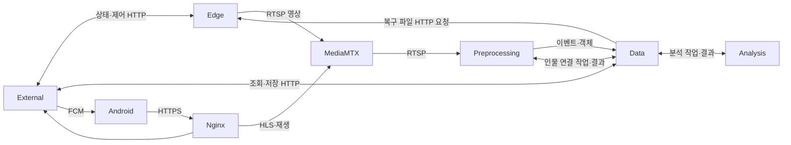

# 시스템 구조

Raspberry Pi가 영상을 보내면 중앙 서버가 녹화·감지하고, Android 앱이 HTTPS로 조회한다. 중앙은 [Compose](../server/compose.yml)의 **6개 컨테이너**로 실행한다.

## 구성과 개발 위치

| 구성 | 역할 | 코드 |
|---|---|---|
| MediaMTX | RTSP 수신, HLS, 녹화·재생 | `server/services/mediamtx/` |
| Preprocessing | 사람 감지·카메라별 추적·박스, 전역 인물 연결 | `server/services/preprocessing/` |
| Analysis | 객체에 metadata 추가 | `server/services/analysis/` |
| Data | SQLite, 이벤트·작업·파일 정보, 복구·보관 기간 관리 | `server/services/data/` |
| External | 로그인·권한, 공개 API, Edge 상태 수집, FCM 발송 | `server/services/external/` |
| Nginx | HTTPS 진입점, 영상 권한 확인, 내부 HTTP 중계 | `server/services/nginx/` |

Edge(`edge/`), Android 앱(`mobile/`), 설치 GUI/CLI(`configurator/`)는 별도 프로그램이다. `lib/ai_cctv_core/`에는 공유 설정·입출력 계약·객체 작업 실행기가 있다. `server/scripts/`에는 초기 설정 생성·진단·백업·이관 도구가 있다.

감지는 YOLO/ByteTrack 기본 구현을 사용한다. **전역 인물 연결과 metadata 분석은 다른 담당자가 구현할 블랙박스**이며 기본 결과는 `unconfigured`다. 교체 대상은 [Preprocessing](SRS_interface_preprocessing.md), [Analysis](SRS_interface_analysis.md), [모바일](openapi.yaml)이다. 다른 중앙 컨테이너는 현행 구현을 유지하며 별도 교체 규약을 두지 않는다.

## 통신

그림은 기능 흐름이다. 실제 주소와 경유지는 다음과 같다.

| 호출 | 실제 경로·인증 |
|---|---|
| 외부 앱 → API·영상 | Nginx 443, JWT·카메라 접근 권한 검사 |
| Edge → MediaMTX | RTSP 8554/TCP, 카메라별 게시 계정 |
| Preprocessing → MediaMTX | `rtsp://mediamtx:8554`, 전용 읽기 계정 |
| External·처리기·녹화 Hook → Data | `http://nginx:8080/internal/data/v1` → Data 8000, `X-Internal-Token` |
| External → MediaMTX 제어 | Nginx 8080의 `/internal/media` → MediaMTX 9997 |
| MediaMTX → 게시·읽기 인증 | External 8000에 직접 HTTP 요청 |
| External → Edge 상태·제어 | 기본 HTTP 8003, Edge Bearer 토큰 |
| Data → Edge 복구 파일 | 기본 HTTP 8002, Edge Bearer 토큰 |
| Data 내부 복구 작업 → Segment 등록 | 자기 컨테이너의 `127.0.0.1:8000/internal/v1` |

하나의 Docker bridge를 공유한다. 내부 HTTP·RTSP는 암호화하지 않으며 모든 통신의 Nginx 경유를 네트워크가 강제하지는 않는다. 80/443과 필요한 신뢰 LAN의 8554만 호스트에 연결한다. Edge 8002/8003과 Pairing UDP 37020은 신뢰 LAN에서 사용한다. 기본 호스트 bind는 loopback이다.

Data 토큰은 External·감지·인물 연결·Analysis·Media·Recovery의 6개 역할로 분리한다. `data.env`는 검증용 전체 토큰, `preprocessing.env`는 감지·인물 연결 두 토큰, `analysis.env`·`external.env`·`media.env`는 각 역할 토큰을 받는다. RTSP 읽기 계정은 External과 Preprocessing이 공유하며 사용자 JWT·카메라 게시 계정과 별개다. 실제 파일 생성은 [설치 안내](../README.md#소스-배포)를 따른다.

## 데이터와 영상

- SQLite는 **Data만** 직접 연다. 다른 서비스는 내부 API를 사용한다.
- MediaMTX가 기본 60초 중앙 녹화를 만들고 완료 Hook으로 Data에 등록한다. Hook 유실은 파일 정합성 점검으로 보완한다.
- 중앙 fMP4 재생은 Nginx → MediaMTX, 복구 MPEG-TS 재생은 공개 `/api/v1/recordings/{id}/content`의 Nginx → External → 내부 Nginx → Data 경로를 사용한다.
- Edge는 평소에도 기본 10초 MPEG-TS를 로컬에 저장하며 중앙 연결 장애 중에도 기록을 유지한다. Data는 연결 복구 이벤트를 받아 파일 크기·SHA-256을 검증한 뒤 별도 복구 저장소에 등록한다.
- 감지 이벤트가 Data에 도착하면 이벤트·객체 작업·해당 푸시 대기열을 같은 DB 트랜잭션에 저장한다. 감지기에는 Data 수신 전 이벤트를 보존하는 디스크 송신 대기열이 없다.
- 시각은 UTC로 저장한다. 녹화 검색은 요청 구간과 겹치는 Segment를 반환한다.
- 운영 카메라 정보는 Data DB가 기준이다. `config.yaml`의 카메라 목록은 초기 등록·복구 입력이다.
- DB·영상·모델·설정은 호스트에 저장하여 컨테이너 재생성과 분리한다. 마운트 권한은 Compose, 보존·복원 절차는 [운영과 백업](../README.md#운영과-백업)을 따른다.

MediaMTX는 1.9.0 기준으로 고정한다. 모델 장애 중에도 HLS와 녹화는 계속 동작해야 한다. 객체와 푸시 작업은 HTTP로 수신·완료 처리하며 별도 메시지 브로커는 없다. 인물 연결·분석의 완료 순서는 보장되지 않고, 후속 metadata 갱신은 새 이벤트나 추가 푸시를 만들지 않는다.

| 호스트 저장소 | 컨테이너의 접근 |
|---|---|
| `DATABASE_DIR` | Data만 읽기·쓰기 |
| `RECORDINGS_DIR` | MediaMTX·Data 읽기·쓰기 |
| `RECOVERED_DIR` | Data만 읽기·쓰기, 내부에서는 `/recordings/recovered` |
| `SNAPSHOTS_DIR` | Preprocessing·Data 읽기·쓰기, Analysis 읽기 전용 |
| `MODELS_DIR` | Preprocessing·Analysis 읽기 전용 |
| `CONFIG_FILE` | Data·External·Preprocessing 읽기 전용 |
| `CERTS_DIR` | Nginx 읽기 전용 |

## 상태 확인

| 검사 | 의미와 한계 |
|---|---|
| Nginx `/healthz` | Nginx 자체 응답; 전체 서비스 점검이 아님 |
| MediaMTX Control API | 제어 API 응답; 각 카메라의 녹화·재생은 별도 확인 |
| Data `/health/ready` | DB·저장소 준비 상태 |
| External `/health/ready` | Nginx 경유 Data 연결; FCM 단말 도착을 보장하지 않음 |
| Preprocessing `/health/ready` | Data 연결 실패는 503, 모델·인물 연결 오류는 200 `degraded`일 수 있음 |
| Analysis `/health/ready` | 작업기 미준비·시간 초과는 503, 최근 처리 오류는 200 `degraded`일 수 있음 |

`unconfigured`는 아직 알고리즘을 넣지 않았다는 뜻이다. Python 서비스의 `/health/live`는 프로세스 생존 확인이다. Compose의 `healthy` 표시와 실제 영상·모델 성공은 구분한다. 자동 복구 작업은 관리자 `GET /api/v1/recovery-jobs`에서 확인한다.

## 현재 범위

| 항목 | 범위 |
|---|---|
| 카메라 | 최대 4개 활성, 기본 HD 1280×720/30fps·2Mbps; 지원 장치만 FHD 1920×1080/30fps·4Mbps |
| 영상 | 실시간 HLS, 중앙 녹화·복구 MPEG-TS 재생 |
| 객체 | 카메라별 사람 추적, 박스·크롭, 전역 ID·metadata 확장 계약 |
| 모바일 | Android 우선; 박스는 최신 좌표 표시이며 HLS 프레임과 정확히 동기화되지 않음 |
| 알림 | 선택적 FCM, 모든 이벤트 기본 수신; Firebase 파일·단말 연결 필요 |
| 미구현 | 실제 재식별·metadata 알고리즘, Discord·MQTT, 저장 영상 암호화, iOS 제품화 |

[개발·검증](../README.md#개발과-검증)에서 자동 테스트와 실제 장비 확인을 구분한다.

## 개발 환경

운영은 `server/compose.yml`의 6개 서비스다. 개발 시 `compose.dev.yml`을 추가하여 각 Python 서비스의 개발 이미지와 코드 마운트를 사용한다. 별도의 개발 env·저장소를 준비한다.

`compose.test.yml`은 운영 설정을 상속하지 않는 독립 구성이다. 기본 테스트 컨테이너에서 공통·서비스별 자동 검증을 실행하고, integration 프로필은 임시 Data·External과 HTTP 검증기를 실행한다. 테스트 네트워크는 외부 접속을 막고 운영 저장소를 마운트하지 않는다.

공통 패키지 정의는 `lib/pyproject.toml`, Windows 개발 환경은 `configurator/pyproject.toml`·`uv.lock`, Edge는 `edge/pyproject.toml`에 있다. 루트에 Python 프로젝트 정의·설치 목록·잠금 파일을 두지 않는다. 실행 명령은 [개발·검증](../README.md#개발과-검증)을 따른다.
