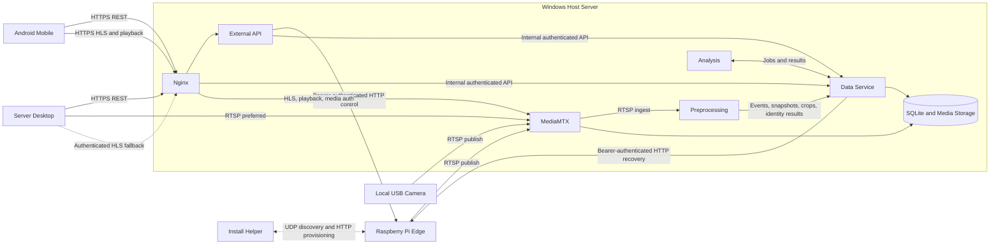
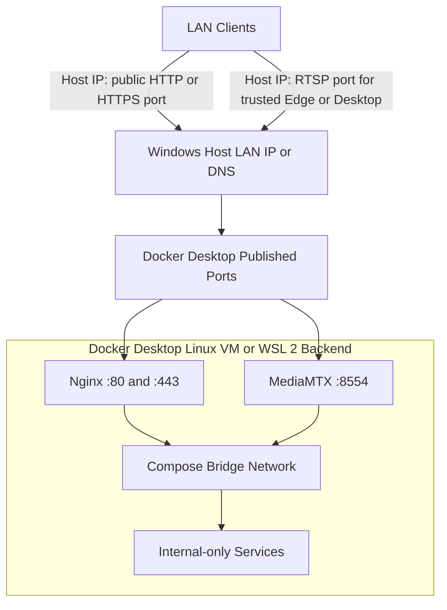
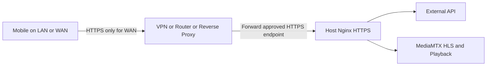
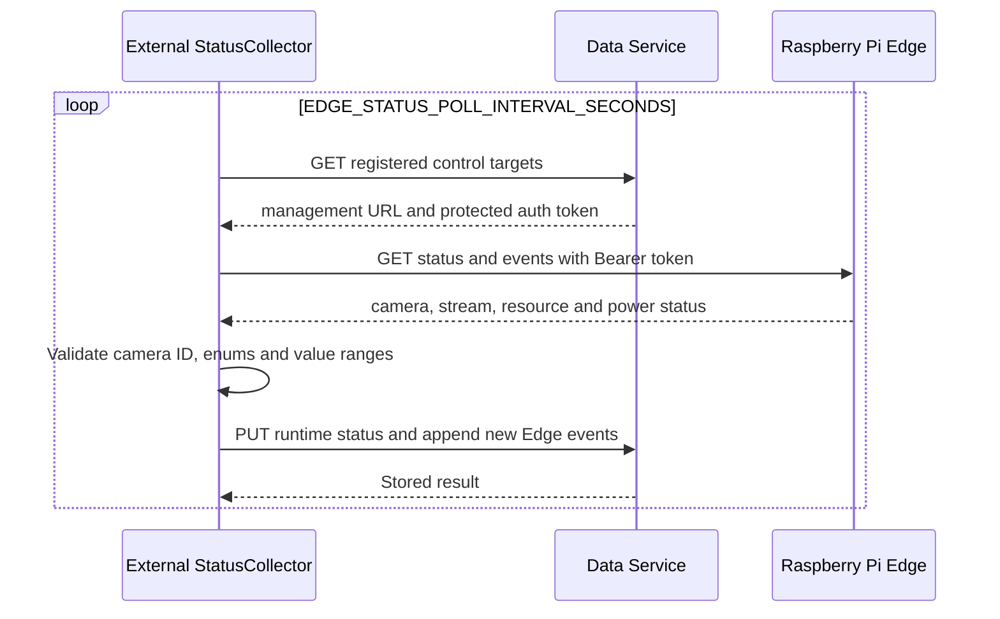
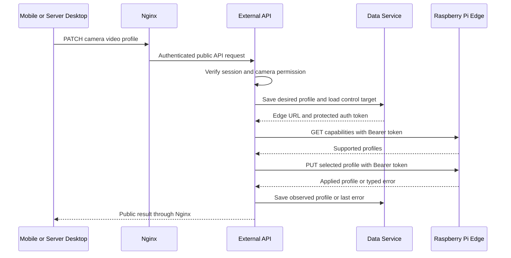

# 🏛 Architecture & Network Topology

이 문서는 현재 구현된 AI CCTV의 구성 요소, 네트워크 경계, 영상·API·제어 흐름을
설명한다. 시스템은 REST만으로 통신하지 않는다. 공개 API와 Edge 관리·복구에는
HTTP(S)를 사용하고, 영상에는 RTSP/HLS, 최초 Edge 발견에는 UDP를 사용한다.

## Table of Contents

1. [End-to-End System Topology](#end-to-end-system-topology)
2. [Network Routing & Configuration](#network-routing--configuration)
   - [2.1 WSL 2 Virtual Network Structure](#21-wsl-2-virtual-network-structure)
   - [2.2 Local Edge Network](#22-local-edge-network)
   - [2.3 External Access Method](#23-external-access-method)
3. [REST Data Flow & Sequence Diagrams](#rest-data-flow--sequence-diagrams)
   - [3.1 Edge Telemetry](#31-edge-telemetry)
   - [3.2 Remote Control](#32-remote-control)
4. [Component Responsibilities](#component-responsibilities)

## End-to-End System Topology

Mobile과 Server Desktop은 Host Server의 Nginx를 통해 공개 API와 미디어에 접근한다.
Edge는 영상을 MediaMTX로 송출하고, Host Server는 Edge의 관리·복구 API를 호출한다.
따라서 `Mobile ─REST→ Server ←REST─ Edge` 하나로 단순화하면 실제 영상 방향과
제어 방향을 잘못 표현하게 된다.

```mermaid
flowchart LR
    Mobile[Android Mobile]
    Desktop[Server Desktop]
    Helper[Install Helper]
    Edge[Raspberry Pi Edge]
    Local[Local USB Camera]

    subgraph Host[Windows Host Server]
        Nginx[Nginx]
        External[External API]
        Data[Data Service]
        Media[MediaMTX]
        Pre[Preprocessing]
        Analysis[Analysis]
        Storage[(SQLite and Media Storage)]
    end

    Mobile -->|HTTPS REST| Nginx
    Mobile -->|HTTPS HLS and playback| Nginx
    Desktop -->|HTTPS REST| Nginx
    Desktop -->|RTSP preferred| Media
    Desktop -.->|Authenticated HLS fallback| Nginx

    Edge -->|RTSP publish| Media
    Local -->|RTSP publish| Media
    Helper <-.->|UDP discovery and HTTP provisioning| Edge
    External -->|Bearer-authenticated HTTP control| Edge
    Data -->|Bearer-authenticated HTTP recovery| Edge

    Nginx --> External
    Nginx -->|Internal authenticated API| Data
    Nginx -->|HLS, playback, media auth| Media
    External -->|Internal authenticated API| Data
    Media -->|RTSP ingest| Pre
    Pre -->|Events, snapshots, crops, identity results| Data
    Analysis <-->|Jobs and results| Data
    Data --> Storage
    Media --> Storage
```

중앙 서버는 [Compose](../server/compose.yml)로 Nginx, External, Data, MediaMTX,
Preprocessing, Analysis를 실행한다. Preprocessing과 Analysis는 AI profile에 속하며,
영상 수신·녹화와 분리되어 있다.

## Network Routing & Configuration

### 2.1 WSL 2 Virtual Network Structure

지원되는 Windows 경로는 Docker Desktop의 Linux container mode와 Docker Compose
v2이다. Docker Desktop이 WSL 2 backend를 사용할 수 있지만, 사용자가 WSL 내부 IP에
직접 서버를 띄우는 방식은 이 프로젝트의 공식 실행 경로가 아니다.

```mermaid
flowchart TB
    LAN[LAN Clients]
    Win[Windows Host LAN IP or DNS]
    Ports[Docker Desktop Published Ports]

    subgraph VM[Docker Desktop Linux VM or WSL 2 Backend]
        Bridge[Compose Bridge Network]
        Nginx[Nginx :80 and :443]
        Media[MediaMTX :8554]
        Internal[Internal-only Services]
    end

    LAN -->|Host IP: public HTTP or HTTPS port| Win
    LAN -->|Host IP: RTSP port for trusted Edge or Desktop| Win
    Win --> Ports
    Ports --> Nginx
    Ports --> Media
    Nginx --> Bridge
    Media --> Bridge
    Bridge --> Internal
```

- Mobile과 Raspberry Pi에는 변경될 수 있는 WSL 2 내부 가상 IP가 아니라 Windows Host의
  LAN IP 또는 DNS 이름을 설정한다.
- Nginx의 HTTP/HTTPS와 MediaMTX의 RTSP만 Compose `ports`로 Host에 게시된다. Data,
  External, Preprocessing, Analysis의 포트는 Compose network 내부에서만 사용한다.
- 기본 예시는 `PUBLIC_BIND_ADDRESS=127.0.0.1`과 `RTSP_BIND_ADDRESS=127.0.0.1`이다.
  다른 LAN 장치가 접근해야 하면 설치 도우미에서 실제 LAN bind 주소를 선택하고 필요한
  포트만 Windows Defender Firewall에 허용한다.
- Docker Desktop이 게시 포트를 Windows Host에 연결하므로 정상 Compose 배포에 임의의
  `netsh interface portproxy` 규칙을 추가하지 않는다. 별도 NAT·방화벽 구성이 필요한
  환경에서는 실제 bind 주소와 `docker compose ... config` 결과를 먼저 확인한다.

### 2.2 Local Edge Network

Raspberry Pi와 Host Server는 최초 설치 시 같은 신뢰 LAN에 있어야 한다.

| 방향 | 기본 포트 | 프로토콜 | 용도 |
| --- | ---: | --- | --- |
| Edge → Host | `8554/TCP` | RTSP | 실시간 영상 publish |
| Host → Edge | `8003/TCP` | HTTP + Bearer | 상태·기능 조회와 화질 변경 등 Control API |
| Host → Edge | `8002/TCP` | HTTP + Bearer | 장애 구간 녹화 manifest·파일 Recovery API |
| Edge → LAN broadcast | `37020/UDP` | JSON advertisement | 미설정 Edge 발견 |
| Host → Edge | Edge `8003/TCP` | HTTP | 최초 pairing completion |

Discovery advertisement에는 device ID, camera ID, 정규화 MAC, IP, 관리·복구 포트,
지원 profile이 포함된다. 광고는 인증 비밀값이나 운영 token을 포함하지 않으며 HMAC으로
서명되지 않는다. Device ID와 MAC은 식별 정보이지 인증 수단이 아니다. 등록 후 Control과
Recovery는 같은 Edge operational token을 Bearer 자격 증명으로 사용한다.

Edge의 IP가 바뀌어도 identity 자체는 바뀌지 않지만 중앙에 저장된 management/recovery
URL은 도달 가능한 새 주소로 갱신해야 한다. RTSP와 Edge 관리 포트는 인터넷에 직접
공개하지 않는다.

### 2.3 External Access Method

Mobile은 Nginx의 공개 HTTP(S) base URL에 접속하고 `/api/v1`을 직접 입력하지 않는다.
실시간 영상은 Nginx가 중계하는 인증 HLS, 녹화는 인증된 playback 경로를 사용한다.

```mermaid
flowchart LR
    Mobile[Mobile on LAN or WAN]
    Gateway[VPN or Router or Reverse Proxy]
    Nginx[Host Nginx HTTPS]
    External[External API]
    Media[MediaMTX HLS and Playback]

    Mobile -->|HTTPS only for WAN| Gateway
    Gateway -->|Forward approved HTTPS endpoint| Nginx
    Nginx --> External
    Nginx --> Media
```

- 신뢰 LAN에서는 명시적으로 HTTP mode를 선택할 수 있다. WAN에서는 신뢰 가능한 TLS
  인증서와 HTTPS를 사용한다.
- 저장소는 라우터 포트 포워딩, 공인 DNS, VPN, reverse proxy를 자동 구성하지 않는다.
  운영자가 선택한 외부 접근 방식에서 `PUBLIC_BASE_URL`, 인증서, 공개 bind 주소, 방화벽을
  일치시켜야 한다.
- WAN에 공개할 경로는 Nginx의 HTTPS 진입점으로 제한한다. Data 내부 API, Edge Control,
  Edge Recovery, RTSP ingest를 직접 공개하지 않는다.

## REST Data Flow & Sequence Diagrams

### 3.1 Edge Telemetry

현재 구현은 Raspberry Pi가 telemetry를 중앙으로 POST하는 push 방식이 아니다. External의
`StatusCollector`가 등록된 Edge Control API를 기본 5초 간격으로 polling하고, 검증한 상태와
Edge event를 Data에 저장한다.

```mermaid
sequenceDiagram
    participant E as External StatusCollector
    participant D as Data Service
    participant P as Raspberry Pi Edge

    loop EDGE_STATUS_POLL_INTERVAL_SECONDS
        E->>D: GET registered control targets
        D-->>E: management URL and protected auth token
        E->>P: GET status and events with Bearer token
        P-->>E: camera, stream, resource and power status
        E->>E: Validate camera ID, enums and value ranges
        E->>D: PUT runtime status and append new Edge events
        D-->>E: Stored result
    end
```

영상에서 생성되는 AI 이벤트는 이 telemetry polling과 별도다. Preprocessing이 MediaMTX의
RTSP stream을 읽고 사람 감지·추적 결과, snapshot, crop을 Data 내부 API로 보낸다. Analysis는
Data의 작업을 가져와 결과를 다시 보고한다.

### 3.2 Remote Control

Mobile의 화질 변경은 Edge polling이나 webhook을 기다리지 않는다. Mobile의 관리자 요청을
External이 인증·인가하고 Data에 desired state를 기록한 뒤, Edge Control API를 직접 호출한다.
성공 결과 또는 오류 코드는 Data에 반영된다.

```mermaid
sequenceDiagram
    participant M as Mobile or Server Desktop
    participant N as Nginx
    participant X as External API
    participant D as Data Service
    participant E as Raspberry Pi Edge

    M->>N: PATCH camera video profile
    N->>X: Authenticated public API request
    X->>X: Verify session and camera permission
    X->>D: Save desired profile and load control target
    D-->>X: Edge URL and protected auth token
    X->>E: GET capabilities with Bearer token
    E-->>X: Supported profiles
    X->>E: PUT selected profile with Bearer token
    E-->>X: Applied profile or typed error
    X->>D: Save observed profile or last error
    X-->>M: Public result through Nginx
```

녹화 복구는 별도 방향이다. Data recovery worker가 Edge Recovery API에서 manifest와 파일을
가져오고 크기와 SHA-256을 검증한 뒤 복구 저장소와 recording metadata에 등록한다.

## Component Responsibilities

| Component | Responsibilities |
| --- | --- |
| Nginx | 공개 HTTP(S) 진입점, External API routing, 내부 Data routing, HLS·playback·MediaMTX auth routing |
| External | 사용자 인증·권한, 공개 Camera/Event API, Edge 상태 polling과 Control 요청, push notification dispatch |
| Data | SQLite 단독 소유, 카메라·이벤트·작업·identity·recording metadata 저장, retention, Edge recording recovery worker |
| MediaMTX | Edge/Local Camera RTSP 수신, 중앙 녹화, Desktop RTSP, Mobile HLS와 playback 제공 |
| Preprocessing | RTSP frame 소비, YOLO/ByteTrack 감지·추적, snapshot/crop 생성, OSNet 특징 추출, event outbox |
| Analysis | Data job 소비, person crop 추가 분석, 결과 보고 |
| Install Helper | 배포 설정·검증·Compose 관리, 미설정 Edge UDP 발견과 최초 설정 전달, Server Desktop 실행 |
| Server Desktop | 관리자 로그인, 카메라·Edge 관리, RTSP 우선 live view와 인증 HLS fallback, event media 조회 |
| Raspberry Pi Edge daemon | 카메라 캡처, MediaMTX RTSP publish, 로컬 장애 녹화, Control/Recovery API, 최초 discovery/pairing |
| Android Mobile | 공개 API 로그인, 카메라·이벤트 조회, 인증 HLS live view, playback, client-side object overlay, push 설정 |

중앙 SQLite 파일은 Data만 직접 연다. 다른 중앙 서비스는 역할별 `X-Internal-Token`을 사용해
내부 Data API에 접근한다. Edge Control/Recovery는 operational Bearer token을 사용하며,
Mobile·Desktop 사용자 인증과 분리된다.
