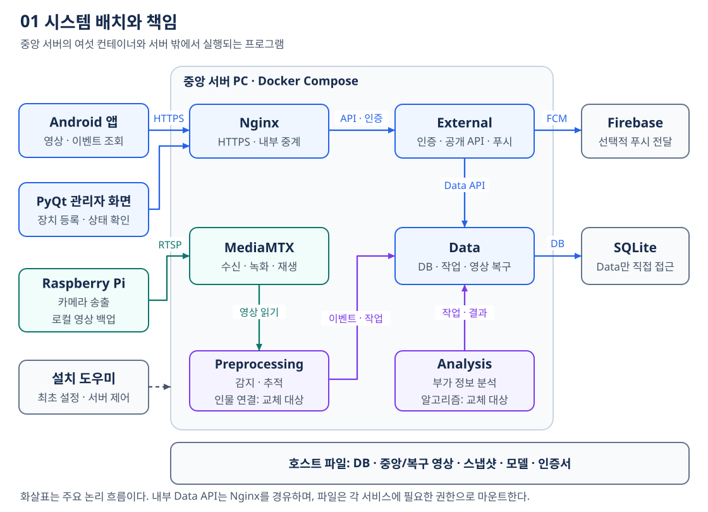

# 시스템 구조

Edge가 보낸 영상을 중앙 서버가 녹화·분석하고 Android 앱이 조회한다.

## 구성 요소

중앙 서버는 [Compose](../server/compose.yml)로 여섯 컨테이너를 실행한다.

| 구성 요소 | 역할 |
|---|---|
| Nginx | HTTPS 진입점, API·영상 중계 |
| External | 사용자 인증, 카메라 권한, 공개 API, 관리자 API, 푸시 |
| Data | 중앙 SQLite, 이벤트·작업·인물 연결 저장, 녹화 등록·복구·보관 |
| MediaMTX | RTSP 수신, 중앙 녹화, HLS·녹화 재생 |
| Preprocessing | 사람 감지·추적, 대표 이미지·좌표 생성, 인물 특징 추출 |
| Analysis | 사람 크롭의 색·품질 등 추가 정보 분석 |

Edge는 영상 송출과 로컬 녹화를 수행한다. 설치 도우미는 서버 설정·기동과 최초 Edge 연결을 담당한다. 앱은 External API와 Nginx 영상 경로를 사용한다.

## 데이터 흐름

- 영상: Edge → MediaMTX → 중앙 녹화·HLS. 앱 요청은 Nginx와 External의 권한 검사를 거친다.
- 이벤트: Preprocessing이 이미지를 저장한 뒤 Data에 이벤트를 보낸다. Data는 이벤트, identity·analysis 작업, 푸시 대기열을 함께 저장한다.
- 인물 연결·분석: Preprocessing과 Analysis가 각 작업을 가져와 결과를 보고한다. Data는 특징을 비교해 전역 ID를 연결하고 기존 이벤트의 결과를 갱신한다.
- 알림: External이 Data의 푸시 대기열을 가져와 FCM으로 발송한다.
- 녹화 복구: 중앙 연결 장애 후 Data가 Edge 원본을 받아 크기·SHA-256을 검사하고 별도 복구 저장소에 등록한다.

## 저장소와 통신

중앙 업무 DB는 Data만 직접 연다. 다른 서비스는 `http://nginx:8080/internal/data/v1`에 역할별 `X-Internal-Token`으로 접근한다. Preprocessing의 미전송 이벤트는 별도 SQLite outbox에 보존하며 `source_event_id`로 재전송 중복을 제거한다.

DB·중앙 녹화·복구 녹화·이미지·모델·설정은 호스트에 저장한다. Preprocessing은 이미지를 쓰고, Analysis는 같은 폴더를 읽기 전용으로 사용한다. 모델은 읽기 전용이다. 실제 마운트와 포트는 [Compose](../server/compose.yml)에 정의한다.

## 현재 범위

- 단일 서버, 활성 카메라 최대 4개, Android 앱을 기준으로 한다.
- 기본 감지·추적은 YOLO/ByteTrack, 인물 연결은 OSNet 특징과 Data gallery, 분석은 상·하의 후보 영역 색·품질 측정이다.
- 영상 녹화와 AI 처리는 독립적이다. 녹화 복구는 장애 구간의 감지 이벤트를 재생성하지 않는다.
- 인물 연결·색 분석 정확도와 동시 처리 성능은 현장 검증이 필요하다.

상태 확인과 장애 대응은 [운영 안내](operations.md)를 따른다.
