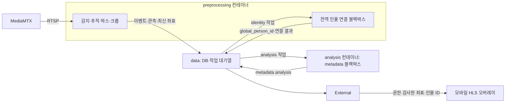

# 객체 감지·전역 인물 연결·추가 분석

중앙 Compose는 `data`, `external`, `preprocessing`, `analysis`, `mediamtx`, `nginx` **6개 컨테이너**다. 감지·추적과 전역 인물 연결은 Preprocessing 내부에서 독립 작업기로 실행하며 metadata 분석은 Analysis 컨테이너가 담당한다.



## 책임과 현재 동작

- `preprocessing` 감지 작업기: YOLO 사람 감지와 ByteTrack 카메라별 추적을 수행한다. 좌표는 원본 프레임 기준 `[x1,y1,x2,y2]`이며 프레임 경계로 잘라낸다. 등장 시 원본 스냅샷, 객체 크롭, 해당 객체 박스·로컬 ID가 그려진 스냅샷을 저장한다. 크롭 생성 실패가 감지·영상 수신을 중단시키지 않는다.
- `preprocessing` 인물 연결 작업기: 다른 개발자가 구현할 동일 인물 판정 영역이다. 기본 `IdentityBlackBox`는 `unconfigured`를 반환하며 `global_person_id`를 임의 생성하지 않는다.
- `analysis`: 다른 개발자가 구현할 metadata 분석 영역이다. 기본 `MetadataBlackBox`는 `unconfigured`를 반환하며 이미지 특성·의상·행동 등의 분석 결과를 생성하지 않는다. YOLO·CNN 등 모델 선택과 분석 구현은 담당 개발자가 같은 플러그인 계약으로 추가한다.
- `data`: 이벤트와 두 작업을 같은 트랜잭션으로 저장한다. 모델 실행과 파일 읽기는 worker가 수행하고 SQLite는 Data만 연다. 두 worker는 녹화·감지와 독립적이다.
- `external`: 로그인과 Camera ACL을 확인한 뒤 `/api/v1/cameras/{camera_id}/objects`로 좌표를 전달한다. 내부 작업 API는 공개하지 않는다.

## 식별자와 객체 계약

`person_id`는 카메라 내 추적 ID다. `tracking_session_id`는 Worker/RTSP 추적 구간을 구분하며 재시작·재접속 때 바뀐다. `(camera_id, tracking_session_id, person_id)`로 로컬 추적을 구별한다. 전역 연결은 이 키와 `global_person_id`를 별도 테이블에 저장한다. 같은 카메라 추적의 이미 확정된 전역 ID를 다른 값으로 덮어쓰는 결과는 거부한다. 여러 카메라의 서로 다른 로컬 추적에 같은 전역 ID를 지정하는 것은 허용한다.

객체 관측은 현재 사람 **등장마다 한 번** 생성한다. 매 프레임 이미지나 임베딩을 저장하는 구조는 아니다. 좋은 크롭을 다시 선정하거나 여러 관측을 모아 재식별하는 정책은 블랙박스 개발 시 추가할 범위다.

공유 스키마: [`src/ai_cctv_core/contracts/objects.py`](../src/ai_cctv_core/contracts/objects.py).

```json
{
  "camera_id": "cam-001",
  "person_id": "7",
  "event_type": "person_appeared",
  "occurred_at": "2026-09-06T10:00:00Z",
  "object_observation": {
    "schema_version": 1,
    "tracking_session_id": "0123456789abcdef0123456789abcdef",
    "object_class": "person",
    "bbox": [100, 50, 300, 600],
    "frame_width": 1280,
    "frame_height": 720,
    "crop_path": "cam-001/2026/09/06/example_crop.jpg",
    "annotated_snapshot_path": "cam-001/2026/09/06/example_boxed.jpg"
  }
}
```

Data는 관측을 이벤트 `metadata.object`에 저장하고 `metadata.identity`, `metadata.analysis`에 각 단계 상태와 결과를 별도로 병합한다. 분석 결과 전체는 64 KiB로 제한한다. 전역 ID는 이벤트 최상위 필드에도 반영한다. 같은 추적 구간의 사라짐 이벤트와 실시간 표시에도 전파한다. 추가 분석 완료는 새 이벤트나 추가 푸시를 만들지 않는다. 이벤트 상세를 새로 고치면 최신 metadata를 확인할 수 있다.

## 블랙박스·분석기 개발자 인터페이스

| 담당 영역 | 구현·계약 |
|---|---|
| 감지·추적 | [Preprocessing 안내](../server/services/preprocessing/README.md), `processors/detection/contracts.py`와 `processors/detection/yolo.py` |
| 전역 인물 연결 | [Identity 연결부](../server/services/preprocessing/processors/identity/__init__.py) |
| metadata 분석 | [Analysis 안내](../server/services/analysis/README.md), [분석 연결부](../server/services/analysis/processors/__init__.py) |
| 공통 실행 | [작업기](../src/ai_cctv_core/processing/worker.py), [객체 스키마](../src/ai_cctv_core/contracts/objects.py) |

감지 팩토리는 `factory(model_path: Path, confidence: float, device: str)`이며 `reset()`과 `process(DetectionFrame) -> DetectionResult`를 구현한다. 입력은 v1 스키마, 카메라·추적 세션·UTC 관측 시각·원본 BGR `uint8` 이미지다. 출력 객체는 `person_id`, 픽셀 `bbox`, `confidence`를 가진다. 감지 기본 어댑터는 기존 YOLO/ByteTrack이며 `DETECTION_PLUGIN`으로 교체한다. 모델 미설정·로딩 실패 시 가짜 결과를 만들지 않는다.

인물 연결과 metadata 분석은 아래 동일한 작업 계약을 사용한다. 인물 연결은 Preprocessing 안에서 감지와 독립적으로 실행하며, Analysis는 별도 컨테이너·토큰으로 실행한다.

```python
class MyIdentityBackend:
    def process(self, job: dict, crop_path: Path) -> dict:
        # job: id(작업 ID), event_id, camera_id, person_id,
        # occurred_at, global_person_id, object_observation, lease_id 등
        # crop_path: /snapshots 내부의 검증된 로컬 파일
        return {
            "outcome": "complete",
            "global_person_id": "your-global-id",
            "metadata": {"backend": "your-model", "version": "1"}
        }
```

위 반환값은 계약 예시이며 기본 구현에서 고정 ID를 반환하지 않는다. 동일 인물 판정 모델·갤러리·정확도·보존 정책은 담당 개발자가 구현한다. 이미지를 보고 유사도를 추정하는 임시 알고리즘은 넣지 않았다. DB 영속화가 더 필요하면 Data API/마이그레이션으로 추가한다.

분석기 역시 `process(job, crop_path)`를 구현하고 `outcome`, `metadata`를 반환한다. 분석기는 `global_person_id`를 지정할 수 없다. 모델 여러 개의 출력은 `metadata` 안에서 분석기별 이름으로 구분해 조합할 수 있다.

`outcome`: `complete`, `unconfigured`, `retry`, `failed`. 오류 응답에는 비밀값·예외 원문을 넣지 않는다. 플러그인은 동기 함수이며 한 작업당 120초 제한이 있다. 시간 초과 후 실행 중인 모델 스레드를 강제로 죽이지 않고 worker가 추가 작업 수신을 중단해 unhealthy가 된다. 운영자가 컨테이너를 재시작해야 한다. 일반 실패는 최대 5회 재시도하며 프로세스 중단 시 5분 lease 만료 후 회수한다. 오래된 lease 결과는 반영하지 않는다.

각 담당자는 구현 후 해당 서비스의 내부 토큰으로 `POST /internal/v1/object-jobs/identity/requeue-unconfigured` 또는 `POST /internal/v1/object-jobs/analysis/requeue-unconfigured`를 호출해 이전 미설정 작업을 최대 100건씩 재처리할 수 있다. 기존 크롭이 남아 있어야 하며 다른 단계의 작업을 재처리할 권한은 없다.

## 배포

새 설치는 Configurator 또는 `generate_secrets.py --output-dir ...`가 `data.env`, `external.env`, `preprocessing.env`, `analysis.env`, `media.env`를 생성한다.

- `preprocessing.env`: `DATA_INFERENCE_TOKEN`, `DATA_IDENTITY_TOKEN`, RTSP 읽기 인증 쌍. 감지와 인물 연결은 별도 제한 토큰을 사용한다.
- `analysis.env`: `DATA_ANALYSIS_TOKEN`만 전달한다.
- 모델은 양쪽 읽기 전용이다. 스냅샷은 Preprocessing이 생성하므로 쓰기 가능하며 Analysis는 읽기 전용이다.
- 외부 공개 포트와 DB 볼륨은 추가하지 않는다. 새 설치는 별도 `identity.env`를 만들지 않는다.

기존 설치에는 이전 환경 파일의 자격증명을 회전하지 않고 새 파일 구성으로 이관하는 도구를 사용한다.

```powershell
python server/scripts/enable_object_processing.py --env-file C:/path/to/compose.env
```

그 뒤 같은 Compose 프로젝트의 Configurator **Start services**로 컨테이너를 재생성한다. 시작 명령은 `up -d --build --wait --remove-orphans`다. 직접 실행하는 경우에도 기존 `COMPOSE_PROJECT_NAME`과 실제 환경 파일 경로를 유지한다.

```powershell
docker compose --env-file C:/path/to/compose.env -f server/compose.yml up -d --build --wait --remove-orphans
```

이 명령은 같은 프로젝트의 이전 `inference`, `identity`, `object-analysis` 컨테이너를 제거해 감지 중복 실행을 막는다. DB·영상의 Bind Mount 데이터는 보존한다. 환경 이관 스크립트만 실행하거나 단순 Restart하면 이전 컨테이너 정리와 새 환경 적용이 완료되지 않는다. Data 시작 시 미적용 SQL 마이그레이션을 적용한다.

`compose.env`의 선택 설정:

```dotenv
DETECTION_PLUGIN=server.services.preprocessing.processors.detection.yolo:YoloTracker
IDENTITY_PLUGIN=server.services.preprocessing.processors.identity:IdentityBlackBox
ANALYSIS_PLUGIN=server.services.analysis.processors:MetadataBlackBox
```

각 담당자는 새 플러그인과 필요한 모델·의존성을 해당 서비스에 추가한 뒤 플러그인 경로를 지정하고 이미지를 다시 빌드한다. Analysis 기본 이미지에는 metadata 분석 모델이 없다. `INFERENCE_*` 감지 설정은 기존 이름을 유지한다. Configurator 설정을 재생성한 뒤 사용자 플러그인 선택이 유지되는지 확인한다.

## 모바일 박스 표시와 검증 범위

실시간 화면에서 `사람 위치·ID 표시`를 켜면 프레임 크기에 맞춰 박스와 `P:person_id`, 연결된 경우 `G:global_person_id`를 표시한다. 0.5초마다 좌표를 요청하며 서버에서 3초 이상 지난 관측은 숨긴다. API 오류·재생 일시정지·버퍼링·백그라운드 진입 시 숨기고, 화면 비율이 바뀌어 좌표와 영상이 맞지 않으면 표시하지 않는다.

**현재 오버레이는 HLS 프레임과 정확하게 동기화되지 않는다.** 감지와 영상 재생은 서로 다른 지연을 가지므로 움직이는 사람과 박스 사이에 시차가 생길 수 있다. UI에 이를 표시한다. 정확한 프레임 동기화에는 영상 PTS와 관측 타임스탬프를 연결하거나 박스를 합성한 별도 영상 스트림을 제공하는 후속 작업이 필요하다. 박스가 그려진 스냅샷은 동일 프레임 기준이다.

Docker/Android 실기기와 실제 AI 모델은 이 작업 환경에서 실행 검증하지 못했다. 자동 테스트는 크롭·박스 좌표·작업 재시도·권한·결과 병합·모바일 표시를 검증한다. 검증 목적으로 실제 Firebase 메시지를 발송하지 않는다.
